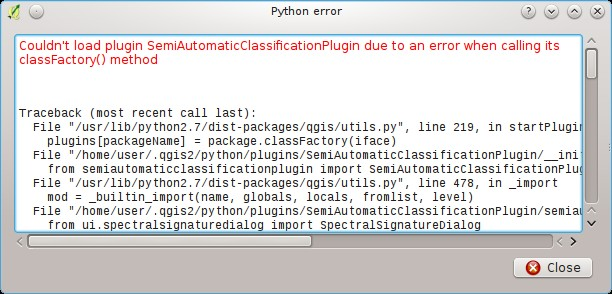

.. _FAQ:

***************************************************************
Frequently Asked Questions 
***************************************************************

.. |br| raw:: html

  

.. contents::
    :depth: 2
    :local:
	
This is a collection of Frequently Asked Questions.
For other questions please visit `From GIS to Remote Sensing FAQ <http://fromgistors.blogspot.com/p/frequently-asked-questions.html>`_
	
.. _FAQ_plugin_installation:
 
Plugin installation
===================================================

.. _plugin_installation_1:

How to install the plugin manually?
------------------------------------------------------
	
In order to install the plugin manually:

#. download the zip file from the `QGIS Python Plugins Repository <http://plugins.qgis.org/plugins/SemiAutomaticClassificationPlugin/#plugin-versions>`_;
#. open the directory ``.qgis2/python/plugins`` that is inside the User/Home directory and delete the folder SemiAutomaticClassificationPlugin if present;
#. extract the downloaded zip file inside the directory ``.qgis2/python/plugins``;
#. the plugin should be installed; start QGIS, open the Plugin Manager and be sure that Semi-Automatic Classification Plugin is checked.

.. _FAQ_pre_processing:
 
Pre processing
===================================================

.. _pre_processing_1:

Which image bands should I use for a semi-automatic classification?
-----------------------------------------------------------------------------------------

In general, it is preferable to avoid thermal infrared bands. If you are using Landsat 4, 5 or 7 you should select bands: 1, 2, 3, 4, 5, 7 avoiding band 6 that is thermal infrared; for Landsat 8 you should select bands: 2, 3, 4, 5, 6, 7.

.. _pre_processing_2:

Which Landsat bands can be converted to reflectance by the SCP?
-----------------------------------------------------------------------------------------

All Landsat 1,2, and 3 MSS and Landsat 4, 5, 7, and 8 images downloaded from http://earthexplorer.usgs.gov/ and processed with the Level 1 Product Generation System (LPGS) can be converted to reflectance automatically by the SCP; products generated by the LPGS have a MTL file included that is required for the conversion.
Since version 3.1.1 the SCP can also convert images from the `Global Land Cover Facility <http://glcfapp.glcf.umd.edu/>`_ (images available for free from ftp://ftp.glcf.umd.edu/glcf/Landsat/). In particular, images having an old format of the MTL file (or a .met file) can be processed through the automatic conversion to reflectance and the DOS correction. However, some images do not have the required information and cannot be processed. Also, notice that some images available from the Global Land Cover Facility are already converted to reflectance. For this process, image bands must be renamed in order to remove the final 0 if present (e.g. rename B10 to B1).

.. _pre_processing_3:

Can I apply the Landsat conversion and DOS correction to clipped bands?
-----------------------------------------------------------------------------------------

Yes, you can clip the images before the conversion to reflectance and then copy the MTL file (contained in the Landsat dataset) inside the directory with the clipped bands. 
If you want to apply the DOS correction (which is an image based technique) you should convert the original Landsat bands (the entire image) and then clip the conversion output (i.e. bands converted to reflectance).

.. _pre_processing_4:

Can I apply the DOS correction to Landsat bands with black border (i.e. with NoData value)?
---------------------------------------------------------------------------------------------------

If you want to apply the DOS correction to an entire Landsat band which has NoData values (the black border with value = 0) then you have to check the checkbox ``Use NoData value`` and set the value to 0.
This is because DOS is an image based technique, and NoData values must be excluded from the calculation.

.. _pre_processing_5:

How to remove cloud cover from Landsat images?
-----------------------------------------------------------------------------------------

DOS1 correction does not remove clouds from the image.
However, Landsat 8 images include Band 9 that identifies clouds (see this `NASA site <http://landsat.gsfc.nasa.gov/?page_id=5377>`_).
You can use this band for the creation of a mask.

For other Landsat satellites, clouds can be masked using the approach described `this paper <http://www.planning4adaptation.eu/Docs/papers/08_NWP-DoM_for_LCC_in_Dar_using_Landsat_Imagery.pdf>`_.

Also, see the following `video-tutorial <https://youtu.be/acxmIrM-Qns?t=37m08s>`_.

.. _pre_processing_6:

How do I create a virtual raster manually in QGIS?
-----------------------------------------------------------------------------------------

In order to create a multi-spectral virtual raster in QGIS:

#. from the menu ``Raster`` select ``Miscellaneous > Build Virtual Raster (catalog)``;
#. click the button ``Select...`` and select all the Landsat bands (in numerical order); 
#. select the output file (for instance ``rgb.vrt``); check ``Separate`` (bands will be separated) and click ``OK``.

.. _FAQ_tutorials:
 
Tutorials
===================================================

.. _FAQ_tutorials_1:

Why using only Landsat 8 band 10 in the estimation of surface temperature?
-----------------------------------------------------------------------------------------

There are several methods for estimating surface temperature.
The method described in `this tutorial <http://fromgistors.blogspot.com/2014/01/estimation-of-land-surface-temperature.html>`_ requires only one band and can be applied also to Landsat 5 and 7.
Moreover, USGS recommends that users refrain from relying on Landsat 8 Band 11 data in quantitative analysis of the Thermal Infrared Sensor data (see `Changes to Thermal Infrared Sensor (TIRS) data <http://landsat.usgs.gov/calibration_notices.php>`_ by USGS).

.. _FAQ_errors:
 
Errors
===================================================

.. _error_0:

How can I report an error?
-----------------------------------------------------------------------------------------

If you found an error of the Semi-Automatic Classification Plugin please follow these steps in order to collect the required information (log file):

#. close QGIS if already open;
#. open QGIS, open the Plugin tab :ref:`settings_debug_tab` and check the checkbox ``Records events in a log file`` ;

.. figure:: _static/settings_debug_tab.jpg
	:align: center
	
	:guilabel:`Debug`

3. click the button ``Test dependencies`` in the tab :ref:`settings_debug_tab` ;
#. load the data in QGIS (or open a previously saved QGIS project) and repeat all the steps that cause the error in the Plugin;
	* if the issue could be related to the image data, please use `this sample dataset <https://docs.google.com/uc?id=0BysUrKXWIDwBc1llME4yRmpjMGc&export=download>`_ ;
#. if an error message appears (like the one in the following image), copy the whole content of the message in a text file;

	
	:guilabel:`Error message`
	
6. open the tab :ref:`settings_debug_tab` and uncheck the checkbox ``Records events in a log file``, then click the button ``Export Log file`` and save the **log file** (which is a text file containing information about the Plugin processes);
#. open the **log file** and copy the whole content of the file;
#. join the Facebook `group <https://www.facebook.com/groups/661271663969035/>`_ or the Google+ `community <https://plus.google.com/communities/107833394986612468374>`_ , create a new post and copy the error message and the **log file** (or attach them).

.. _error_1:

Why am I having issues during the creation of the Landsat virtual raster?
-----------------------------------------------------------------------------------------

The automatic creation of the virtual raster after Landsat conversion to reflectance is not required for the classification. Errors could happen if the output destination path contains special characters (such as accented letters) or spaces; try to rename directories (e.g. rename ``new directory`` to ``new_directory``).
If you still get the same error you can create a virtual raster manually.

.. _error_2:

Error [26] 'The version of Numpy is outdated'. Why?
-----------------------------------------------------------------------------------------

QGIS 32bit could have an older version of Numpy as default;
in order to update Numpy:

#. download `this file <https://docs.google.com/uc?id=0BysUrKXWIDwBUmZaRGpXOF9nQ2M&export=download>`_ (which is based on `WinPython installer <http://sourceforge.net/projects/winpython/files/WinPython_2.7/2.7.6.4/WinPython-32bit-2.7.6.4.exe/download>`_ and `PyParsing <https://pypi.python.org/packages/source/p/pyparsing/pyparsing-1.5.7.zip>`_);
#. extract the file with `7-zip <http://www.7-zip.org/>`_;
#. copy the content of the extracted directory inside the directory ``apps\Python27\Lib\site-packages`` inside the QGIS installation directory (e.g. ``C:\Program Files (x86)\QGIS Chugiak\apps\Python27\Lib\site-packages``) overwriting the files ``pyparsing``, ``numpy``, ``matplotlib``, and ``scipy``.

Alternatively, you should be able to install QGIS and Numpy with the `OSGEO4W advanced installer <http://download.osgeo.org/osgeo4w/osgeo4w-setup-x86.exe>`_.

.. _error_3:

Error 'Plugin is damaged. Python said: ascii'. Why?
-----------------------------------------------------------------------------------------

It could be related to a wrong installation.
Please, uninstall QGIS and install it again with administrative rights.
Delete also the directory .qgis2 in your user directory.
Then run QGIS 2 and try to install the plugin following the :ref:`installation` guide.

Also, it could be related to the user name containing special characters.
Please try the installation creating a new user without special characters (e.g. ``user``).

Also, if the error message contains something like:
	``sfnt4 = sfnt4.decode('ascii').lower()``
	
it could be related to a known issue of Matplotlib (a Python library); in order to solve this, you should (as reported at `stackoverflow <http://stackoverflow.com/questions/18689854/enthought-matplotlib-problems-with-plot-function>`_):

	#. open in a text editor the file font_manager.py which is inside the directory ``C:\PROGRA~1\QGISCH~1\apps\Python27\lib\site-packages\matplotlib\``
	#. search for the line
		``sfnt4 = sfnt4.decode('ascii').lower()``
	#. and replace it with the line
		``sfnt4 = sfnt4.decode('ascii', 'ignore').lower()``

Alternatively, try to install QGIS through the `OSGEO4W installer <http://trac.osgeo.org/osgeo4w/>`_, which includes an updated Matplotlib version.

.. _FAQ_other:
 
Other
===================================================

.. _other_1:

What are free and valuable resources about remote sensing and GIS?
-----------------------------------------------------------------------------------------

The following links are remote sensing and Landsat images:

	* `The Landsat 8 Data Users Handbook by USGS <http://landsat.usgs.gov/documents/Landsat8DataUsersHandbook.pdf>`_;
	* `The Landsat 7 Science Data Users Handbook by NASA <http://landsathandbook.gsfc.nasa.gov/pdfs/Landsat7_Handbook.pdf>`_;
	* `Remote Sensing Note by JARS <http://www.jars1974.net/pdf/rsnote_e.html>`_.

.. _other_2:

Where can I ask a new question?
-----------------------------------------------------------------------------------------

A `Facebook group <https://www.facebook.com/groups/661271663969035/>`_ and a `Google+ Community <https://plus.google.com/communities/107833394986612468374>`_ are available for sharing information and asking for help.

.. _other_3:

Where can I find more tutorials about SCP, also in languages other than English?
-----------------------------------------------------------------------------------------

There are several tutorials about SCP on the internet.
Following an incomplete list of these resources:

	* `French: Suivre l’impact des feux de forêts par imagerie satellite avec le plugin Qgis SCP <http://blog.martzluff.net/suivre-limpact-des-feux-de-forets-par-imagerie-satellite-avec-le-plugin-qgis-scp-semi-automatic-classification-plugin-exemple-de-lincendie-de-fin-mars-2015-en-ukraine-a-proximite-de-la/>`_;
	* `German: 2015 Jakob Erfassung von Landnutzungsveränderungen mit FOSS Image Processing Tools <https://www.youtube.com/watch?v=vIsHFvLS5_Q>`_;
	* `Italian: Classificazione e Mosaico di Varie Immagini Landsat <http://fromgistors.blogspot.com/2015/09/tutorial-classificazione-mosaico-landsat.html>`_;
	* `Korean: QGIS Semi-Automatic Classification Plugin <http://blog.daum.net/geoscience/715>`_;
	* `Portuguese: Classificação Supervisionada de Imagens Orbitais com o Semi-Automatic Classification Plugin <http://qgisbrasil.org/blog/wp-content/uploads/2015/08/tutorial_scp_01.pdf>`_;
	* `Portuguese: Tutorial Classificação e caracterização de imagens de satélites <https://www.youtube.com/watch?v=Wab1UVmVl0k>`_;
	* `Portuguese: Aprendizagem Supervisionada usando o SCP no QGIS <https://www.youtube.com/watch?v=FDYQrDb4qYY>`_;
	* `Portuguese: Classificação supervisionada utilizando o QGIS e SCP <https://www.youtube.com/watch?v=TOMfdalS_U4>`_;
	* `Spanish: Ejercicio Clasificación Semiautomática Plugin (SCP) <https://sernanpqgis.wordpress.com/2015/09/25/ejercicio-clasificacion-semiautomatica-plugin-scp/>`_;
	* `Spanish: Aplicaciones de Teledetección con el QGIS y el plugin Semi-Automatic Classification <http://carbajallosa.blogspot.it/2015/04/aplicaciones-de-teledeteccion-con-el.html>`_;
	* `Spanish: Descarga de Landsat 8, 7, 5 y 4 Semi Automatic Classification Plugin Qgis 2.8 <http://sistemasdeinformaciongeografica911.blogspot.mx/2015/04/descarga-de-landsat-5-7-y-8-qgis-semi.html>`_;
	* `Swedish: Landsat 8 och fjärranalys med QGIS <https://geosupportsystem.wordpress.com/2015/04/02/landsat-8-och-fjarranalys-med-qgis/>`_;
	* `Ukrainian: Посібник користувача модуля Напівавтоматичної класифікації <http://semiautomaticclassificationmanual.readthedocs.org/uk_UA/latest/>`_;

.. _other_4:

How can I translate this user manual to another language?
-----------------------------------------------------------------------------------------

It is possible to easily translate the user manual to any language, because it is written in reStructuredText as markup language (using Sphinx).
Therefore, your contribution is fundamental for the translation of the manual to your language.
The following guide illustrates the main steps for the translation, which can be performed:

* using the free online service Transifex;
* using the gettext .po files.

**Method 1. Translation using the free online service Transifex**

This is probably the easiest way to translate the manual using an online service.

1. Transifex free registration
	
	Go to the Transifex login page (https://www.transifex.com/signin/).
	You can sign in using your Google or Facebook account, or with a free registration.
	
2. Join the Semi-automatic Classification Manual project
	
	Go to the page https://www.transifex.com/semi-automatic-classification/semi-automatic-classification-plugin-4-manual/ .
	Select your language and click the button Join team. If your language is not listed, click the button Request language.

3. Translation

	There are several files to be translated, which refer to the sections of the SCP manual.
	The translation is performed through an online application, which shows you each sentence in the original English version, and a text editor allows for the translation to your language.
	This should make the translation process very rapid and easy.
	
**Method 2. Translation using the gettext .po files**

In order to use this method, you should be familiar with GitHub. This translation method allows for the translation of the PO files locally.

1. Download the translation files

	Go to the GitHub project https://github.com/semiautomaticgit/SemiAutomaticClassificationManual_v4/tree/master/locale and download the .po files of your language (you can add your language, if it is not listed), or you can fork the repository. 
	Every file .po is a text file that refers to a section of the User Manual.
	
2. Edit the translation files

	Now you can edit the .po files. It is convenient to edit those file using one of the following programs: for instance `Poedit <http://www.poedit.net/>`_ for Windows and Mac OS X, or `Gtranslator <https://wiki.gnome.org/Apps/Gtranslator>`_ for Linux or `OmegaT <http://www.omegat.org/en/download_selector/ui.php>`_ (Java based) for Windows, Linux and Mac OS X.
	These editors allow for an easy translation of every sentence in the User Manual.
