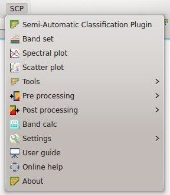

.. _SCP_menu:

******************************
SCP menu
******************************

.. |br| raw:: html

  

	
	:guilabel:`SCP menu`
		
The ``SCP menu`` allows for the selection of the main functions of the :ref:`main_interface_window`, the :ref:`spectral_signature_plot`, and the :ref:`scatter_plot`.

* |plugin|: show the :ref:`main_interface_window` and display the :ref:`roi_dock` and the :ref:`classification_dock`;
* |band_set|: open the :ref:`band_set_tab`;
* |sign_plot|: open the :ref:`spectral_signature_plot`;
* |scatter_plot|: open the :ref:`scatter_plot`;
* |tools|: open the :ref:`tools_tab` and the sub-menu thereof;
* |preprocessing|: open the :ref:`pre_processing_tab` and the sub-menu thereof;
* |postprocessing|: open the :ref:`post_processing_tab` and the sub-menu thereof;
* |bandcalc|: open the :ref:`band_calc_tab`;
* |settings|: open the :ref:`settings_tab` and the sub-menu thereof;
* |guide|: open the online user manual in a web browser;
* |help|: open the `Online help <http://fromgistors.blogspot.com/p/ask-for-help.html>`_ in a web browser; also, a `Facebook group <https://www.facebook.com/groups/661271663969035/>`_ and a `Google+ Community <https://plus.google.com/communities/107833394986612468374>`_ are available for sharing information and asking for help about SCP.

.. |plugin| image:: _static/semiautomaticclassificationplugin.png
	:width: 20pt
	
.. |band_set| image:: _static/semiautomaticclassificationplugin_bandset_tool.png
	:width: 20pt

.. |sign_plot| image:: _static/semiautomaticclassificationplugin_sign_tool.png
	:width: 20pt

.. |scatter_plot| image:: _static/semiautomaticclassificationplugin_scatter_tool.png
	:width: 20pt

.. |tools| image:: _static/semiautomaticclassificationplugin_roi_tool.png
	:width: 20pt
	
.. |preprocessing| image:: _static/semiautomaticclassificationplugin_class_tool.png
	:width: 20pt
	
.. |postprocessing| image:: _static/semiautomaticclassificationplugin_post_process.png
	:width: 20pt
			
.. |bandcalc| image:: _static/semiautomaticclassificationplugin_bandcalc_tool.png
	:width: 20pt
		
.. |settings| image:: _static/semiautomaticclassificationplugin_settings_tool.png
	:width: 20pt
			
.. |guide| image:: _static/guide.png
	:width: 20pt
				
.. |help| image:: _static/help.png
	:width: 20pt
	