.. _tutorials:

***************************************************************
Basic Tutorials
***************************************************************

.. |br| raw:: html

  

Following, the list of basic tutorials that guide you through the steps of a land cover classification:

.. contents::
    :depth: 2
    :local:
	

.. _tutorial_1:
 
Tutorial 1: Your First Land Cover Classification
===================================================

This is a basic tutorial about the use of the Semi-Automatic Classification Plugin (SCP) for the classification of a generic image.
It is worth noticing that the image is multi-spectral.
It is recommended to read the :ref:`remote_sensing` before this tutorial.

In this tutorial we are going to classify a remote sensing image acquired over Frascati (Rome, Italy) in order to identify the following land cover classes:

#. Water;
#. Built-up;
#. Vegetation;
#. Bare soil.

Following the video of this tutorial.

.. raw:: html

	<iframe allowfullscreen="" frameborder="0" height="360" src="http://www.youtube.com/embed/nZffzX_sMnk?rel=0" width="640"></iframe>

http://www.youtube.com/watch?v=nZffzX_sMnk

Alternative video link
https://archive.org/details/video_basic_tutorial_1

.. _tutorial_1_data:

Data
-------------------------

**Download the image data** from `here <https://docs.google.com/uc?id=0BysUrKXWIDwBUUdmWjJXZEVqbDg&export=download>`_ (data available from the U.S. Geological Survey).
It is a Landsat image, but in this tutorial we are going to use this raster as a generic dataset. For a specific tutorial about Landsat images read :ref:`tutorial_2` .

**Unzip** the downloaded file in a directory of your choice.
The dataset is a multi-spectral raster (the file ``sample_image.tif`` ) that includes the following Landsat bands:

#. Blue;
#. Green;
#. Red;
#. Near-Infrared;
#. Short Wavelength Infrared 1;
#. Short Wavelength Infrared 2.

.. _tutorial_1_1:

Load Data
-------------------------

Start QGIS and load ``sample_image.tif`` in QGIS (from the QGIS menu ``Layer > Add Raster Layer`` ). The image is displayed in QGIS.

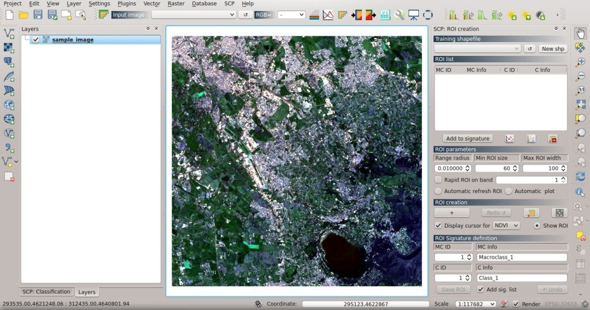
	
	:guilabel:`Image loaded in QGIS`
	
.. _tutorial_1_2:

Set the Input Image in SCP
---------------------------

In the SCP :ref:`toolbar` click the button |refresh| for refreshing the list ``Input image`` . In the list ``Input image`` select ``sample_image`` .

In the list ``RGB`` select the item ``4-3-2`` for displaying a :ref:`color_composite_definition` of Near-Infrared, Red, and Green.
The image in QGIS will be updated accordingly.

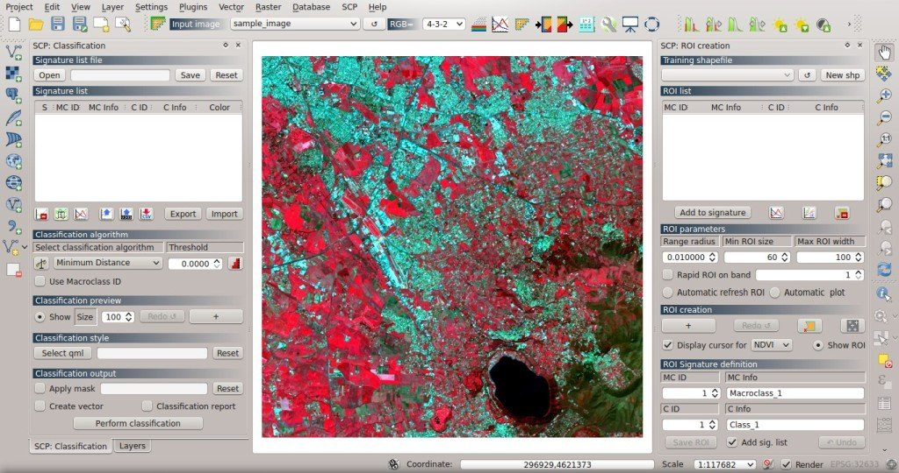
	
	:guilabel:`Color composite RGB=4-3-2 of Input image`
	
.. _tutorial_1_3:

Create the Training Shapefile and Signature List File
------------------------------------------------------

In order to collect :ref:`ROI_definition` (ROIs) and calculate the :ref:`spectral_signature_definition` thereof, we need to create the ``Training shapefile`` and ``Signature list file`` in SCP.

In the :ref:`roi_dock` click the button ``New shp`` and define a name (e.g. ``ROI.shp`` ) in order to create the ``Training shapefile`` that will store ROI polygons.
The shapefile is created and added to QGIS.
The name of the ``Training shapefile`` is displayed in :ref:`training_shapefile` .

Also, click the button ``Save`` in the :ref:`classification_dock` and define a name (e.g. ``SIG.xml`` ) in order to create the ``Signature list file`` that will store spectral signatures.
The path of the ``Signature list file`` is displayed in :ref:`signature_list_file` .

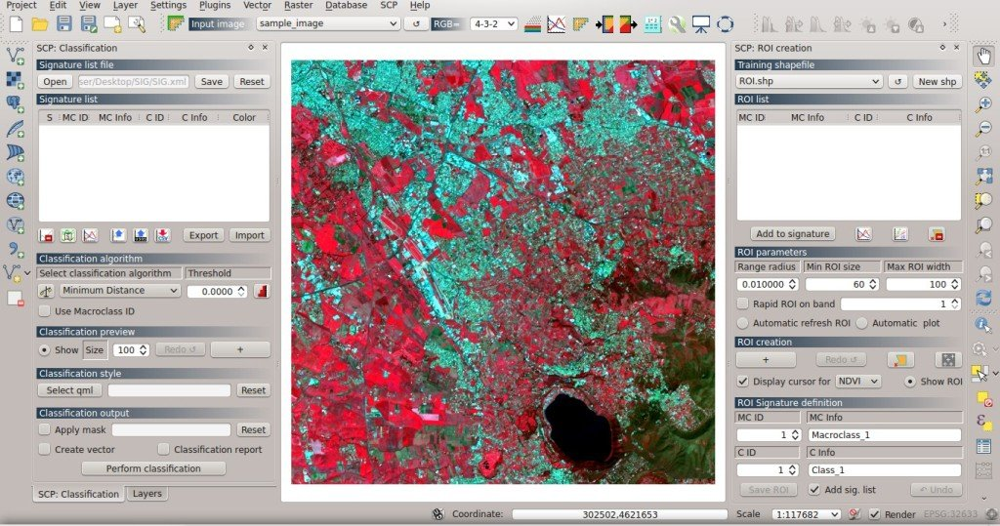
	
	:guilabel:`Definition of Training shapefile and Signature list file in SCP`
	
	
.. _tutorial_1_4:

Create the ROIs
------------------------------------------------------

We are going to create ROIs defining the :ref:`classes_definition` .
The Macroclass ID codes are illustrated in the following table (of course, one can define different codes and classes according to the needs).
	
+-----------------------------+--------------------------+
| Macroclass name             | Macroclass ID            |
+=============================+==========================+
| Water                       |  1                       |
+-----------------------------+--------------------------+
| Built-up                    |  2                       |
+-----------------------------+--------------------------+
| Vegetation                  |  3                       |
+-----------------------------+--------------------------+
| Bare soil                   |  4                       |
+-----------------------------+--------------------------+

ROIs can be created by manually drawing a polygon or with an automatic region growing algorithm.

Zoom in the map over the dark area (it is a lake) in the lower right region of the image.
In order to create manually a ROI inside the dark area, click the button |manual| in the :ref:`ROI_creation` .
Left click on the map to define the ROI vertices and right click to define the last vertex closing the polygon.
An orange semi-transparent polygon is displayed over the image, which is a temporary polygon (i.e. it is not a shapefile).

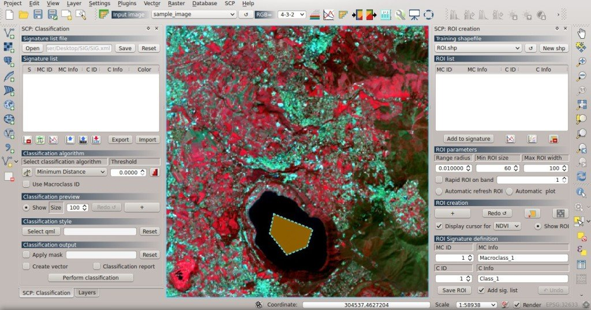
	
	:guilabel:`A temporary ROI created manually`
	
It is required to define the :ref:`classes_definition` .
In the :ref:`ROI_signature_definition` set ``MC ID`` = 1 and ``MC Info`` = "Water" ; also set ``C ID`` = 1 and ``C Info`` = "Lake".

In order to save the polygon in the ``Training shapefile`` click the button ``Save ROI`` .
After a few seconds, the ROI is listed in the :ref:`ROI_list` . 
Also, the spectral signature is calculated and listed in :ref:`signature_list` (because ``Add sig. list`` was checked in :ref:`classes_definition`).

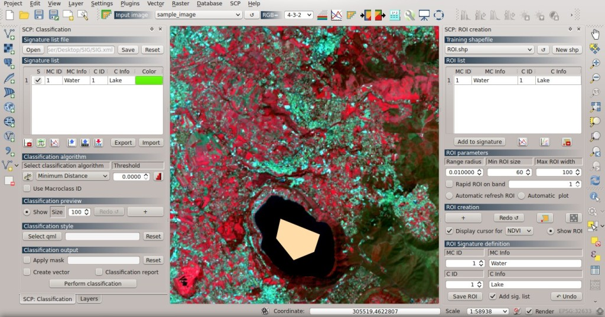
	
	:guilabel:`The ROI saved in the Training shapefile and the corresponding spectral signature displayed in the Signature list`
	
Now we have created the first ROI.
Zoom in the map over the blue area (it is built-up) in the upper left region of the image.
In order to create a ROI with the automatic region growing algorithm, in :ref:`ROI_parameters` set the ``Range radius`` value to 2000 (this value depends on image range of pixel values).
It is possible to increase or decrease this value in order to create large or small ROIs.
Click the button ``+`` in the :ref:`ROI_creation` and click over the blue area of the map.
After a few moments the orange semi-transparent polygon is displayed over the image.

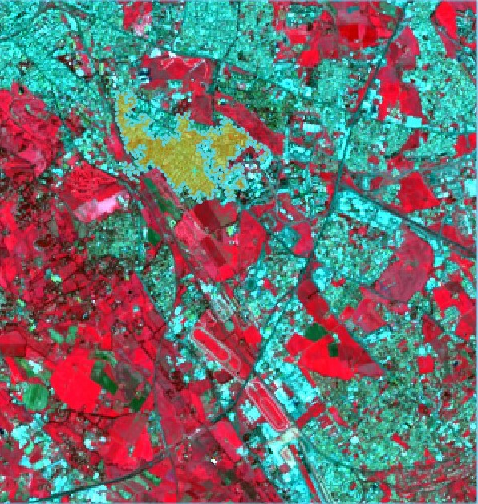
	
	:guilabel:`A temporary ROI created with the automatic region growing algorithm`
	
In the :ref:`ROI_signature_definition` set ``MC ID`` = 2 and ``MC Info`` = "Built-up" ; also set ``C ID`` = 2 and ``C Info`` = "Buildings".

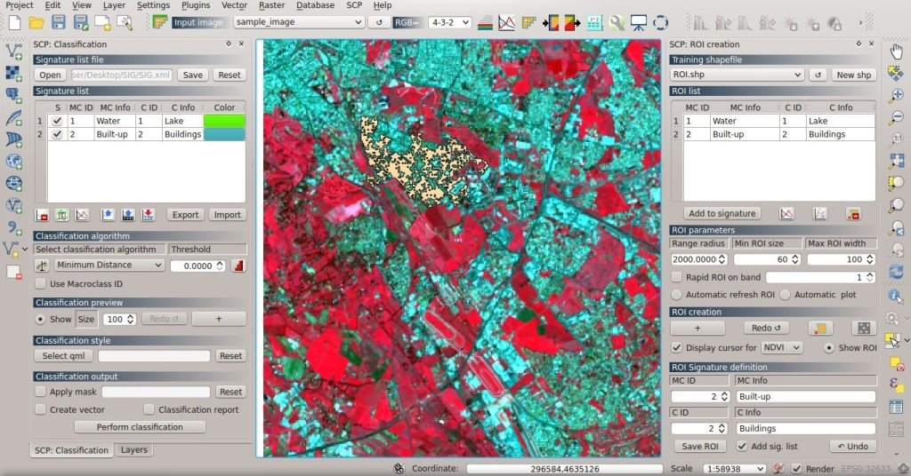
	
	:guilabel:`The ROI saved in the Training shapefile and the corresponding spectral signature displayed in the Signature list`
		
Create a ROI for the class ``Vegetation`` (red areas) and a ROI for the class ``Bare soil`` (green areas) following the same steps described previously.
The following images show a few examples of these classes identified in the map.

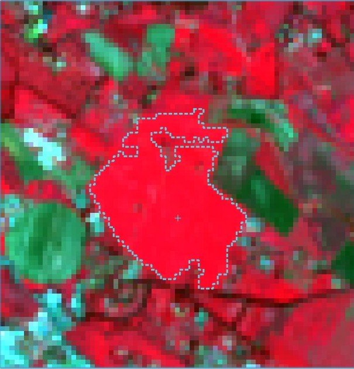
	
	:guilabel:`Vegetation`
	
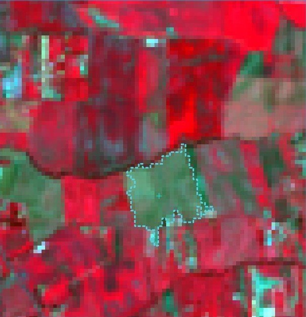
	
	:guilabel:`Bare soil`
		
	**TIP** : The region growing algorithm can create more homogeneous spectral signatures than ROI created manually, which is good for the use of the algorithm ``Spectral Angel Mapping`` and ``Maximum Likelihood``.
	The manual creation of ROIs can be useful in order to account for the spectral variability of a class, especially when using the algorithm ``Maximum Likelihood``.

.. _tutorial_1_5:

Create a Classification Preview
------------------------------------------------------

It is useful to create a :ref:`classification_preview` in order to assess the results before the final classification.

Set the colors of the spectral signatures, which will represent classes in the classification output: in the :ref:`signature_list` double click the color in the column ``Color``  and choose a representative color of each class.
	
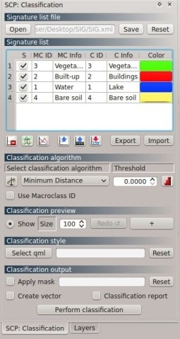
	
	:guilabel:`Definition of class colors in the table Signature list`
	
In the :ref:`classification_alg` select the classification algorithm ``Spectral Angle Mapping`` that we are going to use in this tutorial.
In :ref:`classification_preview` set ``Size`` = 500 , click the button ``+`` and then left click the image in the map in order to create a classification preview.
The result is a square in the map which represent the classification output.

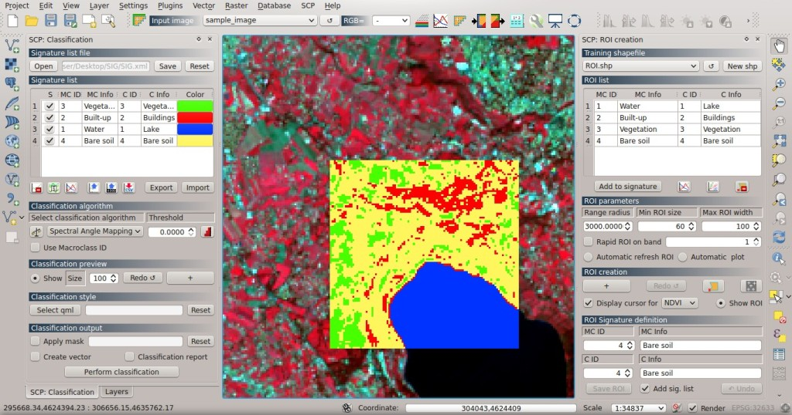
	
	:guilabel:`Classification preview displayed over the image`
	
Previews are temporary classifications and are useful for assessing the effects of spectral signatures during the ROI collection.
Previews are placed in a group named ``Class_temp_group`` in the QGIS panel Layers.

In general, it is good to perform a classification preview every time a ROI (or a spectral signature) is added to the list. Therefore, the phases :ref:`tutorial_1_4` and :ref:`tutorial_1_5` should be iterative and concurrent processes.

.. _tutorial_1_6:

Create the Classification Output
------------------------------------------------------

Assuming that the results of classification previews were good (i.e. classes were identified correctly), it is possible to perform the actual land cover classification of the whole image.

In the :ref:`classification_output` click the button ``Perform classification`` and define the name of the classification output.
The classification output is a raster file (.tif) where each pixel value corresponds to a land cover class (defined in the :ref:`signature_list`).

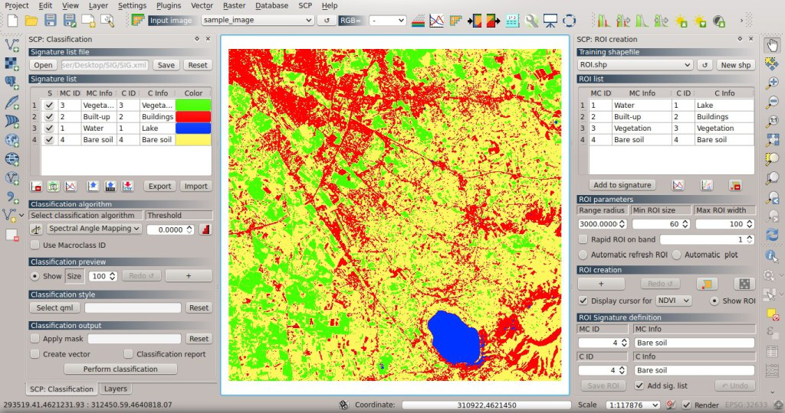
	
	:guilabel:`Result of the land cover classification`
	
Well done! You have just performed your first land cover classification.
However, you can see that there are several classification errors (especially soil classified as built-up and vice versa), because the number of ROIs (spectral signatures) is insufficient.

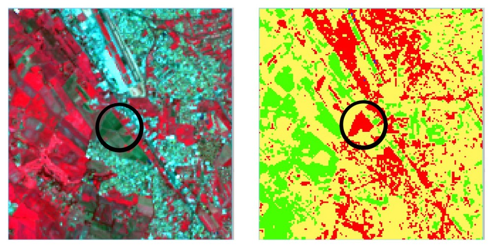

	:guilabel:`Example of error: Bare soil classified as Built-up`
	
In the following :ref:`tutorial_2` we are going to create more ROIs and improve the classification results.
	
.. _tutorial_2:
 
Tutorial 2: Land Cover Classification of Landsat Images
========================================================

This tutorial describes the main phases for the classification of images acquired by :ref:`Landsat_definition` .
In addition, some of the SCP tools are illustrated.

In this tutorial we are going to classify a Landsat 8 image acquired over Frascati (Rome, Italy) in order to identify the following land cover classes:

#. Water;
#. Built-up;
#. Vegetation;
#. Bare soil.

Following the video of this tutorial.

.. raw:: html

	<iframe allowfullscreen="" frameborder="0" height="360" src="http://www.youtube.com/embed/ImbYhiIgl1g?rel=0" width="640"></iframe>

http://www.youtube.com/watch?v=ImbYhiIgl1g

Alternative video link
https://archive.org/details/video_basic_tutorial_2

.. _tutorial_2_data_download:

Data Download
-------------------------

We are going to **download the Landsat 8 image** using the SCP tool :ref:`Landsat_download_tab`.
The dataset we are going to download is a Landsat 8 image that includes the metadata file (the file LC81910312015006LGN00_MTL.txt) and the following Landsat 8 bands (for more information read :ref:`Landsat_definition` ) :

* LC81910312015006LGN00_B2.tif = Blue;
* LC81910312015006LGN00_B3.tif = Green;
* LC81910312015006LGN00_B4.tif = Red;
* LC81910312015006LGN00_B5.tif = Near-Infrared;
* LC81910312015006LGN00_B6.tif = Short Wavelength Infrared 1;
* LC81910312015006LGN00_B7.tif = Short Wavelength Infrared 2.

Landsat images are available from the U.S. Geological Survey, and these bands are downloaded through the Amazon Web Services.

Start a new QGIS project. Open the tab :ref:`Landsat_download_tab` clicking the button |tools| in the :ref:`SCP_menu` or the :ref:`toolbar`.

First, we need to download the Landsat database. Click the button ``Select database directory`` in order to define where to save the database.
It is preferable to create a new directory (e.g. ``LandsatDB``) in the user directory.
Check the option ``only Landsat 8`` in order to download the database of Landsat 8 only.
Click the button ``Update database`` and click ``Yes`` in the following question about updating the image database.

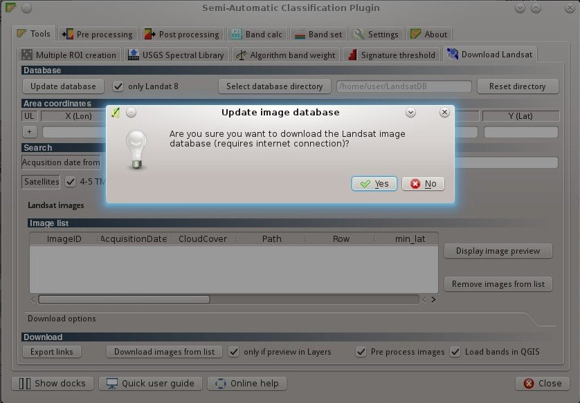

	:guilabel:`Download Landsat 8 database`

The download should start (about 7 MB).

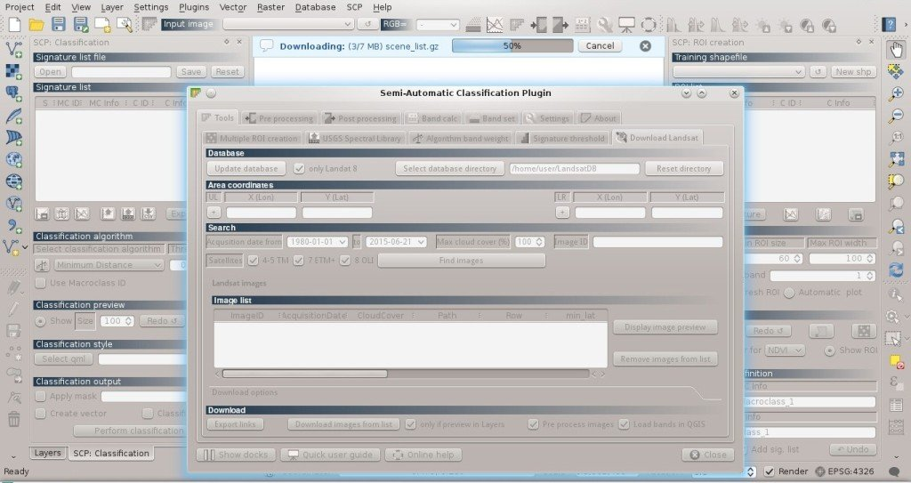

	:guilabel:`Downloading Landsat 8 database`
	
When the download is completed, in the search box ``Image ID`` paste the Landsat ID: ``LC81910312015006LGN00`` .
Now click the button ``Find images`` and after a few seconds the image will be listed in the ``Image list``.

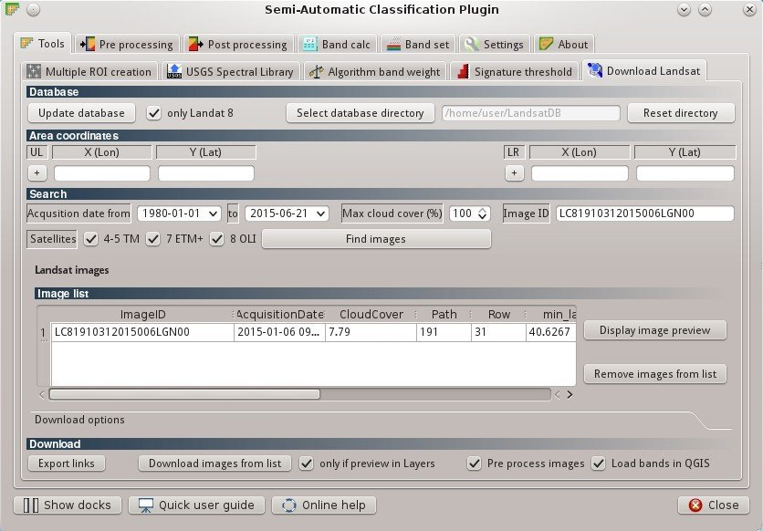

	:guilabel:`Search Landsat 8 image`
	
Click the tab ``Download options`` and leave checked only bands from 2 to 7 (we don't need the other bands for this tutorial).
Also, uncheck all the options ``only if preview in Layers``, ``Pre process images``, and ``Load bands in QGIS`` (we are going to see these functions in other tutorials).

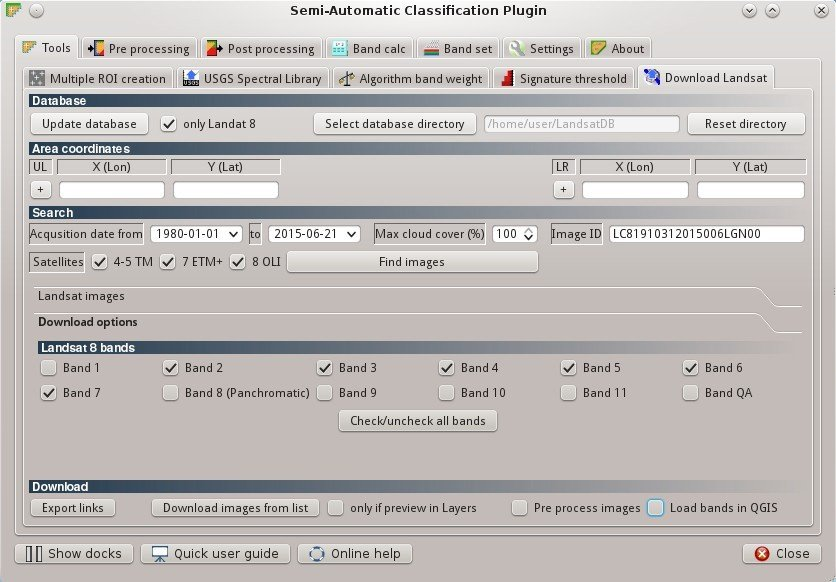

	:guilabel:`Select Landsat 8 bands for download`

In order to start the image download, click the button ``Download images from list`` and select a directory where bands are saved (i.e. ``Desktop``).
The download could last a few minutes according to your internet connection speed (each Landsat band is about 50MB).
The progress bar inform you about the downloading process.
After the download, all the bands and the metadata file are saved in a new directory ``LC81910312015006LGN00`` (i.e. the Landsat ID) created automatically.

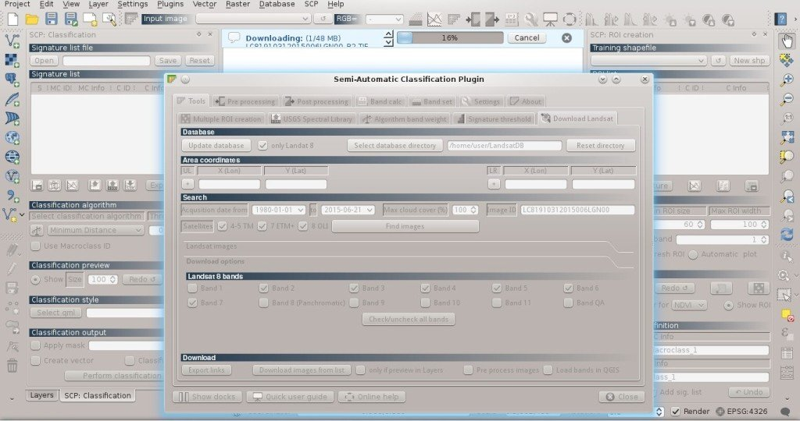

	:guilabel:`Download Landsat 8 bands`

.. _tutorial_2_1:

Automatic Conversion to Surface Reflectance
------------------------------------------------------

The metadata file contains information that is useful for the automatic conversion of bands to :ref:`radiance_reflectance_definition` .
Read :ref:`landsat_conversion_to_reflectance` for information about the calculation.

In order to convert automatically Landsat bands to reflectance, open the tab :ref:`landsat_tab` clicking the button |preprocessing| in the :ref:`SCP_menu` or the :ref:`toolbar` .

Click the button ``Select directory`` and select the ``Directory containing Landsat bands`` (i.e. the directory ``LC81910312015006LGN00``).
The list of bands will be automatically loaded in the table :ref:`landsat_metadata` .
Also, the metadata information for each band is loaded (because the metadata file MTL.txt is inside the same directory).

	**TIP** : If the metadata file MTL.txt was in a different directory, one can click the button ``Select MTL file`` and select the file. Also, it is possible to edit the metadata information inside the table :ref:`landsat_metadata` .

In order to calculate surface reflectance we are going to apply the :ref:`DOS1_correction` ; therefore, enable the option ``Apply DOS1 atmospheric correction`` .

	**TIP** : It is recommended to perform the DOS1 atmospheric correction to the entire Landsat image (before clipping the image) in order to improve the calculation of parameters based on the image.

Uncheck the option ``Create Band set`` (already enabled).
In order to start the conversion process, click the button ``Perform conversion`` and select the directory where converted bands are saved (e.g. ``LandsatRT``).
	
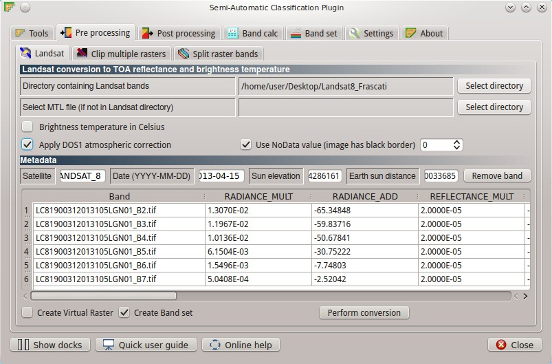

	:guilabel:`Landsat conversion to reflectance`
	
After a few minutes, converted bands are loaded in QGIS.

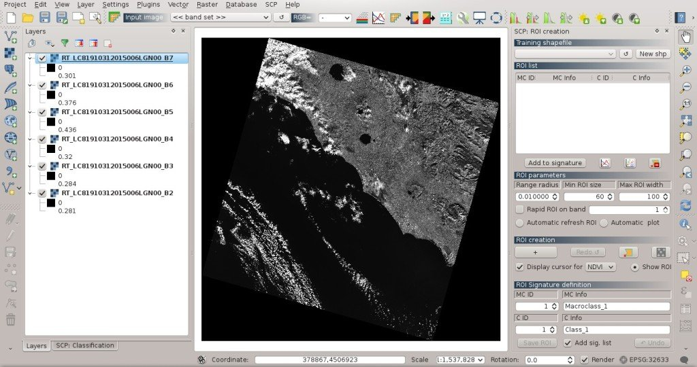

	:guilabel:`Converted Landsat bands`
	
.. _tutorial_2_clip_data:

Clip Data
---------------------------------

We are going to clip Landsat bands to our study area (of course this is optional in case the study is focused on a certain area of the image).
Download the shapefile of the study area `from here <https://docs.google.com/uc?id=0BysUrKXWIDwBLXB4dDBQcHM5ZE0&export=download>`_ .
Unzip the file and load the shapefile ``study_area_Frascati`` in QGIS.

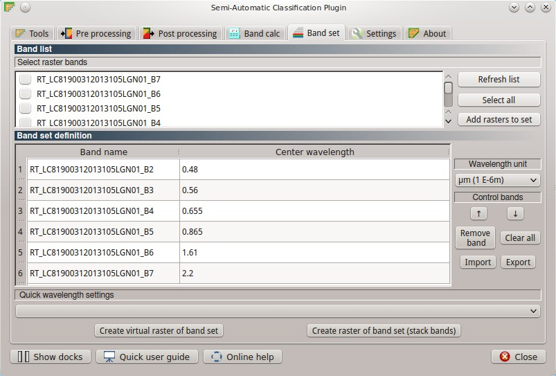

	:guilabel:`The study area shapefile`
	
Open the tab :ref:`clip_multiple_rasters_tab` clicking the button |preprocessing| in the :ref:`SCP_menu` or the :ref:`toolbar` .
Under ``Raster list`` , click the button ``Refresh list`` and the Landsat bands loaded in QGIS will be listed in the table.
Click the button ``Select all`` in order to clip all the images.
Under ``Clip coordinates``, check ``Use shapefile for clipping`` and click the button ``Refresh list`` in order to see the shapefile in the list.
Click the button ``Clip selected rasters`` and select a directory (e.g. ``Landsat_clip``) where clipped bands are saved (with the file name prefix ``clip_``).

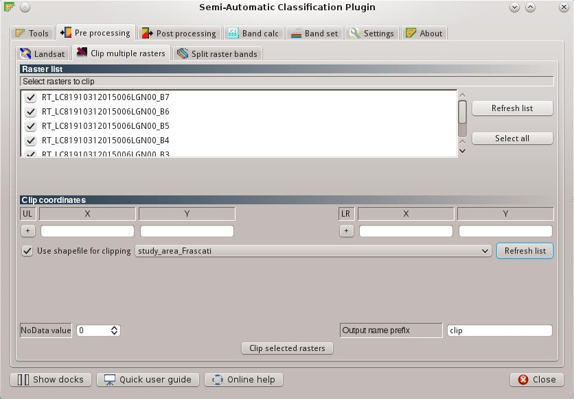

	:guilabel:`The tool for clipping the bands with the shapefile`
	
When the process is completed, clipped rasters are loaded in QGIS.
We can remove the original Landsat bands from QGIS.

.. figure:: _static/tutorial_2_1_5.jpg
	:align: center

	:guilabel:`Clipped Landsat bands`
	
.. _tutorial_2_band_set:

Create the Band Set
---------------------------------
	
Now we need to define the ``Band set`` which is the input image for SCP.
Open the tab :ref:`band_set_tab` clicking the button |band_set| in the :ref:`SCP_menu` or the :ref:`toolbar`.
Click the button ``Select All``, then ``Add rasters to set`` (order the band names in ascending order, from top to bottom, using the arrow buttons).
Finally, select ``Landsat 8 OLI`` from the combo box ``Quick wavelength settings``, in order to set automatically the center wavelength of each band (this is required for the spectral signature calculation).

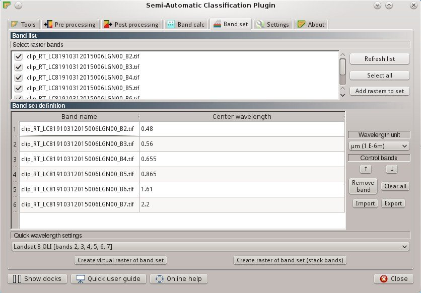

	:guilabel:`Definition of a band set`

You can notice that the item ``<< band set >>`` is selected as ``Input image``  in the :ref:`toolbar`.

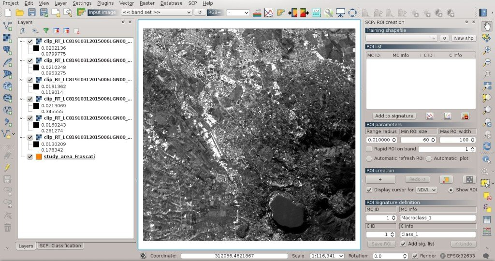

	:guilabel:`Band set defined`
	
.. _tutorial_2_2:

Open the Training Shapefile and Signature List File
------------------------------------------------------

We are going to open the ``Training Shapefile`` and ``Signature list file`` already created in :ref:`tutorial_1`.
If you don't have these files, follow the instructions :ref:`tutorial_1_3`.

Load in QGIS the ``Training shapefile`` saved previously (e.g. ``ROI.shp``) from the QGIS menu ``Layer > Add Vector Layer``.
The shapefile is displayed in QGIS.

The name of the ``Training shapefile`` is displayed in :ref:`training_shapefile` of the :ref:`roi_dock` and ROIs are listed in the :ref:`ROI_list`.

Also, click the button ``Open`` in the :ref:`classification_dock` and select the ``Signature list file`` previously created (e.g. ``SIG.xml`` ) .
The path of the ``Signature list file`` is displayed in :ref:`signature_list_file` and the spectral signatures are loaded in the :ref:`signature_list`.

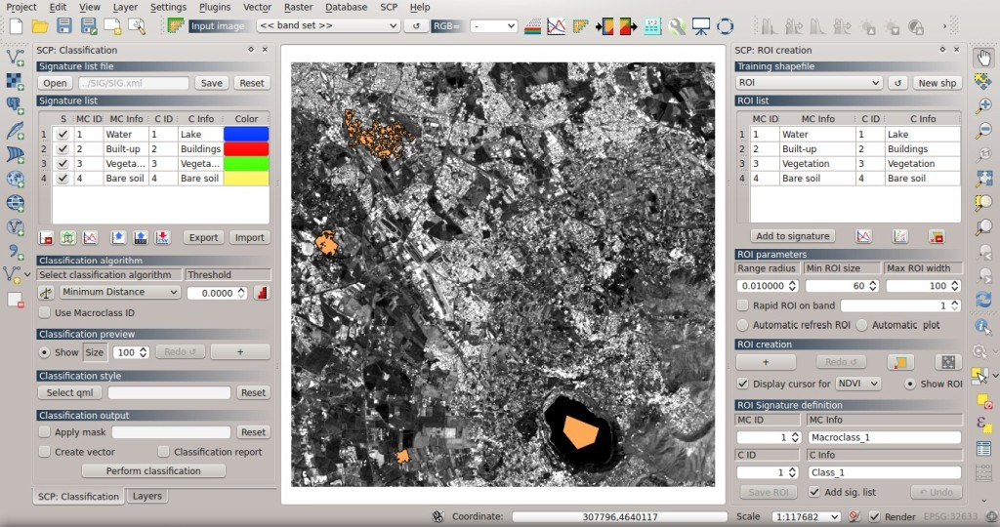

.. _tutorial_2_3:

Create the ROIs
------------------------------------------------------

We are going to create several ROIs using the Macroclass ID defined in the following table.
	
+-----------------------------+--------------------------+
| Macroclass name             | Macroclass ID            |
+=============================+==========================+
| Water                       |  1                       |
+-----------------------------+--------------------------+
| Built-up                    |  2                       |
+-----------------------------+--------------------------+
| Vegetation                  |  3                       |
+-----------------------------+--------------------------+
| Bare soil                   |  4                       |
+-----------------------------+--------------------------+

In the :ref:`toolbar` select the item ``3-2-1`` (which is natural color) in the list ``RGB=``.
After a few seconds, the :ref:`color_composite_definition` will be displayed.
We can see that urban areas are white and vegetation is green.

	**TIP** : If a :ref:`band_set_tab` is defined, a temporary virtual raster (named ``band_set.vrt``) is created automatically, which allows for the display of :ref:`color_composite_definition`. In order to speed up the visualization, you can show only the virtual raster and hide all the single band rasters from the QGIS Layers.

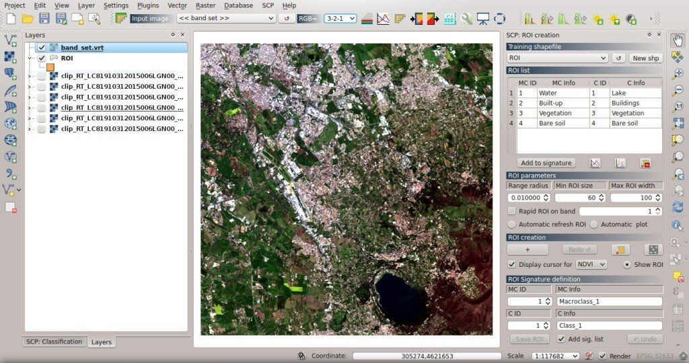
	
	:guilabel:`Color composite RGB = 3-2-1`
	
In the :ref:`toolbar` type ``3-4-6`` in the list ``RGB=``.
Using this color composite, urban areas are purple and vegetation is green.
You can notice that this color composite ``RGB = 3-4-6`` highlights roads more than ``RGB = 3-2-1``.

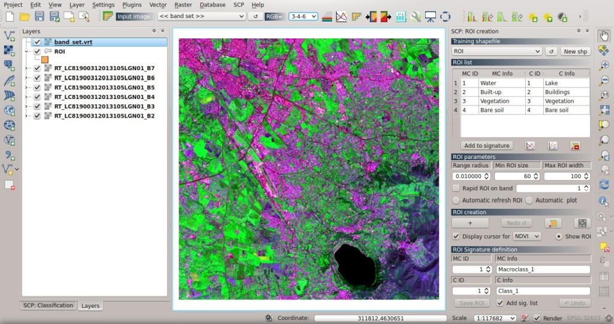
	
	:guilabel:`Color composite RGB = 3-4-6`

See :ref:`tutorial_1_4` for the details about the ROI creation by manually drawing a polygon or with an automatic region growing algorithm.

	**TIP** : Install the `OpenLayers Plugin <http://plugins.qgis.org/plugins/openlayers_plugin/>`_ in QGIS, and add a map (e.g. `OpenStreetMap <http://www.openstreetmap.org>`_) in order to facilitate the identification of ROIs using high resolution data.

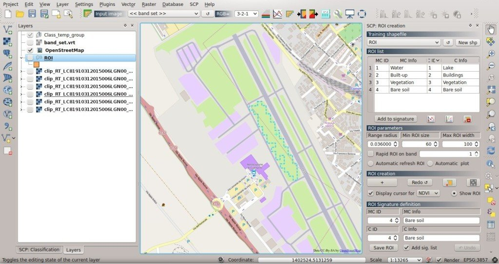
	
	:guilabel:`Creation of a ROI displaying OpenStreetMap`
	
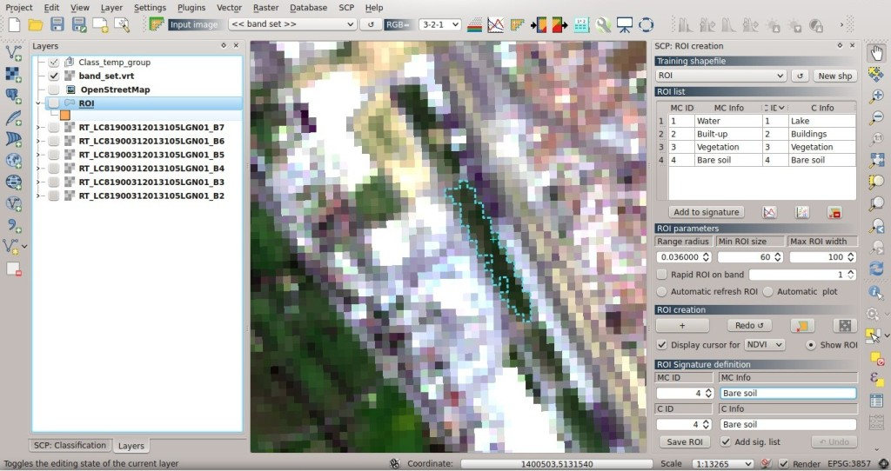
	
	:guilabel:`The same ROI displaying the color composite RGB = 3-2-1`
	
After clicking the button ``+`` in the :ref:`ROI_creation` you should notice that the cursor in the map displays a value changing over the image.
This is due to the function ``Display cursor for NDVI`` in the :ref:`ROI_creation`, which displays the NDVI value of the pixel beneath the cursor.
The NDVI value can be useful for identifying pure pixels, in fact vegetation has higher NDVI values than soil.

For instance, move the mouse over a vegetation area and left click to create a ROI when you see a local maximum value.
This way, the created ROI and the spectral signature thereof will be particularly representative of healthy vegetation.

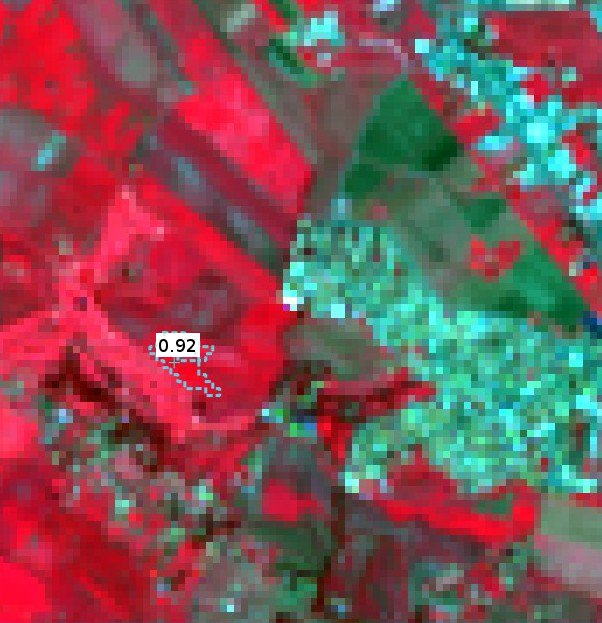
	
	:guilabel:`Example of NDVI value of vegetation displayed in the map`
	
Create several ROIs (the more is the better).
In general, you should create one ROI for each color that you can distinguish in the image.
Therefore, change the color composite in order to identify the different types of land cover.

	**TIP** : Change frequently the :ref:`color_composite_definition` in order to clearly identify the materials at the ground; use the mouse wheel on the list ``RGB=`` for changing the color composite rapidly.

A few examples of ROIs are illustrated in the following figures. 

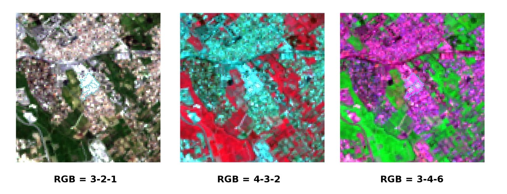
	
	:guilabel:`Built-up ROI: large buildings`
	
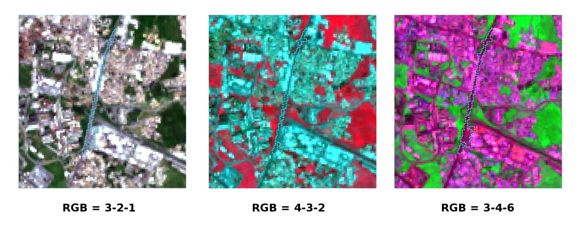
	
	:guilabel:`Built-up ROI: road`
	
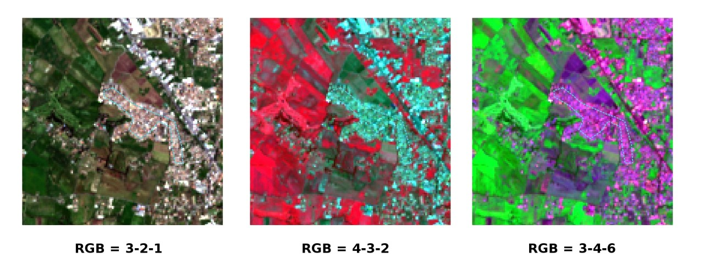
	
	:guilabel:`Built-up ROI: buildings and narrow roads`
	
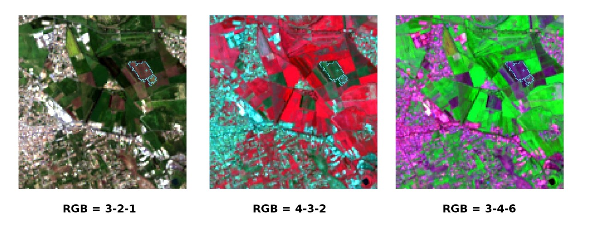
	
	:guilabel:`Bare soil ROI: uncultivated land`
	
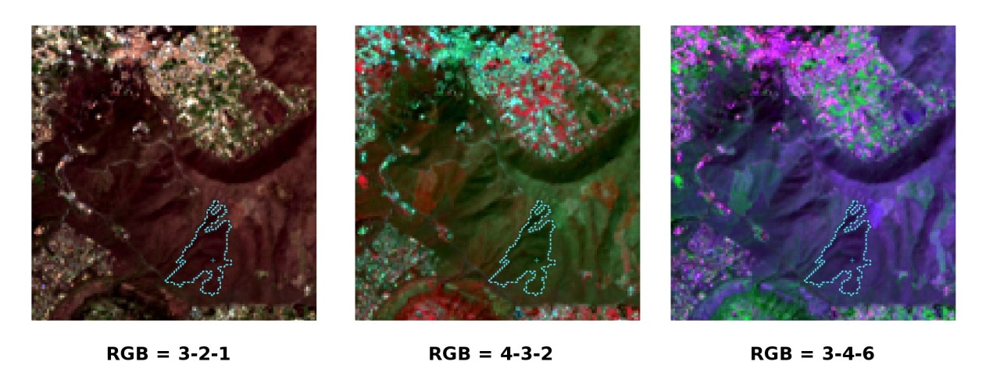
	
	:guilabel:`Vegetation ROI: deciduous trees`
	
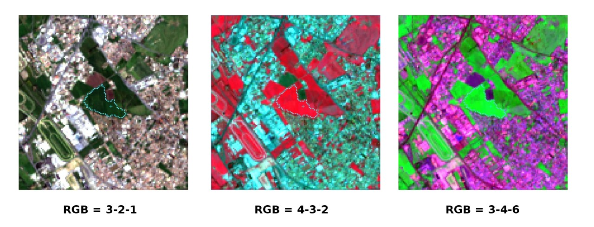
	
	:guilabel:`Vegetation ROI: crop`

It is worth mentioning that you can show or hide the temporary ROI by switching ``Show ROI`` in :ref:`ROI_creation`.
	
.. _tutorial_2_4:

Create a Classification Preview
------------------------------------------------------

As pointed out in :ref:`tutorial_1`, previews are temporary classifications that are useful for assessing the effects of spectral signatures during the ROI collection.

Set the colors of the spectral signatures in the :ref:`signature_list`; then, in the :ref:`classification_alg` select the classification algorithm ``Spectral Angle Mapping``.
In :ref:`classification_preview` set ``Size`` = 500 , click the button ``+`` and then left click the map in order to create a classification preview.

The preview result is displayed in the map.
Previews are temporary rasters (deleted after QGIS is closed) placed in a group named ``Class_temp_group`` in the QGIS panel Layers.

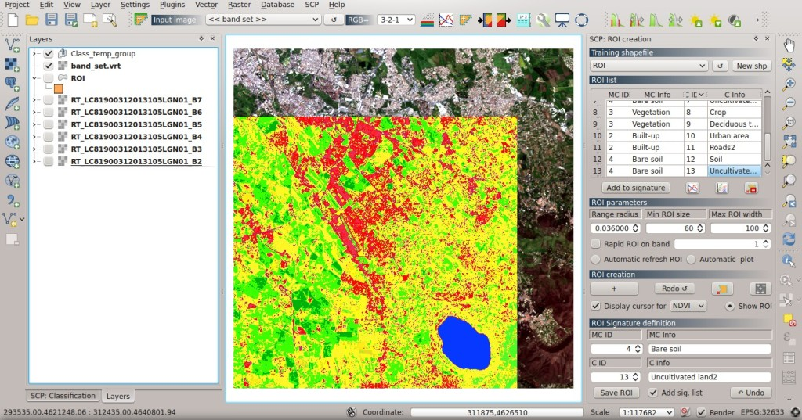

Place the ``Class_temp_group`` to the top of layers in order to display the preview over the image.
Also, in :ref:`classification_preview` switch the button ``Show`` in order to show or hide the previews.
	
In QGIS, you could notice one or more warnings similar to this ``Warning [9]: The following signature has wavelength different from band set. Macro: 1 ID: 1`` (see the following Figure :ref:`figWar9`).
This is because in :ref:`tutorial_2_2` we have loaded the ``Signature list file``, created in :ref:`tutorial_1` without defining the center wavelength of each band.

.. _figWar9:

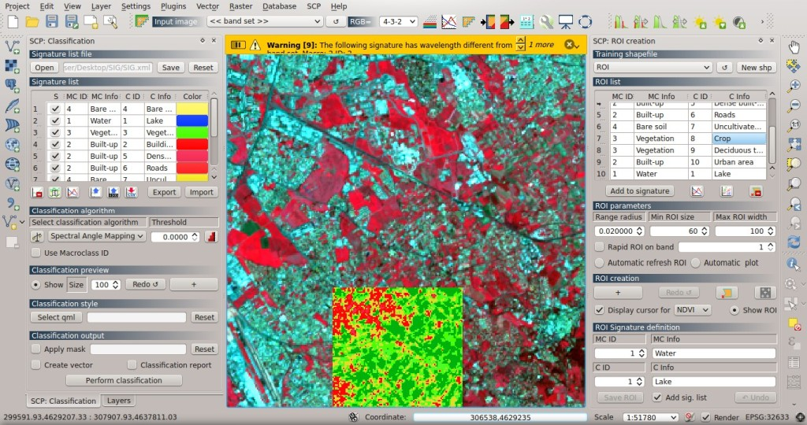
	
	:guilabel:`Warning [9]`
	
We need to delete the signatures created in :ref:`tutorial_1` from the :ref:`signature_list_file`: highlight (with mouse selection in the table) these signatures and click the button |delete_sign|.
Then highlight (with mouse selection in the table) the corresponding ROIs in the :ref:`ROI_list` and click the button ``Add to signature``.
The spectral signatures will be calculated with the correct center wavelength and added to the :ref:`signature_list_file`.

.. _tutorial_2_5:

Assess Spectral Signatures
------------------------------------------------------
	
The classification algorithm uses spectral signatures for classifying the image.
In general, one should use spectral signatures that are not similar, in order to avoid classification errors.
Therefore, it is useful to assess signatures in order to find similar spectral signatures and delete them.

Highlight (with mouse selection in the table) two or more spectral signatures in the :ref:`signature_list` then click the button |sign_plot| .
The :ref:`spectral_signature_plot` is displayed in a new window.
In this window you can see the spectral :ref:`signature_plot` of signatures, the :ref:`signature_details`, and assess :ref:`spectral_distances`.
Move inside the :ref:`signature_plot` and see if signatures are similar (i.e. very close) or dissimilar (i.e. not very close).

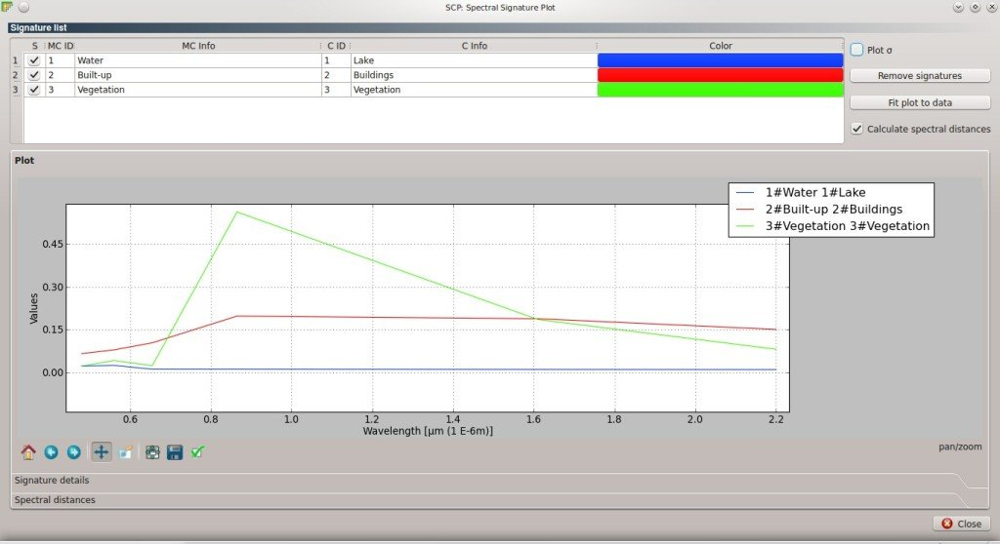
	
.. _tutorial_2_6:

Create the Classification Output
------------------------------------------------------
	
Repeat iteratively the phases :ref:`tutorial_2_3` and :ref:`tutorial_2_4` until the classification previews are good.

In order to create a classification output using only the Macroclass ID defined in :ref:`tutorial_2_3` activate the checkbox ``Use Macroclass ID`` in :ref:`classification_alg`.

In order to classify the entire image, in the :ref:`classification_output` click the button ``Perform classification`` and define the name of the classification output.

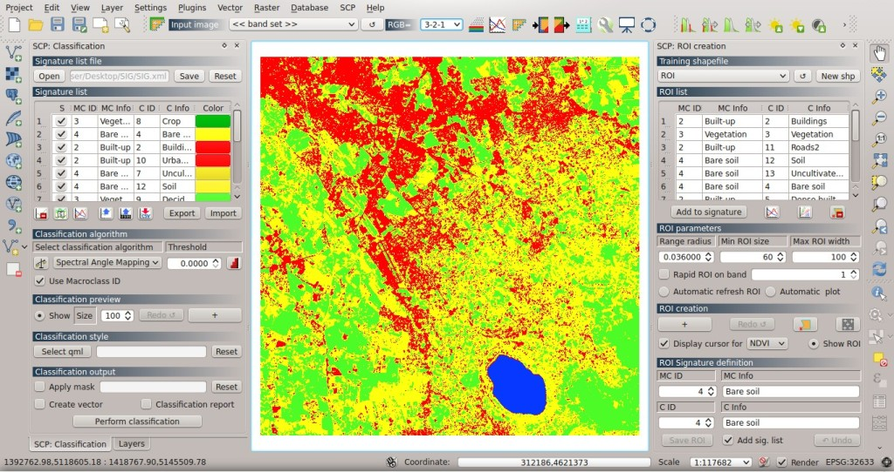
	
	:guilabel:`Resulting classification`

You can notice that the resulting classification is better than the one created in :ref:`tutorial_1`.
However, there are other tools and techniques that can improve the results which are described in :ref:`other_tutorials`.

.. _other_tutorials:
 
Other Tutorials
========================================================

Other :ref:`thematic_tutorials` are available about SCP functions. 

Also, visit the blog `From GIS to Remote Sensing <http://fromgistors.blogspot.com/search/label/Tutorial>`_ for other tutorials such as:

* `Supervised Classification of Hyperspectral Data <http://fromgistors.blogspot.com/2014/10/supervised-classification-of-hyperspectral.html>`_;

* `Monitoring Deforestation <http://fromgistors.blogspot.com/2014/09/monitoring-changes-in-amazon-rainforest.html>`_;

* `Flood Monitoring <http://fromgistors.blogspot.com/2014/09/flood-monitoring-tutorial-using-semi.html>`_;

* `Estimation of Land Surface Temperature with Landsat Thermal Infrared Band <http://fromgistors.blogspot.com/2014/01/estimation-of-land-surface-temperature.html>`_;

* `Land Cover Classification of Cropland <http://fromgistors.blogspot.com/2014/01/land-cover-classification-of-cropland.html>`_.

For other unofficial tutorials, also in languages other than English, see :ref:`other_3`.
	
.. |refresh| image:: _static/refresh_button.jpg
	:width: 20pt
	
.. |manual| image:: _static/semiautomaticclassificationplugin_manual_ROI.jpg
	:width: 20pt
	
.. |preprocessing| image:: _static/semiautomaticclassificationplugin_class_tool.png
	:width: 20pt
	
.. |band_set| image:: _static/semiautomaticclassificationplugin_bandset_tool.png
	:width: 20pt
	
.. |delete_sign| image:: _static/semiautomaticclassificationplugin_delete_signature.png
	:width: 20pt
	
.. |sign_plot| image:: _static/semiautomaticclassificationplugin_sign_tool.png
	:width: 20pt
	
.. |tools| image:: _static/semiautomaticclassificationplugin_roi_tool.png
	:width: 20pt
	