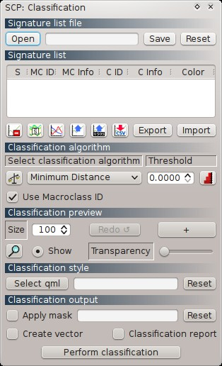
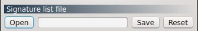
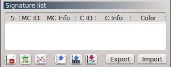
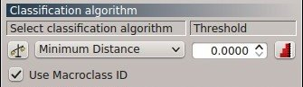
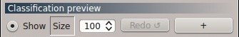
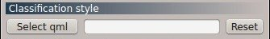
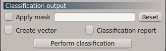

.. _classification_dock:

*******************
Classification dock
*******************

.. |br| raw:: html

  

	
	:guilabel:`Classification dock`
	
The dock ``Classification`` is designed to manage the **spectral signatures**, and **classify** the ``Input image``.

Spectral signatures define the characteristics of land cover classes.
Only spectral signatures in the :ref:`signature_list` are used by classification algorithms.
Spectral signatures are calculated from the ROIs of a ``Training shapefile`` (defined in the :ref:`roi_dock`). In addition, spectral signatures can be imported from files, from ASTER spectral libraries, or from the :ref:`USGS_spec_library_tab`.

Spectral signatures are saved in **signature list file** (.xml).

The use of the ``Macroclass ID`` or ``Class ID`` for classifications is defined with the option ``Use Macroclass ID`` in the :ref:`classification_alg`.

The **classification** can be performed for the entire image ( :ref:`classification_output` ) or a part of it, creating a :ref:`classification_preview`. 

|br|

[P] = Configuration stored in the active project of QGIS

[Q] = Configuration stored in QGIS registry

.. _signature_list_file:
 
Signature list file
-------------------

	
	:guilabel:`Signature list file`
	
* ``Open`` [P]: open a signature list file (a .xml file) loading the signatures in the :ref:`signature_list` and displaying the file path (absolute or relative path according to QGIS project settings);
* ``Save`` : save the signature list to the open file; if no signature list is open, a window will ask for the creation of a new signature file;
* ``Reset`` : clear the path of the signature list file.

.. _signature_list:
 
Signature list
--------------

	
	:guilabel:`Signature list`
	
The ``Signature list`` displays loaded spectral signatures.
Spectral signatures are automatically saved in the :ref:`signature_list_file`  every time the QGIS project is saved, or when the button ``Save`` is clicked.
In order to highlight items perform a mouse selection in the table.

* Table fields:
	* ``S`` : checkbox field; only the spectral signatures checked in this list are used for the classification process; double click on any item to check/uncheck all the items in the list;
	* ``MC ID`` : signature Macroclass ID [int]; it can be edited with a single click;
	* ``MC Info`` : signature Macroclass Information [text]; it can be edited with a single click;
	* ``C ID`` : signature Class ID [int]; it can be edited with a single click;
	* ``C Info`` : signature Class Information [text]; it can be edited with a single click;
	* ``Color`` : color field; double click to select a color for the class that is used in the classification.
* |delete_sign|: delete highlighted spectral signatures from the list;
* |merge_sign|: merge highlighted spectral signatures obtaining a new signature calculated as the average of signature values for each band (covariance matrix is excluded);
* |sign_plot|: add highlighted signatures to the :ref:`spectral_signature_plot`;
* |spectral_library|: import a spectral library from ASTER spectral libraries (i.e. files .txt downloaded from http://speclib.jpl.nasa.gov), USGS spectral libraries (i.e. files .asc downloaded from http://speclab.cr.usgs.gov/spectral-lib.html), or generic .csv files;
* |USGS_spectral_library|: open the :ref:`USGS_spec_library_tab` for importing USGS spectral libraries directly from internet;
* |export_csv| : open a window for exporting signatures; every signature is exported as a .csv file in the selected directory;
* ``Export``: export the signature list to a new signature file (i.e. a .xml file for the :ref:`signature_list_file` );
* ``Import``: import a .xml file, adding the spectral signatures to the ones already loeaded in the ``Signature list``.
	
.. |delete_sign| image:: _static/semiautomaticclassificationplugin_delete_signature.png
	:width: 20pt
		
.. |merge_sign| image:: _static/semiautomaticclassificationplugin_merge_sign_tool.png
	:width: 20pt
	
.. |spectral_library| image:: _static/semiautomaticclassificationplugin_import_spectral_library.png
	:width: 20pt
	
.. |USGS_spectral_library| image:: _static/semiautomaticclassificationplugin_import_USGS_spectral_library.png
	:width: 20pt
		
.. |export_csv| image:: _static/semiautomaticclassificationplugin_export_sign_to_csv.png
	:width: 20pt
	
.. |sign_plot| image:: _static/semiautomaticclassificationplugin_sign_tool.png
	:width: 20pt
	
.. _classification_alg:

Classification algorithm
------------------------

	
	:guilabel:`Classification algorithm`
	
* |weight_tool| : open the :ref:`Algorithm_band_weight_tab` for the definition of band weights;
*  ``Select a classification algorithm`` : select one of the :ref:`classification_algorithm_definition`; available classification algorithms are:
	* :ref:`minimum_distance_algorithm`;
	* :ref:`max_likelihood_algorithm`;
	* :ref:`spectra_angle_mapping_algorithm`;
* ``Threshold`` [optional]: allows for the definition of a classification threshold for all the spectral signatures (for individual settings see :ref:`Signature_threshold_tab`); if threshold is equal to 0, then no threshold is considered and all image pixels are classified; otherwise:
	* for Minimum Distance, pixels are unclassified if distance is greater than threshold value;
	* for Maximum Likelihood, pixels are unclassified if probability is less than threshold  value (max 100);
	* for Spectral Angle Mapping, pixels are unclassified if spectral angle distance is greater than threshold value (max 90);

* ``Use Macroclass ID`` : if checked, the classification is performed using the Macroclass ID (code `MC ID` of the signature); if unchecked, then the classification is performed using the Class ID (code `C ID` of the signature);
* |threshold_tool| : open the :ref:`Signature_threshold_tab` for the definition of signature thresholds.

.. |weight_tool| image:: _static/semiautomaticclassificationplugin_weight_tool.png
	:width: 20pt

.. |threshold_tool| image:: _static/semiautomaticclassificationplugin_threshold_tool.png
	:width: 20pt

.. _classification_preview:

Classification preview
----------------------

	
	:guilabel:`Classification preview`
	
Classification previews are temporary classifications of part of the `input image` (every pixel has a value that represents a class).
Also, a algorithm raster can be displayed with a click on the map; algorithm raster represents the distance of the classified pixel to the corresponding signature (every pixel has a value calculated by the algorithm with the spectral signature);
algorithm raster is useful for assessing how much a pixel classified as class `X` is distant from the corresponding spectral signature `X` (black pixels are distant from the spectral signature and white pixels are closer).
Previews are temporarily placed in QGIS Layers inside a layer group named ``Class_temp_group`` (custom name can be defined in  :ref:`group_name` ) and are deleted when the QGIS session is closed.

* < ``Show`` >: show/hide the temporary preview group on the map;
* < ``Size`` >: size in pixel unit of a classification preview (i.e. the side length of a square, centred at the clicked pixel);
* [ ``Redo`` ]: create a new classification preview centred at the same pixel of the previous one;
* [+]: activate the pointer for the creation of a classification preview ; left click the map for starting the classification process and showing the classification preview; right click for starting the classification process and showing the algorithm raster of the preview.

.. _classification_style:

Classification style
--------------------

	
	:guilabel:`Classification style`
	
**Class colors** (for classifications and previews) are defined in the :ref:`signature_list` ; in addition, a `classification style` can be loaded from a QGIS .qml file saved previously.

* [ ``Select qml`` ] [P]: select a .qml file overriding the colors defined in the :ref:`signature_list` ;
* [ ``Reset`` ]: reset style to default (i.e. class colors are derived from the :ref:`signature_list`).

.. _classification_output:

Classification output
---------------------

	
	:guilabel:`Classification output`
	
The **classification output** is a .tif raster file.

* ``Apply mask`` [optional]: if checked, a mask shapefile can be selected and used for masking the classification (i.e. the part of `input image` that is outside the mask shapefile will not be classified);
* [ ``Reset`` ]: reset the shapefile mask;
* ``Create vector`` [optional]: if checked, when ``Perform classification`` is clicked,  a shapefile of the classification is saved inside the same folder and with the same name defined for the classification output; conversion to vector can also be performed later in :ref:`classification_vector_tab`;
* ``Classification report`` [optional]: if checked, when ``Perform classification`` is clicked, a report about the land cover classification is calculated providing the pixel count, the percentage and area for each class; the report is saved as a .csv file in the same folder and with the same name defined for the classification output and the suffix ``_report``; in addition, the results are shown in the :ref:`classification_report_tab`;
* [ ``Perform classification`` ]: define a classification output (a .tif file) and perform the image classification (the .qml file of the QGIS style is saved along with the classification).
