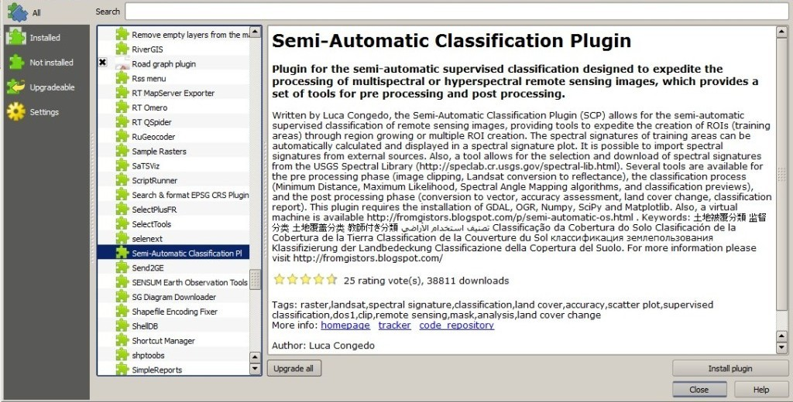
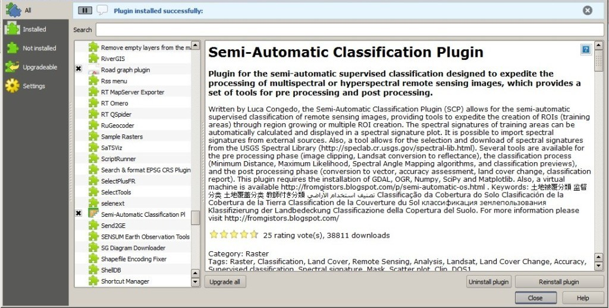
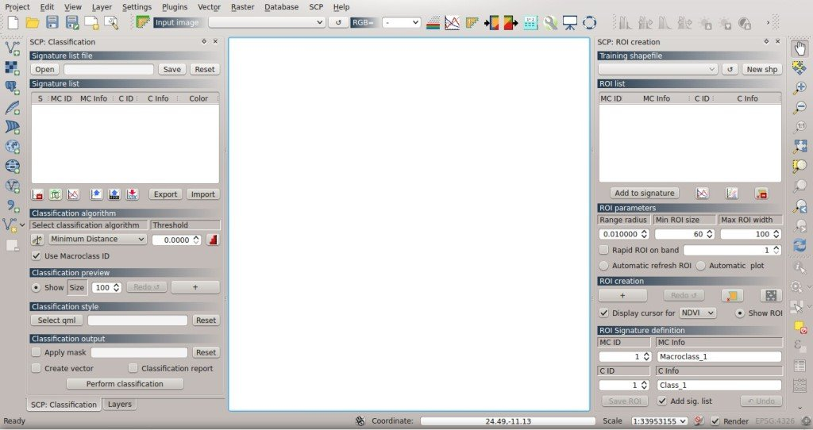

.. _installation_win32:

*******************************
Installation in Windows 32 bit
*******************************

.. |br| raw:: html

	 

.. _QGIS_installation_win32bit:
 
QGIS download and installation
------------------------------------------

* Download the latest QGIS version 32 bit from `here <http://www.qgis.org/en/site/forusers/download.html>`_ (the direct download of QGIS 2.8 from this `link <http://qgis.org/downloads/QGIS-OSGeo4W-2.8.1-1-Setup-x86.exe>`_);

* Execute the QGIS installer with administrative rights, accepting the default configuration.

Now, QGIS 2 is installed.

.. _plugin_installation_win32bit:
 
Semi-Automatic Classification Plugin installation
--------------------------------------------------

* Run QGIS 2;

* From the main menu, select ``Plugins`` > ``Manage and Install Plugins``;

* From the menu ``All``, select the Semi-Automatic Classification Plugin and click the button ``Install plugin``;

* The SCP should be automatically activated; however, be sure that the Semi-Automatic Classification Plugin is checked in the menu ``Installed`` (the restart of QGIS could be necessary to complete the SCP installation);

.. _plugin_configuration_win32bit:

Configuration of the plugin
---------------------------

Now, the Semi-Automatic Classification Plugin is installed and two docks and a toolbar should be added to QGIS.
Also, a SCP menu is available in the Menu Bar of QGIS. 
It is possible to move the :ref:`toolbar` and the docks according to your needs, as in the following image.

Known issues
---------------------------
QGIS 32bit installation could include an old version of NumPy as default; in order to use some SCP tools (e.g. :ref:`land_cover_change_tab` ), the update of NumPy is required. Please, follow the instructions described in :ref:`error_2`.