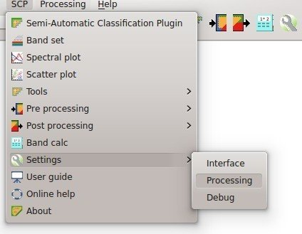

.. _installation_win64:

*******************************
Installation in Windows 64 bit
*******************************

.. |br| raw:: html

	 

.. _QGIS_installation_win64bit:
 
QGIS download and installation
------------------------------------------

* Download the latest QGIS version 64 bit from `here <http://www.qgis.org/en/site/forusers/download.html>`_ (the direct download of QGIS 2.8 from this `link <http://qgis.org/downloads/QGIS-OSGeo4W-2.8.1-1-Setup-x86_64.exe>`_);

* Execute the QGIS installer with administrative rights, accepting the default configuration.

Now, QGIS 2 is installed.

.. image:: _static/QGIS.jpg

.. _plugin_installation_win64bit:
 
Semi-Automatic Classification Plugin installation
---------------------------------------------------

* Run QGIS 2;

* From the main menu, select ``Plugins`` > ``Manage and Install Plugins``;

.. image:: _static/install.jpg

* From the menu ``All``, select the Semi-Automatic Classification Plugin and click the button ``Install plugin``;

.. image:: _static/plugins.jpg

* The SCP should be automatically activated; however, be sure that the Semi-Automatic Classification Plugin is checked in the menu ``Installed`` (the restart of QGIS could be necessary to complete the SCP installation);

.. image:: _static/plugins_installed.jpg

.. _plugin_configuration_win64bit:

Configuration of the plugin
---------------------------

Now, the Semi-Automatic Classification Plugin is installed and two docks and a toolbar should be added to QGIS.
Also, a SCP menu is available in the Menu Bar of QGIS. 
It is possible to move the :ref:`toolbar` and the docks according to your needs, as in the following image.

.. image:: _static/SemiAutomaticClassificationPlugin.jpg

The configuration of available RAM is recommended in order to reduce the processing time. 
From the :ref:`SCP_menu` select |settings| ``Settings > Processing`` .

In the :ref:`settings_tab`, set the ``Available RAM (MB)`` to a value that should be half of the system RAM. For instance, if your system has 2GB of RAM, set the value to 1024MB.

	
.. image:: _static/RAMSettings.jpg