.. _main_interface_window:

******************************
Main Interface Window
******************************

.. |br| raw:: html

  

The Main Interface Window is composed of several tabs grouped in sections. Each section contains several functions that are useful for the classification process, the pre processing of images, and the post processing of land cover classifications.

Three buttons are always available:

* ``Show docks`` : show the :ref:`roi_dock` and the :ref:`classification_dock` if closed;
* ``Quick user guide`` : open the online user manual in a web browser;
* ``Online help`` : open the `Online help <http://fromgistors.blogspot.com/p/ask-for-help.html>`_ in a web browser; also, a `Facebook group <https://www.facebook.com/groups/661271663969035/>`_ and a `Google+ Community <https://plus.google.com/communities/107833394986612468374>`_ are available for sharing information and asking for help about SCP.
	
|br|

[P] = Configuration stored in the active project of QGIS

[Q] = Configuration stored in QGIS registry

Following, the list of tabs and the description thereof:

.. contents::
    :depth: 2
    :local:
	

.. _tools_tab:
 
Tools
==========

The tab ``Tools`` includes several tools for the creation and manipulation of ROI and spectral signatures.

.. _multiple_rois_tab:

Multiple ROI Creation
-------------------------

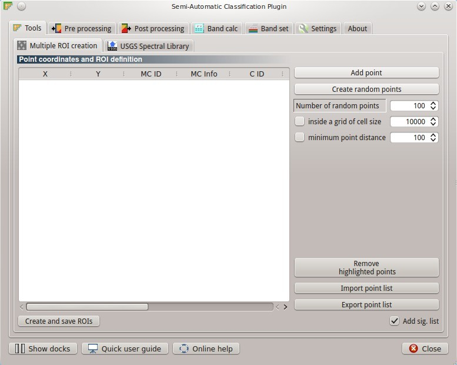
	
	:guilabel:`Multiple ROI Creation`

The tab ``Multiple ROI Creation`` allows for the automatic creation of ROIs, useful for the rapid classification of multi-temporal images, or for accuracy assessment (see `this tutorial <http://fromgistors.blogspot.com/2014/09/accuracy-assessment-using-random-points.html>`_ ).
It performs the region growing of ROIs at user defined points, requiring a list of point coordinates and class definitions. Created ROIs are automatically saved to the :ref:`training_shapefile`.

.. _point_coordinates:

Point coordinates and ROI definition
^^^^^^^^^^^^^^^^^^^^^^^^^^^^^^^^^^^^

* Table fields:
	* ``X [float]`` : point X coordinate;
	* ``Y [float]`` : point Y coordinate;
	* ``MC ID`` [P]: ROI Macroclass ID [int];
	* ``MC Info`` [P]: ROI Macroclass information [text];
	* ``C ID`` [P]: ROI Class ID [int];
	* ``C Info`` [P]: ROI Class information [text];
	* ``Min size [int]`` : the minimum area of a ROI (in pixel unit) corresponding to ``Min ROI size`` in :ref:`ROI_parameters` ;
	* ``Max width [int]`` : the maximum width of a ROI corresponding to ``Max ROI width`` in :ref:`ROI_parameters` ;
	* ``Range radius [float]`` : the interval which defines the maximum spectral distance between the seed pixel and the surrounding pixels (in radiometry unit) corresponding to ``Range radius`` in :ref:`ROI_parameters` ;
	* ``Rapid ROI band [int]`` : if defined, ROI is created only on the selected band; corresponding to ``Rapid ROI on band`` in :ref:`ROI_parameters` ;
* [ ``Add point`` ]: add a new row to the table for the definition a point; all the table fields must be filled for the ROI creation;
* [ ``Create random points`` ]: create random points inside the ``input image`` area; the point amount is defined in ``Number of random points``;
* [ ``Number of random points`` ]: set a number of points that will be created when ``Create random points`` is clicked;
* ``inside a grid of cell size``: if checked, the ``input image`` area is divided in cells where the size thereof is defined in the combobox [image unit, usually meters]; points defined in ``Number of random points`` are created randomly within each cell;
* ``minimum point distance``: if checked, random points have a minimum distance defined in the combobox [image unit, usually meters]; setting a minimum distance can result in fewer points than the number defined in ``Number of random points``;
* [ ``Remove highlighted points`` ]: delete the highlighted rows from the table;
* [ ``Import point list`` ]: import a point list from text file to the table; every line of the text file must contain values separated by tabs of ``X [float]``, ``Y [float]``, ``MC ID [int]``, ``MC Info [text]``, ``Class ID [int]``, ``C Info [text]``, ``Min size [int]``, ``Max width [int]``, ``Range radius [float]``, and optionally the ``Rapid ROI band [int]``;
* [ ``Export point list`` ]: export the point list to text file;
* [ ``Create and save ROIs`` ]: start the ROI creation process for all the points and save ROIs to the Training shapefile;
* ``Add sig. list``: if checked, the spectral signature is calculated (the ROI mean value, and standard deviation for each raster band, and the covariance matrix) while the ROI is saved to shapefile (it takes some time depending on the number of ``Input image`` bands).

.. _USGS_spec_library_tab:

USGS Spectral Library
-------------------------

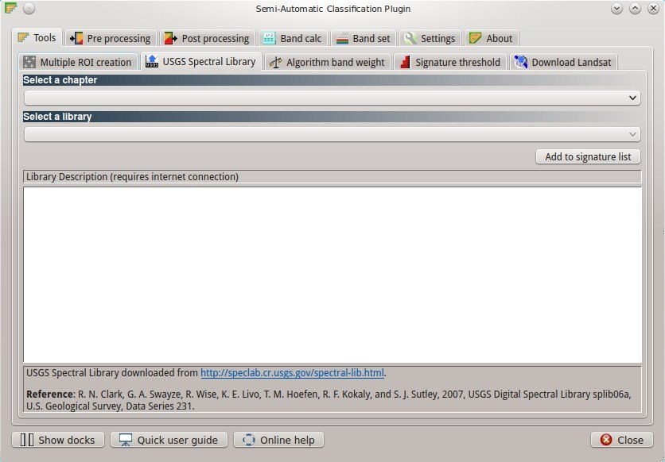
	
	:guilabel:`USGS Spectral Library`

The tab ``USGS Spectral Library`` allows for the download of the `USGS spectral library <http://speclab.cr.usgs.gov/spectral-lib.html>`_ (Clark, R.N., Swayze, G.A., Wise, R., Livo, E., Hoefen, T., Kokaly, R., Sutley, S.J., 2007, USGS digital spectral library splib06a: U.S. Geological Survey, Digital Data Series 231). The libraries are grouped in chapters including Minerals, Mixtures, Coatings, Volatiles, Man-Made, Plants, Vegetation Communities,
Mixtures with Vegetation, and Microorganisms.
The downloaded library is automatically sampled according to the image band wavelengths defined in the :ref:`band_set_tab`, and added to the :ref:`signature_list`.

.. _select_chapter:

Select a chapter
^^^^^^^^^^^^^^^^^

* ``Select a chapter`` : select one of the library chapters; after the selection, chapter libraries are shown in :ref:`select_library`;

.. _select_library:

Select a library
^^^^^^^^^^^^^^^^^

* ``Select a library`` : select one of the libraries; the library description is displayed in the frame ``Library description``;
* ``Add to signature list [internet connection required]`` : download the library and add the sampled spectral signature to the :ref:`signature_list` using the parameters defined in :ref:`ROI_signature_definition`.

	**Tip**: spectral libraries downloaded from the ``USGS Spectral Library`` can be used with Minimum Distance or Spectral Angle Mapping algorithms, but not Maximum Likelihood because this algorithm needs the covariance matrix that is not included in the spectral libraries.
	
.. _Algorithm_band_weight_tab:

Algorithm band weight
-------------------------

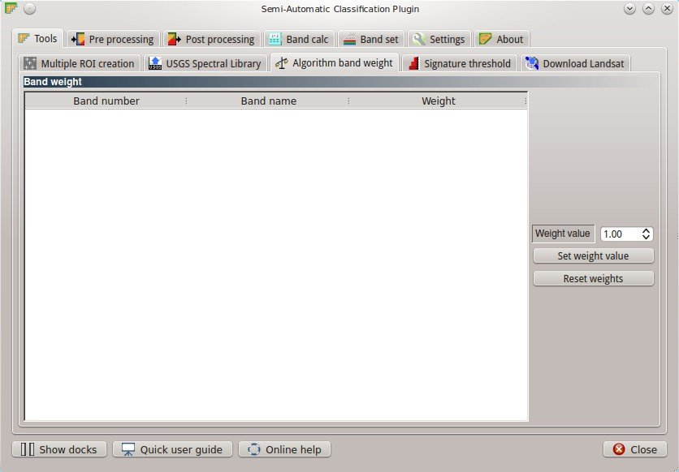
	
	:guilabel:`Algorithm band weight`

The tab ``Algorithm band weight`` allows for the definition of band weights that are useful for improving the spectral separability of materials.
During the classification process, the spectral signature values and the corresponding band weights are multiplied thus modifying the spectral distances.

.. _band_weight:

Band weight
^^^^^^^^^^^^^^^^^
		
* Table fields:
	* ``Band number`` : number of the band in the band set;
	* ``Band name`` : name of the band;
	* ``Weight`` : weight of the band; it can be edited directly or through the button ``Set weight value``;
	
* [ ``Weight value`` ]: value of weight used with the button ``Set weight value``;
* [ ``Set weight value`` ]: set the value defined in ``Weight value`` for all the highlighted bands in the table;
* [ ``Reset weights`` ]: reset all band weights to 1.
		
.. _Signature_threshold_tab:

Signature threshold
-------------------------

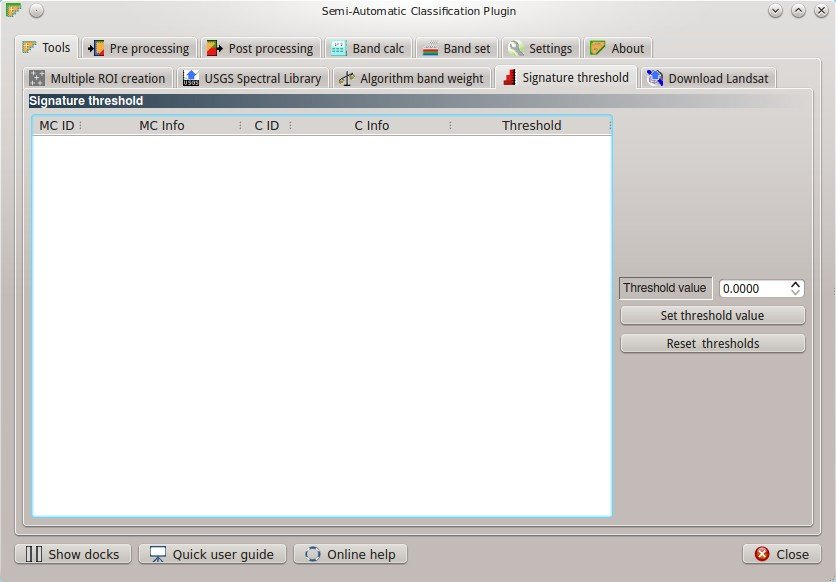
	
	:guilabel:`Signature threshold`

The tab ``Signature threshold`` allows for the definition of a classification threshold for each spectral signature.
This is useful for improving the classification results, especially when spectral signatures are similar.
Thresholds of signatures are saved in the :ref:`signature_list_file`.

If threshold is 0 then no threshold is applied.
Depending on the selected :ref:`classification_alg` the threshold value is considered differently:

* for Minimum Distance, pixels are unclassified if distance is greater than threshold value;
* for Maximum Likelihood, pixels are unclassified if probability is less than threshold  value (max 100);
* for Spectral Angle Mapping, pixels are unclassified if spectral angle distance is greater than threshold value (max 90).
	
.. _signature_threshold:

Signature threshold
^^^^^^^^^^^^^^^^^^^^^^^
		
* Table fields:
	* ``MC ID`` : signature Macroclass ID;
	* ``MC Info`` : signature Macroclass Information;
	* ``C ID`` : signature Class ID;
	* ``C Info`` : signature Class Information;
	* ``Threshold`` : signature threshold;
	
* [ ``Threshold value`` ]: value of threshold used with the button ``Set threshold value``;
* [ ``Set threshold value`` ]: set the value defined in ``Threshold value`` for all the highlighted signatures in the table;
* [ ``Reset thresholds`` ]: reset all signatures thresholds to 0 (i.e. no threshold used);
* [ ``Automatic thresholds`` ]: calculate automatically a threshold for all the highlighted signatures based on the standard deviation thereof (currently works for Minimum Distance and Spectral Angle Mapping calculating the distance or angle between mean signature and mean + standard deviation signature);
* [ ``Multiplicative value`` ]: each threshold value calculated with ``Automatic thresholds`` is multiplied by this value.

.. _Landsat_download_tab:

Download Landsat
-------------------------

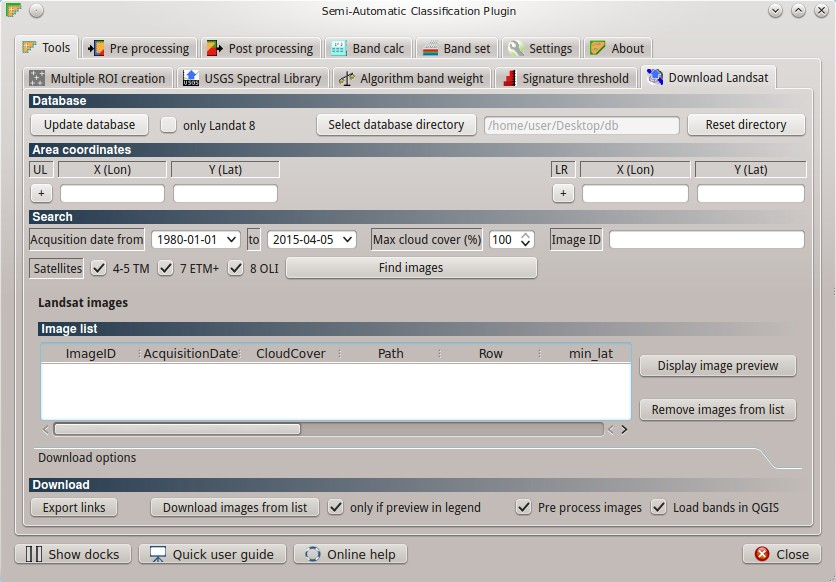
	
	:guilabel:`Download Landsat`

The tab ``Download Landsat`` allows for searching and downloading the :ref:`Landsat_definition` 4, 5, 7, and 8 images of the whole world from the 80s to present days, freely available through the `Google Earth Engine <https://earthengine.google.org/#intro>`_ and the `Amazon Web Services (AWS) <http://aws.amazon.com/public-data-sets/landsat/>`_ .
Before the use of this tool, the download of the Landsat image dabatase (about 500MB) is required, which consist of the following files (updated daily):

* http://landsat-pds.s3.amazonaws.com/scene_list.gz
* http://landsat.usgs.gov/metadata_service/bulk_metadata_files/LANDSAT_8.csv.gz
* http://landsat.usgs.gov/metadata_service/bulk_metadata_files/LANDSAT_ETM.csv.gz
* http://landsat.usgs.gov/metadata_service/bulk_metadata_files/LANDSAT_ETM_SLC_OFF.csv.gz
* http://landsat.usgs.gov/metadata_service/bulk_metadata_files/LANDSAT_TM-1980-1989.csv.gz
* http://landsat.usgs.gov/metadata_service/bulk_metadata_files/LANDSAT_TM-1990-1999.csv.gz
* http://landsat.usgs.gov/metadata_service/bulk_metadata_files/LANDSAT_TM-2000-2009.csv.gz
* http://landsat.usgs.gov/metadata_service/bulk_metadata_files/LANDSAT_TM-2010-2012.csv.gz

Images from the Amazon Web Services allows for the download of single bands.

.. _database_landsat:

Database
^^^^^^^^^^^^^^^^^
	
* [ ``Update database`` ]: update Landsat database; only the databases of the satellites checked in ``Satellites`` under the tool :ref:`search_Landsat` are downloaded;
* ``only Landsat 8`` : if checked, only the Landsat 8 database is downloaded from the Amazon Web Services;
* [ ``Select database directory`` ] [Q]: select a directory where the Landsat database is stored; it is recommended to select a custom directory in order to prevent the database deletion when upgrading SCP;
* [ ``Reset directory`` ]: reset the database directory to the default SCP installation directory;
	
.. _area_coordinates_Landsat:

Area coordinates
^^^^^^^^^^^^^^^^^
	
Define the search area.

* [+]: click the map for the definition of the Upper Left (UL) and Lower Right (LR) point coordinates (X and Y) of the rectangle defining the search area; it is possible to enter the coordinates manually;

.. _search_Landsat:

Search
^^^^^^^^^^^^^^^^^
	
Define search settings such as the date of acquisition, maximum cloud cover, or search for specific Landsat images using the Image ID.
In addition it is possible to limit the search to certain Landsat satellites.

* ``Acquisition date from to`` : define the range of acquisition dates; a narrow date range can make the search faster;
* ``Max cloud cover (%)`` : define the maximum percentage of cloud cover present in the image;
* ``Image ID`` : search only the Image ID of Landsat images (e.g. ``LC81910312015006LGN00``); it is possible to enter multiple Image IDs separated by comma or semicolon (e.g. ``LC81910312015006LGN00, LC81910312013224LGN00`` );
* ``Satellites`` : search only the databases of the Landsat satellites checked here; deselecting unwanted satellites can make the search faster;
* [ ``Find images`` ]: start searching Landsat images; the search can last a few minutes depending on the settings thereof; results are displayed inside the table in :ref:`landsat_images`.

.. _landsat_images:

Landsat images
^^^^^^^^^^^^^^^^^

**Image list**

This table displays the results of the Landsat search.
		
* Table fields:
	* ``ImageID`` : the Landsat Image ID;
	* ``AcquisitionDate`` : date of acquisition of Landsat image;
	* ``CloudCover`` : percentage of cloud cover in the image;
	* ``Path`` : path of the image;
	* ``Row`` : row of the image;
	* ``min_lat`` : minimum latitude of the image;
	* ``min_lon`` : minimum longitude of the image;
	* ``max_lat`` : maximum latitude of the image;
	* ``max_lon`` : maximum longitude of the image;
	* ``Service`` : download service of the image;
	* ``Preview`` : URL of the image preview;
	
* [ ``Display image preview`` ]: display image preview of highlighted images in the map; preview are roughly georeferenced on the fly;
* [ ``Remove images from list`` ]: remove highlighted images from the list;
* [ ``Clear table`` ]: remove all images from the list;

.. _landsat_download_options:

Download options
^^^^^^^^^^^^^^^^^

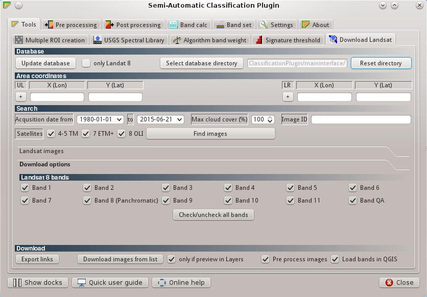
	
	:guilabel:`Download options`
		
**Landsat 8 bands**

* ``Bands`` : Only checked bands are downloaded (if the image is provided by  the Amazon Web Services);
* [ ``Check/uncheck all bands`` ]: select or deselect all Landsat 8 bands;
	
.. _landsat_download:

Download
^^^^^^^^^^^^^^^^^

It is possible to download multiple images (i.e. all the images in the image list table) and select which bands to download for each image.
During the download it is recommended not to interact with QGIS.

* [ ``Export links`` ]: export the download links to a text file;
* [ ``Download images from list`` ]: start the download process of all the images listed in :ref:`landsat_images`;
* ``only if preview in Layers`` : if checked, the download is performed only for the images listed in :ref:`landsat_images` that are also displayed as previews in the map;
* ``Pre process images`` : if checked, bands are converted to reflectance (and temperature) after the download, according to the settings defined in :ref:`landsat_tab`;
* ``Load bands in QGIS`` : if checked, bands are loaded in QGIS after the download;
	
.. _pre_processing_tab:
 
Pre processing
==================

The ``Pre processing`` tab allows for the manipulation of images before the actual classification process.

.. _landsat_tab:
 
Landsat
-----------

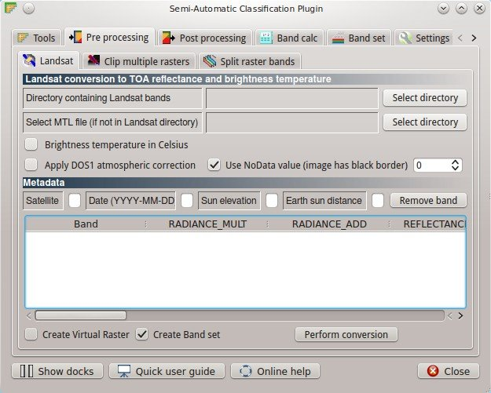
	
	:guilabel:`Landsat`
	
The tab ``Landsat`` allows for the conversion of **Landsat 1, 2, and 3 MSS** and **Landsat 4, 5, 7, and 8** images from DN (i.e. Digital Numbers) to the physical measure of Top Of Atmosphere reflectance (TOA), or the application of a simple atmospheric correction using the DOS1 method (Dark Object Subtraction 1), which is an image-based technique (for more information about the Landsat conversion to TOA and DOS1 correction, see :ref:`landsat_conversion_to_reflectance`).

Pan-sharpening is also available; for more information read :ref:`pan_sharpening_definition`.

.. _landsat_conversion:

Landsat conversion to TOA reflectance and brightness temperature
^^^^^^^^^^^^^^^^^^^^^^^^^^^^^^^^^^^^^^^^^^^^^^^^^^^^^^^^^^^^^^^^

* [ ``Select directory`` ]: select the ``Directory containing Landsat bands``; names of Landsat bands must end with the respective number; if the metafile (a .txt or .met file whit the suffix MTL) is inside this directory then :ref:`landsat_metadata` are filled;
* [ ``Select directory`` ] [optional]: ``Select MTL file`` if the metafile (a .txt or .met file whit the suffix MTL) is in a directory different than the ``Directory containing Landsat bands``;
* ``Brightness temperature in Celsius`` : if checked, convert brightness temperature to Celsius (if a Landsat thermal band is listed in :ref:`landsat_metadata`); if unchecked temperature is in Kelvin;
* ``Apply DOS1 atmospheric correction`` : if checked, the :ref:`DOS1_correction` is applied to all the bands (thermal bands excluded);
* ``Use NoData value (image has black border)`` : if checked, pixels having 'NoData' value are not counted during the DOS1 calculation of DNmin; it is useful when Landsat image has a black border (usually pixel value = 0).
* ``Perform pan-sharpening`` : if checked, a Brovey Transform is applied for the :ref:`pan_sharpening_definition` of Landsat bands.

.. _landsat_metadata:

Metadata
^^^^^^^^^^^^^^^^^

All the bands found in the ``Directory containing Landsat bands`` are listed in the metadata table.
Metadata for the corresponding bands are automatically filled using the metafile found inside the ``Directory containing Landsat bands`` or defined in ``Select MTL file``. In addition, it is possible to edit the metadata manually.
For information about metadata fields read `this page <http://landsat.usgs.gov/Landsat8_Using_Product.php>`_  and `this one <http://landsat.usgs.gov/how_is_radiance_calculated.php>`_ .

* < ``Satellite`` >: satellite name (e.g. Landsat8);
* < ``Date`` >: date acquired (e.g. 2013-04-15);
* < ``Sun elevation`` >: Sun elevation in degrees;
* < ``Earth sun distance`` >: Earth sun distance in astronomical units (automatically calculated if ``Date`` is filled;
* [ ``Remove band`` ]: remove highlighted bands from the table list;

* Table fields:
	* ``RADIANCE_MULT`` : multiplicative rescaling factor;
	* ``RADIANCE_ADD`` : additive rescaling factor;
	* ``REFLECTANCE_MULT`` : multiplicative rescaling factor;
	* ``REFLECTANCE_ADD`` : additive rescaling factor;
	* ``RADIANCE_MAXIMUM`` : radiance maximum;
	* ``REFLECTANCE_MAXIMUM`` : reflectance maximum;
	* ``K1_CONSTANT`` : thermal conversion constant;
	* ``K2_CONSTANT`` : thermal conversion constant;
	* ``LMAX`` : spectral radiance that is scaled to QCALMAX;
	* ``LMIN`` : spectral radiance that is scaled to QCALMIN;
	* ``QCALMAX`` : minimum quantized calibrated pixel value;
	* ``QCALMIN`` : maximum quantized calibrated pixel value;

* ``Create Virtual Raster`` : if checked, a virtual raster named ``landast.vrt`` is created and loaded in QGIS after the conversion;
* ``Create Band set`` : if checked, the Band set is created using converted bands after that ``Perform conversion`` is clicked;
* [ ``Perform conversion`` ]: select an output directory and start the conversion process; only bands listed in the Metadata table are converted; converted Landsat bands are saved in the output directory with the prefix ``RT_``, and automatically loaded in QGIS.
	
.. _clip_multiple_rasters_tab:

Clip multiple rasters
-------------------------

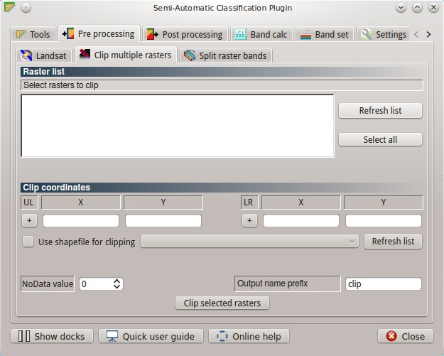
	
	:guilabel:`Clip multiple rasters`

The tab ``Clip multiple rasters`` allows for cutting several image bands at once, using a rectangle defined with point coordinates or a boundary defined with a shapefile.

.. _raster_list:

Raster list
^^^^^^^^^^^

* [ ``Refresh list`` ]: refresh layer list;
* [ ``Select all`` ]: select all the rasters to be clipped.

.. _clip_coordinates:

Clip coordinates
^^^^^^^^^^^^^^^^

* [+]: click the map for the definition of the Upper Left (UL) and Lower Right (LR) point coordinates (X and Y) of the rectangle used for clipping; it is possible to enter the coordinates manually;
* ``Use shapefile for clipping``: if checked, use the selected shapefile (already loaded in QGIS) for clipping, overriding point coordinates;
* < ``No data value`` >: set the value for 'NoData' pixels (e.g. pixel outside the clipped area);
* < ``Output name prefix`` >: set the prefix for output file names;
* [ ``Clip selected rasters`` ]: choose the output destination and clip selected rasters; only rasters selected in the :ref:`raster_list` are clipped and automatically loaded in QGIS.

.. _split_raster_tab:

Split raster bands
-------------------------

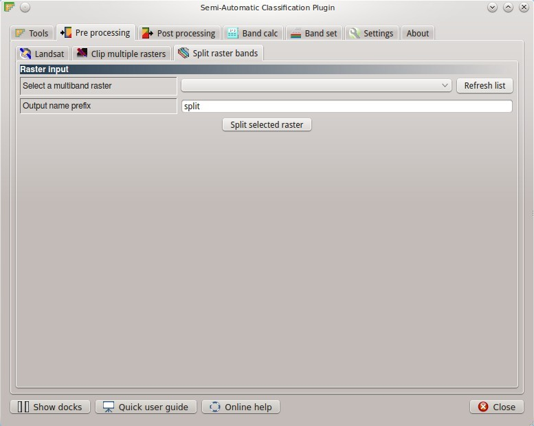
	
	:guilabel:`Split raster bands`

Split a multiband raster to single bands.

.. _raster_input:

* ``Select a multiband raster``: select a multiband raster already loaded in QGIS;
* < ``Output name prefix`` >: set the prefix for output file names;
* [ ``Split selected rasters`` ]: choose the output destination and split selected raster; output bands are automatically loaded in QGIS.

Raster input
^^^^^^^^^^^^^^^^

.. _post_processing_tab:
 
Post processing
===================

The tab ``Post processing`` provides several functions that can be applied to the classification output.

.. _accuracy_tab:
 
Accuracy
------------

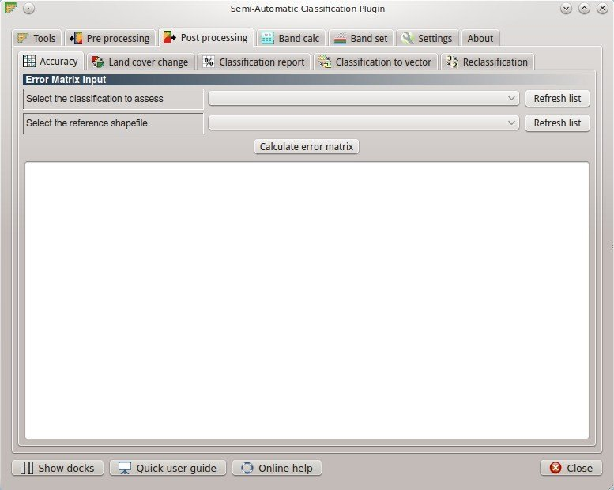
	
	:guilabel:`Accuracy`
	
The tab ``Accuracy`` allows for the validation of a classification (read :ref:`accuracy_assessment_definition` ).
Classification is compared to a reference raster or reference shapefile (which is automatically converted to raster).
If a shapefile is selected as reference, it is possible to choose a field describing class values.

Several statistics are calculated such as overall accuracy, user's accuracy, producer's accuracy, and Kappa hat.
The output is an ``error raster`` that is a .tif file showing the errors in the map, where pixel values represent the categories of comparison (i.e. combinations identified by the ``ErrorMatrixCode`` in the error matrix) between the classification and reference.
Also, a text file containing the error matrix (i.e. a .csv file separated by tab) is created with the same name defined for the .tif file.

.. _error_matrix_input:

Error Matrix Input
^^^^^^^^^^^^^^^^^^

* ``Select the classification to assess`` : select a classification raster;
* ``Select the reference shapefile or raster`` : select a raster or a shapefile, used as reference layer (ground truth) for the accuracy assessment;
* ``Shapefile field`` : if a shapefile is selected as reference, select a shapefile field containing numeric class values;
* [ ``Refresh list`` ]: refresh layer list;
* [ ``Calculate error matrix`` ]: choose the output destination and start the calculation; the error matrix is displayed in the tab frame and the ``error raster`` is loaded in QGIS.
	
.. _land_cover_change_tab:

Land cover change 
---------------------

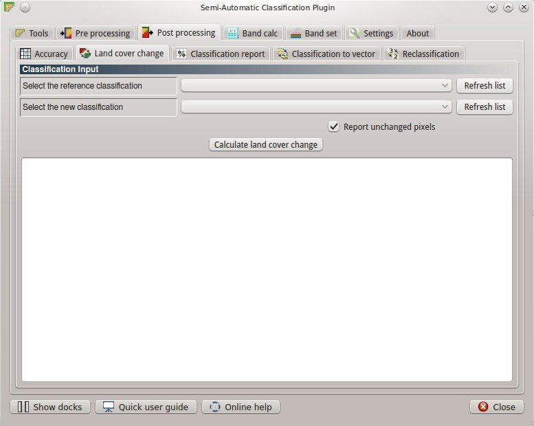
	
	:guilabel:`Land cover change`
	
The tab ``Land cover change`` allows for the comparison between two classifications in order to assess land cover changes.
Output is a ``land cover change raster`` (i.e. a .tif file showing the changes in the map, where each pixel represents a category of comparison (i.e. combinations) between the two classifications, which is the ``ChangeCode`` in the land cover change statistics) and a text file containing the land cover change statistics (i.e. a .csv file separated by tab, with the same name defined for the .tif file).

.. _classification_input:

Classification input
^^^^^^^^^^^^^^^^^^^^

* ``Select the reference classification`` : select a reference classification raster (already loaded in QGIS);
* ``Select the new classification`` : select a new classification raster (already loaded in QGIS), to be compared with the reference classification;
* ``Report unchanged pixels``: if checked, report also unchanged pixels (having the same value in both classifications);
* [ ``Calculate land cover change`` ]:  choose the output destination and start the calculation; the land cover change statistics are displayed in the tab frame and the ``land cover change raster`` is loaded in QGIS.

.. _classification_report_tab:

Classification report
-------------------------

.. figure:: _static/classification_report_tab.jpg
	:align: center
	:width: 500pt
	
	:guilabel:`Classification report`
	
The tab ``Classification report`` allows for the calculation of class statistics as number of pixels, percentage and area (area unit is defined from the image itself).

.. _classification_input2:

Classification input
^^^^^^^^^^^^^^^^^^^^

* ``Select the classification`` : select a classification raster (already loaded in QGIS);
* [ ``Refresh list`` ]: refresh layer list;
* ``Use NoData value`` : if checked, 'NoData' value will be excluded from the report;
* [ ``Calculate classification report`` ]: calculate the report and display it in the tab frame;
* [ ``Save report to file`` ]: save the report to a .csv file.

.. _classification_vector_tab:

Classification to vector 
-------------------------

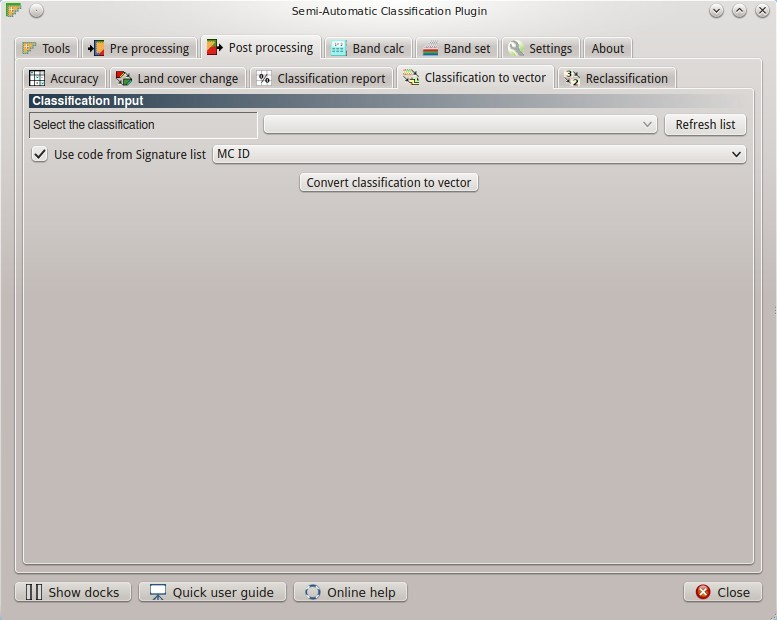
	
	:guilabel:`Classification to vector`
	
The ``Classification to vector`` allows for the conversion of a classification to shapefile.
	
.. _classification_input3:

Classification input
^^^^^^^^^^^^^^^^^^^^

* ``Select the classification`` : select a classification raster (already loaded in QGIS);
* [ ``Refresh list`` ]: refresh layer list;
* ``Use code from Signature list`` : if checked, color and class information are defined from :ref:`signature_list`, according to the selection between ``MC ID`` and ``C ID`` in the combobox;

.. _reclassification_tab:

Reclassification 
-------------------------

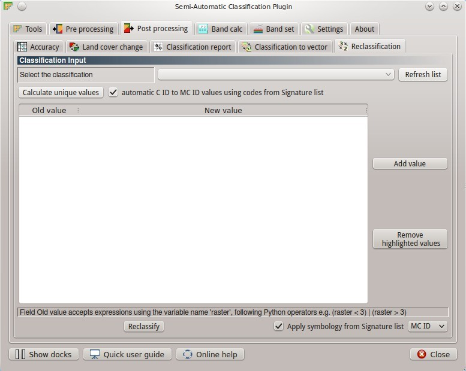
	
	:guilabel:`Reclassification`
		
The tab ``Reclassification`` allows for the reclassification (i.e. assigning a new class code to classification pixels).
In particular, it is useful for converting C ID to MC ID values.

.. _classification_input4:

Classification input
^^^^^^^^^^^^^^^^^^^^

* ``Select the classification`` : select a classification raster (already loaded in QGIS);
* [ ``Refresh list`` ]: refresh layer list;
* [ ``Calculate unique values`` ]: calculate unique values in the classification and fill the reclassification table;
* ``automatic C ID to MC ID values using codes from Signature list``: if checked, the reclassification table is filled according to the :ref:`signature_list` when ``Calculate unique values`` is clicked;

* Table fields:
	* ``Old value`` : set the expression defining old values to be reclassified; ``Old value`` can be a value or an expressions defined using the variable name ``raster`` (custom names can be defined in :ref:`variable_name` ), following Python operators (e.g. ``raster > 3`` select all pixels having value > 3 ; ``raster > 5 | raster < 2`` select all pixels having value > 5 or < 2 ; ``raster >= 2 & raster <= 5`` select all pixel values between 2 and 5);
	* ``New value`` : set the new value for the old values defined in ``Old value``;

* [ ``Add value`` ]: add a row to the table;
* [ ``Remove highlighted values`` ]: remove highlighted rows from the table;
* [ ``Reclassify`` ]: choose the output destination and start the calculation; reclassified raster is loaded in QGIS;
* ``Apply symbology from Signature list`` : if checked, color and class information are defined from :ref:`signature_list`, according to the selection between ``MC ID`` and ``C ID`` in the combobox.

.. _band_calc_tab:
 
Band calc
=============

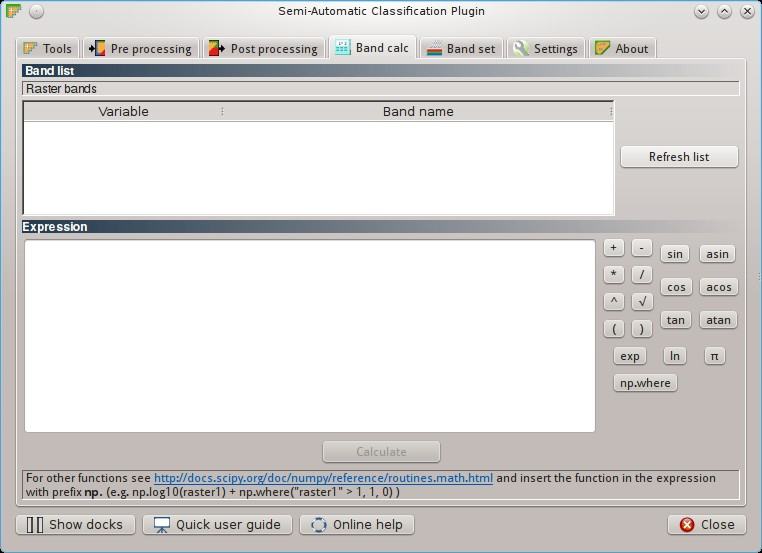
	
	:guilabel:`Band calc tab`
		
The ``Band calc`` allows for the **raster calculation for bands** (i.e. calculation of pixel values) using `NumPy functions <http://docs.scipy.org/doc/numpy/reference/routines.math.html>`_ .
Raster bands must be already loaded in QGIS.
Input rasters must be in the same projection.

.. _band_list2:

Band list
---------

``Band list`` is a list of single band rasters loaded in QGIS.

* Fields of Raster bands table:
	* ``Variable`` : automatic variable name for the specific band (e.g. raster1);
	* ``Band name`` : band name (i.e. the layer name in QGIS);
	
* [ ``Refresh list`` ]: refresh image list;

.. _expression:

Expression
----------

Enter a mathematical expression for bands.
In particular, NumPy functions can be used with the prefix `np.` (e.g. ``np.log10(raster1)`` ).
For a list of NumPy functions see `the NumPy page <http://docs.scipy.org/doc/numpy/reference/routines.math.html>`_ .

The expression can work both with ``Variable`` and ``Band name`` between quotes.
Also, bands in the :ref:`band_set_tab` can be referenced directly; for example ``bandset#b1`` refers to band 1 of the Band set.
Double click on any item in the :ref:`band_list2` for adding its name to the expression.

If text in the ``Expression`` is green, then the syntax is correct; if text is red, then the syntax is incorrect and it is not possible to execute the calculation. 

It is possible to enter multiple expressions separated by newlines like in the following example:

	``raster1 + raster2``
	
	``raster3 - raster4``

The above example calculates two new rasters in the output directory with the suffix ``_1`` (e.g. ``output_1`` ) for the first expression and ``_2`` (e.g. ``output_2`` ) for the second expression.
The following buttons are available:

* [ ``+`` ]: plus;
* [ ``-`` ]: minus;
* [ ``*`` ]: product;
* [ ``/`` ]: ratio;
* [ ``^`` ]: power;
* [ ``V`` ]: square-root;
* [ ``(`` ]: open parenthesis;
* [ ``)`` ]: close parenthesis;
* [ ``exp`` ]: natural exponential;
* [ ``sin`` ]: sine;
* [ ``asin`` ]: inverse sine;
* [ ``cos`` ]: cosine;
* [ ``acos`` ]: inverse cosine;
* [ ``tan`` ]: tangent;
* [ ``atan`` ]: inverse tangent;
* [ ``log`` ]: natural logarithm;
* [ ``π`` ]: pi;
* [ ``np.where`` ]: conditional expression with the syntax ``np.where( condition , value if true, value if false)`` ;

.. _output_raster:

Output raster
--------------

The output raster is a .tif file, with the same spatial resolution and projection of input rasters; if input rasters have different spatial resolutions, then the highest resolution (i.e. minimum pixel size) is used for output raster.

* ``Use NoData value`` : if checked, pixels equal to NoData value will be excluded from the output raster;
* Extent:
	* ``Intersection`` : if checked, the extent of output raster equals the intersection of input raster extents (i.e. minimum extent); if unchecked, the output raster extent will include the extents of input rasters;
	* ``Same as`` : if checked, the extent of output raster equals the extent of selected layer;
* [ ``Calculate`` ]: if ``Expression`` is green, choose the output destination and start the calculation; if multiple expressions are entered, then multiple outputs are created with the same name and a numerical suffix according to the numerical order of expressions.

.. _band_set_tab:
 
Band set
============

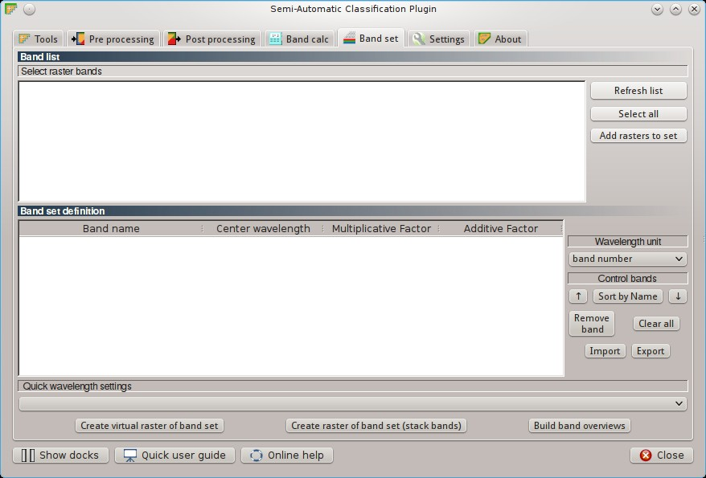
	
	:guilabel:`Band set`
	
The tab ``Band set`` allows for the definition of a set of single band rasters loaded in QGIS, used as ``Input image``.
The ``Center wavelength`` of bands can be defined, which is required in order to calculate properly the spectral signatures.

If a band set of single band rasters is defined, then the item ``<< band set >>`` will be listed in the :ref:`toolbar` as ``Input image``.

The ``Band set`` is stored in the QGIS project.

.. _band_list:

Band list
---------

List of single band rasters loaded in QGIS.

* [ ``Refresh list`` ]: refresh raster band list;
* [ ``Select all`` ]: select all raster bands;
* [ ``Add rasters to set`` ]: add selected rasters to the band set.

.. _band_set_definition:

Band set definition
-------------------

Definition of bands composing the ``Input image`` .

Although it is recommended to define the ``Center wavelength`` of bands, it is possible to assign the band number instead of the wavelength.
Of course, the :ref:`USGS_spec_library_tab` will not be useful, but the ROI collection and the classification process will still be working.
It is possible to define a multiplicative rescaling factor and additive rescaling factor for each band (for instance using the values in Landsat metadata), which allow for on the fly conversion to TOA while calculating spectral signatures or classifying.

* Table fields:
	* ``Band name`` [P]: name of the band; this element cannot be edited;
	* ``Center wavelength`` [P]: center of the wavelength of the band; enter a value;
	* ``Multiplicative Factor`` [P]: multiplicative rescaling factor; enter a value;
	* ``Additive Factor`` [P]: additive rescaling factor; enter a value;
	
* ``Wavelength unit`` [P]: select the wavelength unit among:
	* [ ``Band number`` ]: no unit, only band number;
	* [ :math:`\mu m`  ]: micrometres;
	* [ ``nm`` ]: nanometres;
	
* ``Control bands``:
	* [ :math:`\uparrow` ]: move highlighted bands upward;
	* [ ``Sort by name`` ]: sort automatically bands by name, giving priority to the ending numbers of name;
	* [ :math:`\downarrow` ]: move highlighted bands downward;
	* [ ``Remove band`` ]: remove highlighted bands from the band set;
	* [ ``Clear all`` ]: clear all bands from band set;
	* [ ``Import`` ]: import a previously saved band set from file;
	* [ ``Export`` ]: export the band set to a file.
	
* ``Quick wavelength settings`` [optional]: rapid definition of band center wavelength for the following satellite sensors:
	* GeoEye-1;
	* Landsat 8 OLI;
	* Landsat 7 ETM+;
	* Landsat 5 TM;
	* Landsat 4 TM;
	* Landsat 1, 2, and 3 MSS;
	* Pleiades;
	* QuickBird;
	* RapidEye;
	* Sentinel-2;
	* SPOT 4;
	* SPOT 5;
	* SPOT 6;
	* WorldView-2;
	* WorldView-3.

* [ ``Create virtual raster of band set`` ]: create a virtual raster of bands;
* [ ``Create raster of band set (stack bands)`` ]: stack all the bands and create a unique .tif raster;
* [ ``Build band overviews`` ]: build raster overviews (i.e. pyramids) for improving display performance.
	
.. _settings_tab:
 
Settings
============
	
The tab ``Settings`` allows for the customization of SCP settings.

.. _settings_interface_tab:

Settings: Interface
-------------------------

Customization of the interface.

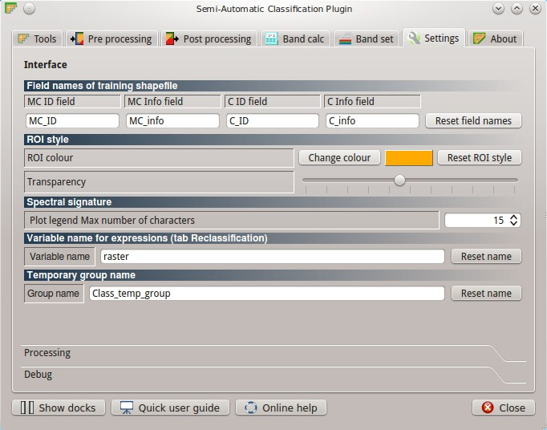
	
	:guilabel:`Settings: Interface`

.. _field_names_training_shapefile:

Field names of training shapefile
^^^^^^^^^^^^^^^^^^^^^^^^^^^^^^^^^^^^

Set the names of fields in the :ref:`training_shapefile` .
Changing field names according to the fields of an existing shapefile is effective for using external shapefiles as :ref:`training_shapefile` (see this `video <http://youtu.be/4V4Fh_MWgSA?t=2m53s>`_ ).

* ``MC ID field`` [Q]: name of the Macroclass ID field (default is ``MC_ID``);
* ``MC Info field`` [Q]: name of the Macroclass Information field (default is ``MC_info``);
* ``C ID field`` [Q]: name of the Class ID field (default is ``C_ID``);
* ``C Info field`` [Q]: name of the Class Information field (default is ``C_info``);
* [ ``Reset field names`` ]: reset field names to default.
	
.. _roi_style:

ROI style
^^^^^^^^^^^^^^^^^^

Change ROI colour and transparency for a better visualization of temporary ROIs on the map.

* [ ``Change colour`` ] [Q]: change ROI colour;
* [ ``Reset ROI style`` ]: reset ROI colour and transparency to default;
* [- ``Transparency`` -] [Q]: change ROI transparency.

.. _spectral_signature:

Spectral signature
^^^^^^^^^^^^^^^^^^

* < ``Plot legend Max number of characters`` >: limit the text length of names in the :ref:`signature_list_plot` legend.

.. _variable_name:

Variable name for expressions (tab Reclassification)
^^^^^^^^^^^^^^^^^^^^^^^^^^^^^^^^^^^^^^^^^^^^^^^^^^^^^^^^^

Set the variable name used in ``Old value`` expressions of the :ref:`reclassification_tab` .

* ``Variable name`` [Q]: set variable name (default is ``raster``);
* [ ``Reset name`` ]: reset variable name to default.

.. _group_name:

Temporary group name
^^^^^^^^^^^^^^^^^^^^^^^^^^^^^^^^^^^^^^^^^^^^^^^^^^^^^^^^^

Set the temporary group name in QGIS Layers used for :ref:`classification_preview` .

* ``Group name`` [Q]: set group name (default is ``Class_temp_group``);
* [ ``Reset name`` ]: reset group name to default.

.. settings_processing_tab:

Settings: Processing
-------------------------

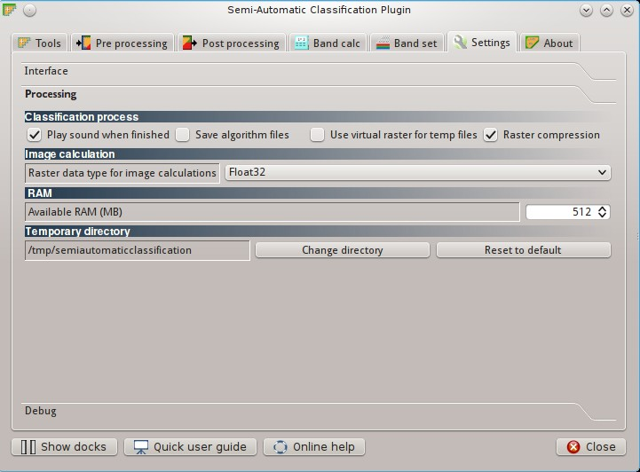
	
	:guilabel:`Settings: Processing`
	
.. _classification_process:

Classification process
^^^^^^^^^^^^^^^^^^^^^^^^^

* ``Play sound when finished`` [Q]: if checked, play a sound when the classification process is completed;
* ``Save algorithm files`` [Q]: if checked, in addition to the classification output, save the intermediate files calculated by the classification algorithm (one .tif file for each land cover class representing the `similarity` of each pixel to the class thereof);
* ``Use virtual rasters for temp files`` [Q]: if checked, create virtual rasters for certain temporary files, instead of creating real rasters; it is useful for reducing disk space usage during calculations;
* ``Raster compression`` [Q]: if checked, a lossless compression (DEFLATE OR PACKBITS) is applied to raster outputs in order to save disk space; however, using raster compression sometimes can produce files larger than rasters without compression.

.. _image_calculation:

Image calculation
^^^^^^^^^^^^^^^^^^^^^^^^^
* ``Raster data type for image calculations`` [Q]: select the raster data type between Float32 (default) and Float64, which is used for the creation of raster outputs;

.. _ram:

RAM
^^^^^^^^^^^^^^^^^^

* < ``Available RAM (MB)`` > [Q]: set the available RAM (in MB) that will be used during the processes; this value should be half of the system RAM (e.g. 1024MB if system has 2GB of RAM);

.. _temporary_directory:

Temporary directory
^^^^^^^^^^^^^^^^^^^^^^

* ``temporary directory`` [Q]: path to the temporary directory;
* [ ``Change directory`` ]: select a new temporary directory where temporary files are saved during processing;
* [ ``Reset to default`` ]: reset to system default temporary directory.

.. _settings_debug_tab:

Settings: Debug
-------------------------

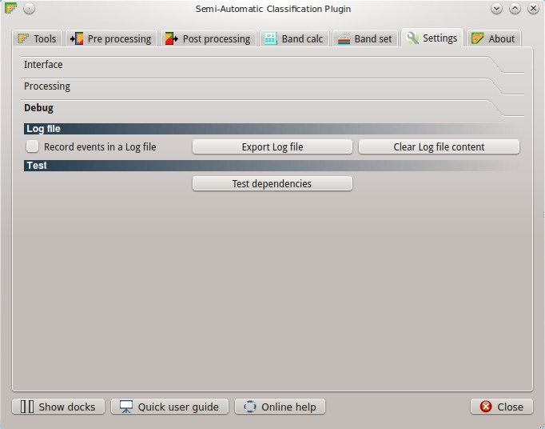
	
	:guilabel:`Settings: Debug`

Debugging utilities for the creation of a Log file (i.e. recording of SCP activities for reporting issues) and testing SCP dependencies.

If you found a plugin error, please read :ref:`error_0` .

.. _log_file:

Log file
^^^^^^^^^^^^^^^^^^

* ``Records events in a log file`` [Q]: start recording events in a Log file;
* [ ``Export Log file`` ]: open a window for choosing where to save the Log file (i.e. a .txt file);
* [ ``Clear Log file content`` ]: clear the content of Log file.

.. _test_dependencies:

Test
^^^^^^^^^^^^^^^^^^

* [ ``Test dependencies`` ]: test SCP dependencies (GDAL, GDAL subprocess, NumPy, SciPy, Matplotlib, Internet connection); a window displays the test results.
