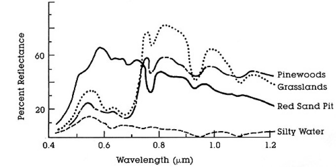
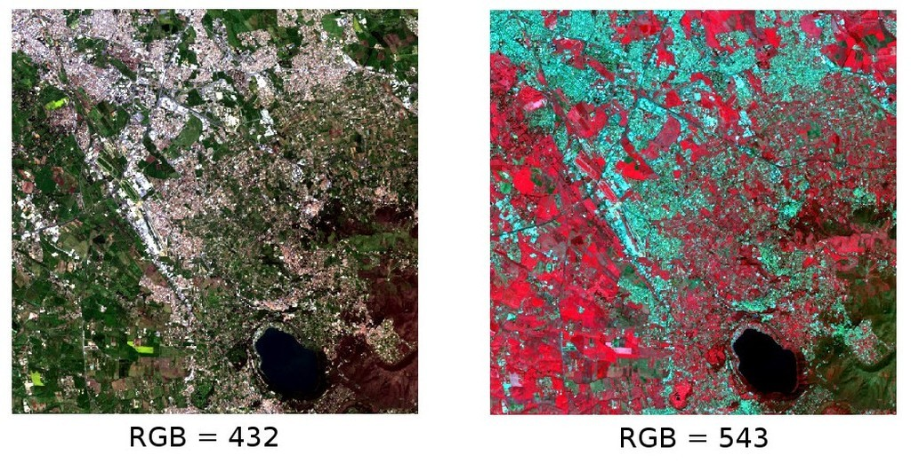
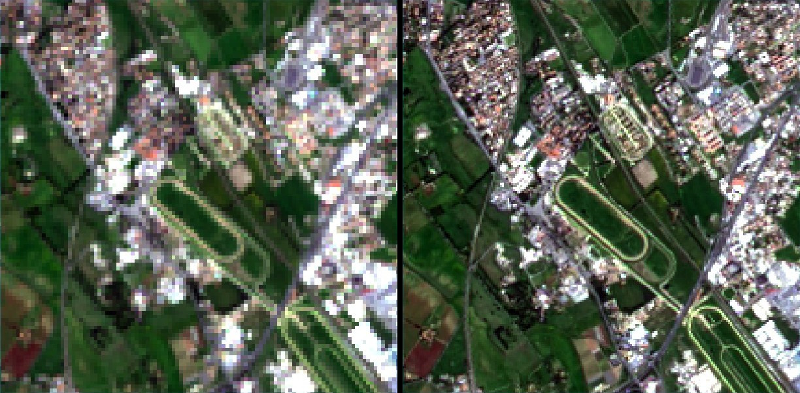
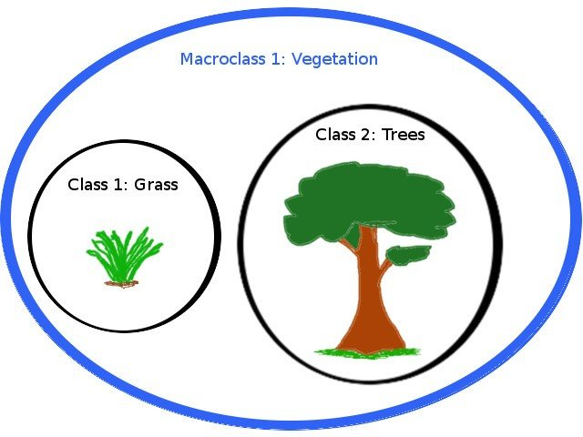
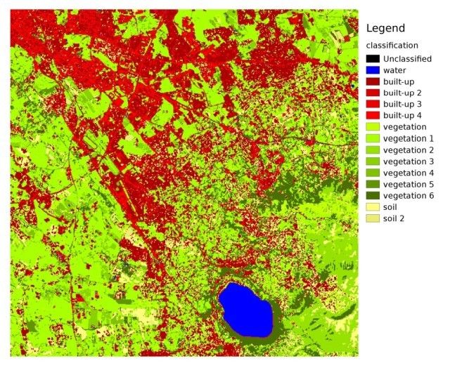
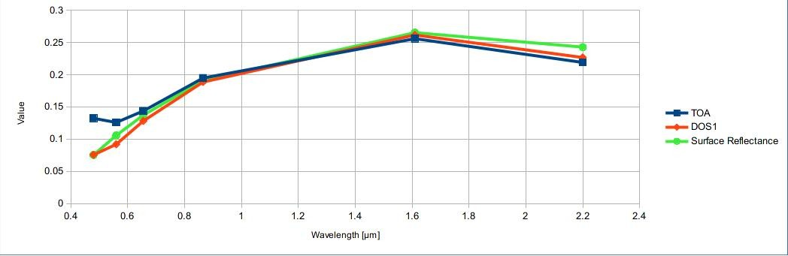

.. _remote_sensing:

************************************
Brief Introduction to Remote Sensing
************************************

.. |br| raw:: html

  
  
  
.. contents::
    :depth: 2
    :local:
	
.. _basic_definitions:
 
Basic Definitions
=================

This chapter provides basic definitions about GIS and remote sensing.

.. _GIS_definition:

GIS definition
-------------------------

There are several definitions of **GIS** (Geographic Information Systems), which is not simply a program. In general, GIS are systems that allow for the use of geographic information (data have spatial coordinates). In particular, GIS allow for the view, query, calculation and analysis of spatial data, which are mainly distinguished in raster or vector data structures. Vector is made of objects that can be points, lines or polygons, and each object can have one ore more attribute values; a raster is a grid (or image) where each cell has an attribute value (Fisher and Unwin, 2005).
Several GIS applications use raster images that are derived from remote sensing.

.. _Remote_Sensing_definition:

Remote Sensing definition
-------------------------

A general definition of **Remote Sensing** is "the science and technology by which the characteristics of objects of interest can be identified, measured or analyzed the characteristics without direct contact" (JARS, 1993).

Usually, remote sensing is the measurement of the energy that is emanated from the Earth’s surface. If the source of the measured energy is the sun, then it is called **passive remote sensing**, and the result of this measurement can be a digital image (Richards and Jia, 2006). If the measured energy is not emitted by the Sun but from the sensor platform then it is defined as **active remote sensing**, such as radar sensors which work in the microwave range (Richards and Jia, 2006).

The **electromagnetic spectrum** is "the system that classifies, according to wavelength, all energy (from short cosmic to long radio) that moves, harmonically, at the constant velocity of light" (NASA, 2013). Passive sensors measure energy from the optical regions of the electromagnetic spectrum: visible, near infrared (i.e. IR), short-wave IR, and thermal IR (see Figure :ref:`figEM`).

.. _figEM:

.. figure:: _static/Electromagnetic-Spectrum.png
	:align: center
	
	:guilabel:`Electromagnetic-Spectrum`
	
	``by Victor Blacus (SVG version of File:Electromagnetic-Spectrum.png)``
	
	``[CC-BY-SA-3.0 (http://creativecommons.org/licenses/by-sa/3.0)]``
	
	``via Wikimedia Commons``
	
	``http://commons.wikimedia.org/wiki/File%3AElectromagnetic-Spectrum.svg``
	
|br|

The interaction between solar energy and materials depends on the wavelength; solar energy goes from the Sun to the Earth and then to the sensor. Along this path, **solar energy** is (NASA, 2013):

* **Transmitted** - The energy passes through with a change in velocity as determined by the index of refraction for the two media in question.

* **Absorbed** - The energy is given up to the object through electron or molecular reactions.

* **Reflected** - The energy is returned unchanged with the angle of incidence equal to the angle of reflection. Reflectance is the ratio of reflected energy to that incident on a body. The wavelength reflected (not absorbed) determines the color of an object.

* **Scattered** - The direction of energy propagation is randomly changed. Rayleigh and Mie scatter are the two most important types of scatter in the atmosphere.

* **Emitted** - Actually, the energy is first absorbed, then re-emitted, usually at longer wavelengths. The object heats up.

.. _Sensors_definition:

Sensors
-------------------------

**Sensors** can be on board of airplanes or on board of satellites, measuring the electromagnetic radiation at specific ranges (usually called bands). As a result, the measures are quantized and converted into a digital image, where each picture elements (i.e. pixel) has a discrete value in units of Digital Number (DN) (NASA, 2013). The resulting images have different characteristics (resolutions) depending on the sensor.
There are several kinds of **resolutions**:

* **Spatial resolution**, usually measured in pixel size, "is the resolving power of an instrument needed for the discrimination of features and is based on detector size, focal length, and sensor altitude" (NASA, 2013); spatial resolution is also referred to as geometric resolution or IFOV;

* **Spectral resolution**, is the number and location in the electromagnetic spectrum (defined by two wavelengths) of the spectral bands (NASA, 2013) in multispectral sensors, for each band corresponds an image;

* **Radiometric resolution**, usually measured in bits (binary digits), is the range of available brightness values, which in the image correspond to the maximum range of DNs; for example an image with 8 bit resolution has 256 levels of brightness (Richards and Jia, 2006);

* For satellites sensors, there is also the **temporal resolution**, which is the time required for revisiting the same area of the Earth (NASA, 2013).

.. _radiance_reflectance_definition:

Radiance and Reflectance
-------------------------

Sensors measure the **radiance**, which corresponds to the brightness in a given direction toward the sensor; it useful to define also the **reflectance** as the ratio of reflected versus total power energy.

.. _spectral_signature_definition:

Spectral Signature
-------------------------

The **spectral signature** is the reflectance as a function of wavelength  (see Figure :ref:`figSR`); each material has a unique signature, therefore it can be used for material classification (NASA, 2013).

.. _figSR:

	
	:guilabel:`Spectral Reflectance Curves of Four Different Targets`
	
	``(from NASA, 2013)``
	

.. _Landsat_definition:

Landsat Satellite
-------------------------

**Landsat** is a set of multispectral satellites developed by the NASA (National Aeronautics and Space Administration of USA), since the early 1970’s.

Landsat images are very used for environmental research. The resolutions of Landsat 4 and Landsat 5 sensors are reported in the following table (from http://landsat.usgs.gov/band_designations_landsat_satellites.php); also, Landsat temporal resolution is 16 days (NASA, 2013).

+-------------------------------------+--------------------------+------------------------+
| Landsat 4, Landsat 5 Bands          | Wavelength [micrometers] |  Resolution [meters]   |
+=====================================+==========================+========================+
| Band 1 - Blue                       | 0.45 - 0.52              |  30                    |
+-------------------------------------+--------------------------+------------------------+
| Band 2 - Green                      | 0.52 - 0.60              |  30                    |
+-------------------------------------+--------------------------+------------------------+
| Band 3 - Red                        | 0.63 - 0.69              |  30                    |
+-------------------------------------+--------------------------+------------------------+
| Band 4 - Near Infrared (NIR)        | 0.76 - 0.90              |  30                    |
+-------------------------------------+--------------------------+------------------------+
| Band 5 - SWIR                       | 1.55 - 1.75              |  30                    |
+-------------------------------------+--------------------------+------------------------+
| Band 6 - Thermal Infrared           | 10.40 - 12.50            |  120 (resampled to 30) |
+-------------------------------------+--------------------------+------------------------+
| Band 7 - SWIR                       | 2.08 - 2.35              |  30                    |
+-------------------------------------+--------------------------+------------------------+

The resolutions of Landsat 7 sensor are reported in the following table (from http://landsat.usgs.gov/band_designations_landsat_satellites.php); also, Landsat temporal resolution is 16 days (NASA, 2013).

+-------------------------------------+--------------------------+------------------------+
| Landsat 7 Bands                     | Wavelength [micrometers] |  Resolution [meters]   |
+=====================================+==========================+========================+
| Band 1 - Blue                       | 0.45 - 0.52              |  30                    |
+-------------------------------------+--------------------------+------------------------+
| Band 2 - Green                      | 0.52 - 0.60              |  30                    |
+-------------------------------------+--------------------------+------------------------+
| Band 3 - Red                        | 0.63 - 0.69              |  30                    |
+-------------------------------------+--------------------------+------------------------+
| Band 4 - Near Infrared (NIR)        | 0.77 - 0.90              |  30                    |
+-------------------------------------+--------------------------+------------------------+
| Band 5 - SWIR                       | 1.57 - 1.75              |  30                    |
+-------------------------------------+--------------------------+------------------------+
| Band 6 - Thermal Infrared           | 10.40 - 12.50            |  60 (resampled to 30)  |
+-------------------------------------+--------------------------+------------------------+
| Band 7 - SWIR                       | 2.09 - 2.35              |  30                    |
+-------------------------------------+--------------------------+------------------------+
| Band 8 - Panchromatic               | 0.52 - 0.90              |  15                    |
+-------------------------------------+--------------------------+------------------------+

The resolutions of Landsat 8 sensor are reported in the following table (from http://landsat.usgs.gov/band_designations_landsat_satellites.php); also, Landsat temporal resolution is 16 days (NASA, 2013).

+-------------------------------------+--------------------------+------------------------+
| Landsat 8 Bands                     | Wavelength [micrometers] |  Resolution [meters]   |
+=====================================+==========================+========================+
| Band 1 - Coastal aerosol            | 0.43 - 0.45              |  30                    |
+-------------------------------------+--------------------------+------------------------+
| Band 2 - Blue                       | 0.45 - 0.51              |  30                    |
+-------------------------------------+--------------------------+------------------------+
| Band 3 - Green                      |  0.53 - 0.59             |  30                    |
+-------------------------------------+--------------------------+------------------------+
| Band 4 - Red                        | 0.64 - 0.67              |  30                    |
+-------------------------------------+--------------------------+------------------------+
| Band 5 - Near Infrared (NIR)        | 0.85 - 0.88              |  30                    |
+-------------------------------------+--------------------------+------------------------+
| Band 6 - SWIR 1                     | 1.57 - 1.65              |  30                    |
+-------------------------------------+--------------------------+------------------------+
| Band 7 - SWIR 2                     | 2.11 - 2.29              |  30                    |
+-------------------------------------+--------------------------+------------------------+
| Band 8 - Panchromatic               | 0.50 - 0.68              |  15                    |
+-------------------------------------+--------------------------+------------------------+
| Band 9 - Cirrus                     | 1.36 - 1.38              |  30                    |
+-------------------------------------+--------------------------+------------------------+
| Band 10 - Thermal Infrared (TIRS) 1 | 10.60 - 11.19            |  100 (resampled to 30) |
+-------------------------------------+--------------------------+------------------------+
| Band 11 - Thermal Infrared (TIRS) 2 | 11.50 - 12.51            |  100 (resampled to 30) |
+-------------------------------------+--------------------------+------------------------+

A vast archive of images is freely available from the `U.S. Geological Survey <http://www.usgs.gov/>`_ . For more information about how to freely download Landsat images read `this  <http://fromgistors.blogspot.com/2014/11/landsat-images-overview-of-worldwide.html>`_ .

.. _Sentinel2_definition:

Sentinel-2 Satellite
-------------------------

**Sentinel-2** is a multispectral satellite developed by the European Space Agency (ESA) in the frame of `Copernicus <http://copernicus.eu/>`_ land monitoring services.
Sentinel-2 acquires 13 spectral bands with the spatial resolution of 10m, 20m and 60m depending on the band, as illustrated in the following table (ESA, 2015).

+-------------------------------------+-------------------------------------+------------------------+
| Sentinel-2 Bands                    | Central Wavelength  [micrometers]   |  Resolution [meters]   |
+=====================================+=====================================+========================+
| Band 1 - Coastal aerosol            | 0.443                               |  60                    |
+-------------------------------------+-------------------------------------+------------------------+
| Band 2 - Blue                       | 0.490                               |  10                    |
+-------------------------------------+-------------------------------------+------------------------+
| Band 3 - Green                      |  0.560                              |  10                    |
+-------------------------------------+-------------------------------------+------------------------+
| Band 4 - Red                        | 0.665                               |  10                    |
+-------------------------------------+-------------------------------------+------------------------+
| Band 5 - Vegetation Red Edge        | 0.705                               |  20                    |
+-------------------------------------+-------------------------------------+------------------------+
| Band 6 - Vegetation Red Edge        | 0.740                               |  20                    |
+-------------------------------------+-------------------------------------+------------------------+
| Band 7 - Vegetation Red Edge        | 0.783                               |  20                    |
+-------------------------------------+-------------------------------------+------------------------+
| Band 8 - NIR                        | 0.842                               |  10                    |
+-------------------------------------+-------------------------------------+------------------------+
| Band 8B - Vegetation Red Edge       | 0.865                               |  20                    |
+-------------------------------------+-------------------------------------+------------------------+
| Band 9 - Water vapour               | 0.945                               |  60                    |
+-------------------------------------+-------------------------------------+------------------------+
| Band 10 - SWIR - Cirrus             | 1.375                               |  60                    |
+-------------------------------------+-------------------------------------+------------------------+
| Band 11 - SWIR                      | 1.610                               |  20                    |
+-------------------------------------+-------------------------------------+------------------------+
| Band 12 - SWIR                      | 2.190                               |  20                    |
+-------------------------------------+-------------------------------------+------------------------+

Sentinel-2 images are freely available from the ESA website https://scihub.esa.int/dhus/ .

.. _color_composite_definition:

Color Composite
-------------------------

Often, a combination is created of three individual monochrome images, in which each is assigned a given color; this is defined **color composite** and is useful for photo interpretation (NASA, 2013). Color composites are usually expressed as:

*"R G B = Br Bg Bb"*

where:

* R stands for Red;

* G stands for Green;

* B stands for Blue;

* Br is the band number associated to the Red color;

* Bg is the band number associated to the Green color;

* Bb is the band number associated to the Blue color.

The following Figure :ref:`figCC` shows a color composite "R G B = 4 3 2" of a Landsat 8 image (for Landsat 7 the same color composite is R G B = 3 2 1) and a color composite "R G B = 5 4 3" (for Landsat 7 the same color composite is R G B = 4 3 2). The composite "R G B = 5 4 3" is useful for the interpretation of the image because vegetation pixels appear red (healthy vegetation reflects a large part of the incident light in the near-infrared wavelength, resulting in higher reflectance values for band 5, thus higher values for the associated color red).

.. _figCC:

	
	:guilabel:`Color composite of a Landsat 8 image`
	
	``Data available from the U.S. Geological Survey``

.. _pan_sharpening_definition:

Pan-sharpening
-------------------------

Pan-sharpening is the combination of the spectral information of multispectral bands (MS), which have lower spatial resolution (for Landsat bands, spatial resolution is 30m), with the spatial resolution of a panchromatic band (PAN), which for Landsat 7 and 8 it is 15m.
The result is a multispectral image with the spatial resolution of the panchromatic band (e.g. 15m).
In SCP, a Brovey Transform is applied, where the pan-sharpened values of each multispectral band are calculated as (Johnson, Tateishi and Hoan, 2012):

.. math::
	MSpan = MS * PAN / I

where :math:`I` is Intensity, which is a function of multispectral bands.

The following weights for I are defined, basing on several tests performed using the SCP. For Landsat 8, Intensity is calculated as:

.. math::
	I = (0.42 * Blue band + 0.98 * Green band + 0.6 *  Red band ) / 2

For Landsat 7, Intensity is calculated as:

.. math::
	I = (0.42 * Blue band + 0.98 * Green band + 0.6 * Red band + NIR band) / 3

.. _figPanSharpening:

	
	:guilabel:`Example of pan-sharpening of a Landsat 8 image. Left, original multispectral bands (30m); right, pan-sharpened bands (15m)`
	
	``Data available from the U.S. Geological Survey``
	
.. _semiautomatic_classification_definition:
 
Supervised Classification Definitions
=====================================
	
This chapter provides basic definitions about supervised classifications.
	
.. _Land_cover_definition:

Land Cover
-------------------------

**Land cover** is the material at the ground, such as soil, vegetation, water, asphalt, etc. (Fisher and Unwin, 2005). Depending on the sensor resolutions, the number and kind of land cover classes that can be identified in the image can vary significantly.

.. _supervised_classification_definition:

Supervised Classification
-------------------------

A **semi-automatic classification** (also supervised classification) is an image processing technique that allows for the identification of materials in an image, according to their spectral signatures. There are several kinds of classification algorithms, but the general purpose is to produce a thematic map of the land cover.

Image processing and GIS spatial analyses require specific software such as the Semi-Automatic Classification Plugin for QGIS.

	
.. _ROI_definition:

Training Areas
-------------------------

Usually, supervised classifications require the user to select one or more Regions of Interest (ROIs, also Training Areas) for each land cover class identified in the image. **ROIs** are polygons drawn over homogeneous areas of the image that overlay pixels belonging to the same land cover class.
	
.. _classes_definition:

Classes and Macroclasses
-------------------------

Land cover classes are identified with an arbitrary ID code (i.e. Identifier).
SCP allows for the definition of **Macroclass ID** (i.e. MC ID) and **Class ID** (i.e. C ID), which are the identification codes of land cover classes.
A **Macroclass** is a group of ROIs having different Class ID, which is useful when one needs to classify materials that have different spectral signatures in the same land cover class.
For instance, one can identify grass (e.g. ``ID class = 1`` and ``Macroclass ID = 1`` ) and trees (e.g. ``ID class = 2`` and ``Macroclass ID = 1`` ) as vegetation class (e.g. ``Macroclass ID = 1`` ).
Multiple Class IDs can be assigned to the same Macroclass ID, but the same Class ID cannot be assigned to multiple Macroclass IDs, as shown in the following table.

+-----------------------------+--------------------------+------------------------+------------------------+
| Macroclass name             | Macroclass ID            |  Class name            |  Class ID              |
+=============================+==========================+========================+========================+
| Vegetation                  |  1                       |  Grass                 |  1                     |
+-----------------------------+--------------------------+------------------------+------------------------+
| Vegetation                  |  1                       |  Trees                 |  2                     |
+-----------------------------+--------------------------+------------------------+------------------------+
| Built-up                    |  2                       |  Road                  |  3                     |
+-----------------------------+--------------------------+------------------------+------------------------+

Therefore, Classes are subsets of a Macroclass as illustrated in Figure :ref:`figMC_example`.

.. _figMC_example:

	
	:guilabel:`Macroclass example`
	
If the use of Macroclass is not required for the study purpose, then the same Macroclass ID can be defined for all the ROIs (e.g. Macroclass ID = 1) and Macroclass values are ignored in the classification process.
	
.. _classification_algorithm_definition:

Classification Algorithms
----------------------------

The **spectral signatures** (spectral characteristics) of reference land cover classes are calculated considering the values of pixels under each ROI having the same Class ID (or Macroclass ID).
Therefore, the classification algorithm classifies the whole image by comparing the spectral characteristics of each pixel to the spectral characteristics of reference land cover classes.
SCP implements the following classification algorithms.
 
.. _minimum_distance_algorithm:

Minimum Distance
^^^^^^^^^^^^^^^^^^^^^^^^^

Minimum Distance algorithm calculates the Euclidean distance :math:`d(x, y)` between spectral signatures of image pixels and training spectral signatures, according to the following equation:

.. math::
	d(x, y) = \sqrt{ \sum_{i=1}^{n} (x_i - y_i)^2}
	
where:

* :math:`x` = spectral signature vector of an image pixel;
* :math:`y` = spectral signature vector of a training area;
* :math:`n` = number of image bands.
	
Therefore, the distance is calculated for every pixel in the image, assigning the class of the spectral signature that is closer, according to the following discriminant function (adapted from Richards and Jia, 2006):

.. math::
	x \in C_k \iff d(x, y_k) < d(x, y_j) \forall k \neq j
	
where:

* :math:`C_k` = land cover class :math:`k`;
* :math:`y_k` = spectral signature of class :math:`k`;
* :math:`y_j` = spectral signature of class :math:`j`.

It is possible to define a threshold :math:`T_i` in order to exclude pixels below this value from the classification:

.. math::
	x \in C_k \iff d(x, y_k) < d(x, y_j) \forall k \neq j
	
	and

	d(x, y_k) < T_i

.. _max_likelihood_algorithm:

Maximum Likelihood
^^^^^^^^^^^^^^^^^^^^^^^^^

Maximum Likelihood algorithm calculates the probability distributions for the classes, related to Bayes’ theorem, estimating if a pixel belongs to a  land cover class.
In particular, the probability distributions for the classes are assumed the of form of multivariate normal models (Richards & Jia, 2006).
In order to use this algorithm, a sufficient number of pixels is required for each training area allowing for the calculation of the covariance matrix.
The discriminant function, described by Richards and Jia (2006), is calculated for every pixel as:

.. math::
	g_k(x) = \ln p(C_k) - \frac{1}{2} \ln | \Sigma_{k} | - \frac{1}{2} (x - y_k)^t \Sigma_{k}^{-1} (x - y_k) 
	
where:

* :math:`C_k` = land cover class :math:`k`;
* :math:`x` = spectral signature vector of a image pixel;
* :math:`p(C_k)` = probability that the correct class is :math:`C_k`;
* :math:`| \Sigma_{k} |` = determinant of the covariance matrix of the data in class :math:`C_k`;
* :math:`\Sigma_{k}^{-1}` = inverse of the covariance matrix;
* :math:`y_k` = spectral signature vector of class :math:`k`.

Therefore:

.. math::
	x \in C_k \iff g_k(x) > g_j(x) \forall k \neq j

In addition, it is possible to define a threshold to the discriminant function in order to exclude pixels below this value from the classification.
Considering a threshold :math:`T_i` the classification condition becomes:

.. math::
	x \in C_k \iff g_k(x) > g_j(x) \forall k \neq j
	
	and

	g_k(x) > T_i

Maximum likelihood is one of the most common supervised classifications, however the classification process can be slower than :ref:`minimum_distance_algorithm`.	

.. _spectra_angle_mapping_algorithm:

Spectra Angle Mapping
^^^^^^^^^^^^^^^^^^^^^^^^^

The Spectral Angle Mapping calculates the spectral angle between spectral signatures of image pixels and training spectral signatures.
The spectral angle :math:`\theta` is defined as (Kruse et al., 1993):

.. math::
	\theta(x, y) = \cos^{-1} \left( \frac{ \sum_{i=1}^{n} x_i y_i } { \left( \sum_{i=1}^{n} x_i^2 \right)^\frac{1}{2} * \left( \sum_{i=1}^{n} y_i^2 \right)^\frac{1}{2} } \right)

Where:

* :math:`x` = spectral signature vector of an image pixel;
* :math:`y` = spectral signature vector of a training area;
* :math:`n` = number of image bands.

Therefore a pixel belongs to the class having the lowest angle, that is:

.. math::
	x \in C_k \iff \theta(x, y_k) < \theta(x, y_j) \forall k \neq j
	
where:

* :math:`C_k` = land cover class :math:`k`;
* :math:`y_k` = spectral signature of class :math:`k`;
* :math:`y_j` = spectral signature of class :math:`j`.

In order to exclude pixels below this value from the classification it is possible to define a threshold :math:`T_i`:

.. math::
	x \in C_k \iff \theta(x, y_k) < \theta(x, y_j) \forall k \neq j
	
	and

	\theta(x, y_k) < T_i
	
Spectral Angle Mapping is largely used, especially with hyperspectral data.
	
.. _spectral_distance_definition:

Spectral Distance 
-----------------------------------
 
It is useful to evaluate the spectral distance (or separability) between training signatures or pixels, in order to assess if different classes that are too similar could cause classification errors.
The SCP implements the following algorithms for assessing similarity of spectral signatures.

.. _Jeffries_Matusita_distance:

Jeffries-Matusita Distance
^^^^^^^^^^^^^^^^^^^^^^^^^^^

Jeffries-Matusita Distance calculates the separability of a pair of probability distributions.
This can be particularly meaningful for evaluating the results of :ref:`max_likelihood_algorithm` classifications.

The Jeffries-Matusita Distance :math:`J_{xy}` is calculated as (Richards and Jia, 2006):

.. math::
	J_{xy} = 2 \left( 1 - e^{-B} \right)
	
where:

.. math::
	B = \frac{1}{8} (x - y)^t \left( \frac{\Sigma_{x} + \Sigma_{y}}{2} \right)^{-1} (x - y)  + \frac{1}{2} \ln \left(  \frac{ | \frac{ \Sigma_{x} + \Sigma_{y}}{2} | }{ | \Sigma_{x} |^{\frac{1}{2}} | \Sigma_{y} |^{\frac{1}{2}} } \right)
	
where:

* :math:`x` = first spectral signature vector;
* :math:`y` = second spectral signature vector;
* :math:`\Sigma_{x}` = covariance matrix of sample :math:`x`;
* :math:`\Sigma_{y}` = covariance matrix of sample :math:`y`;

The Jeffries-Matusita Distance is asymptotic to 2 when signatures are completely different, and tends to 0 when signatures are identical.

.. _spectral_angle:

Spectral Angle
^^^^^^^^^^^^^^^^^^^^^^^^^

The Spectral Angle is the most appropriate for assessing the :ref:`spectra_angle_mapping_algorithm` algorithm.
The spectral angle :math:`\theta` is defined as (Kruse et al., 1993):

.. math::
	\theta(x, y) = \cos^{-1} \left( \frac{ \sum_{i=1}^{n} x_i y_i } { \left( \sum_{i=1}^{n} x_i^2 \right)^\frac{1}{2} * \left( \sum_{i=1}^{n} y_i^2 \right)^\frac{1}{2} } \right)

Where:

* :math:`x` = spectral signature vector of an image pixel;
* :math:`y` = spectral signature vector of a training area;
* :math:`n` = number of image bands.

Spectral angle goes from 0 when signatures are identical to 90 when signatures are completely different.

.. _euclidean_distance:

Euclidean Distance
^^^^^^^^^^^^^^^^^^^^^^^^^
	
The Euclidean Distance is particularly useful for the evaluating the result of :ref:`minimum_distance_algorithm` classifications.
In fact, the distance is defined as:

.. math::
	d(x, y) = \sqrt{ \sum_{i=1}^{n} (x_i - y_i)^2}
	
where:

* :math:`x` = first spectral signature vector;
* :math:`y` = second spectral signature vector;
* :math:`n` = number of image bands.

The Euclidean Distance is 0 when signatures are identical and tends to increase according to the spectral distance of signatures.

.. _Bray_Curtis_similarity:

Bray-Curtis Similarity
^^^^^^^^^^^^^^^^^^^^^^^^^
	
The Bray-Curtis Similarity is a statistic used for assessing the relationship between two samples (`read this <http://en.wikipedia.org/wiki/Bray%E2%80%93Curtis_dissimilarity>`_).
It is useful in general for assessing the similarity of spectral signatures, and Bray-Curtis Similarity :math:`S(x, y)` is calculated as:

.. math::
	S(x, y) = 100 - \left( \frac{\sum_{i=1}^{n} | (x_i - y_i) |}{\sum_{i=1}^{n} x_i + \sum_{i=1}^{n} y_i} \right) * 100

where:

* :math:`x` = first spectral signature vector;
* :math:`y` = second spectral signature vector;
* :math:`n` = number of image bands.

The Bray-Curtis similarity is calculated as percentage and ranges from 0 when signatures are completely different to 100 when spectral signatures are identical.
	
.. _classification_result_definition:

Classification Result
-------------------------

The result of the classification process is a raster (see an example of Landsat classification in Figure :ref:`figLC`), where pixel values correspond to class IDs and each color represent a land cover class.
	
.. _figLC:

	
	:guilabel:`Landsat classification`
	
	``Data available from the U.S. Geological Survey``
	
A certain amount of errors can occur in the land cover classification (i.e. pixels assigned to a wrong land cover class), due to spectral similarity of classes, or wrong class definition during the ROI collection.

.. _accuracy_assessment_definition:

Accuracy Assessment
-------------------------

After the classification process, it is useful to assess the accuracy of land cover classification, in order to identify and measure map errors. 
Usually, **accuracy assessment** is performed with the calculation of an error matrix, which is a table that compares map information with reference data (i.e. ground truth data) for a number of sample areas (Congalton and Green, 2009).

The following table is a scheme of error matrix, where k is the number of classes identified in the land cover classification, and n is the total number of collected sample units. The items in the major diagonal (aii) are the number of samples correctly identified, while the other items are classification error.

+-----------------+--------------------------+------------------------+------------------------+------------------------+-----------------+
|                 |   Ground truth 1         |   Ground truth 2       |  …                     |   Ground truth k       |  Total          |
+=================+==========================+========================+========================+========================+=================+
| **Class 1**     |   :math:`a_{11}`         |   :math:`a_{12}`       |  …                     |   :math:`a_{1k}`       |  :math:`a_{1+}` |
+-----------------+--------------------------+------------------------+------------------------+------------------------+-----------------+
| **Class 2**     |   :math:`a_{21}`         |   :math:`a_{22}`       |  …                     |   :math:`a_{2k}`       |   :math:`a_{2+}`|
+-----------------+--------------------------+------------------------+------------------------+------------------------+-----------------+
| …               |   …                      |   …                    |  …                     |   …                    |   …             |
+-----------------+--------------------------+------------------------+------------------------+------------------------+-----------------+
| **Class k**     |   :math:`a_{k1}`         |   :math:`a_{k2}`       |  …                     |   :math:`a_{kk}`       |   :math:`a_{k+}`|
+-----------------+--------------------------+------------------------+------------------------+------------------------+-----------------+
| **Total**       |   :math:`a_{+1}`         |   :math:`a_{+2}`       |  …                     |   :math:`a_{+k}`       |   :math:`n`     |
+-----------------+--------------------------+------------------------+------------------------+------------------------+-----------------+

Therefore, it is possible to calculate the overall accuracy as the ratio between the number of samples that are correctly classified (the sum of the major diagonal), and the total number of sample units n (Congalton and Green, 2009).

For further information, the following documentation is freely available: `Landsat 7 Science Data User's Handbook <http://landsathandbook.gsfc.nasa.gov>`_, `Remote Sensing Note <http://www.jars1974.net/pdf/rsnote_e.html>`_ , or `Wikipedia <http://en.wikipedia.org/wiki/Remote_sensing>`_.

|br|

**References**

* Congalton, R. and Green, K., 2009. Assessing the Accuracy of Remotely Sensed Data: Principles and Practices. Boca Raton, FL: CRC Press.

* ESA, 2015. Sentinel-2 User Handbook. Available at https://sentinel.esa.int/documents/247904/685211/Sentinel-2_User_Handbook

* Fisher, P. F. and Unwin, D. J., eds. 2005. Representing GIS. Chichester, England: John Wiley & Sons.

* JARS, 1993. Remote Sensing Note. Japan Association on Remote Sensing. Available at http://www.jars1974.net/pdf/rsnote_e.html

* Johnson, B. A., Tateishi, R. and Hoan, N. T., 2012. Satellite Image Pansharpening Using a Hybrid Approach for Object-Based Image Analysis ISPRS International Journal of Geo-Information, 1, 228. Available at  http://www.mdpi.com/2220-9964/1/3/228)

* Kruse, F. A., et al., 1993. The Spectral Image Processing System (SIPS) - Interactive Visualization and Analysis of Imaging spectrometer. Data Remote Sensing of Environment.

* NASA, 2013. Landsat 7 Science Data User's Handbook. Available at http://landsathandbook.gsfc.nasa.gov

* Richards, J. A. and Jia, X., 2006. Remote Sensing Digital Image Analysis: An Introduction. Berlin, Germany: Springer.

|br|

.. _landsat_conversion_to_reflectance:

Landsat image conversion to reflectance and DOS1 atmospheric correction
=======================================================================

This chapter provides information about the Landsat conversion to reflectance implemented in SCP :ref:`landsat_tab`.

Landsat images downloaded from http://earthexplorer.usgs.gov or through the SCP tool :ref:`Landsat_download_tab` are composed of several bands and a metadata file (MTL) which contains useful information about image data.

.. _radiance_conversion:

Radiance at the Sensor's Aperture
----------------------------------

**Radiance** is the "flux of energy (primarily irradiant or incident energy) per solid angle leaving a unit surface area in a given direction", "Radiance is what is measured at the sensor and is somewhat dependent on reflectance" (NASA, 2011, p. 47).

The **Spectral Radiance at the sensor's aperture** (:math:`L_{\lambda}`) is measured in [watts/(meter squared * ster * :math:`\mu m`)] and for Landsat images it is given by (https://landsat.usgs.gov/Landsat8_Using_Product.php):

.. math::

	L_{\lambda} = M_{L} * Q_{cal} + A_{L}

where:

* :math:`M_{L}` = Band-specific multiplicative rescaling factor from Landsat metadata (RADIANCE_MULT_BAND_x, where x is the band number)
* :math:`A_{L}` = Band-specific additive rescaling factor from Landsat metadata (RADIANCE_ADD_BAND_x, where x is the band number)
* :math:`Q_{cal}` = Quantized and calibrated standard product pixel values (DN)

.. _TOA_conversion:

Top Of Atmosphere (TOA) Reflectance
-----------------------------------

"For relatively clear Landsat scenes, a reduction in between-scene variability can be achieved through a normalization for solar irradiance by converting spectral radiance, as calculated above, to planetary reflectance or albedo. This combined **surface and atmospheric reflectance** of the Earth is computed with the following formula" (NASA, 2011, p. 119):

.. math::
	\rho_{p} = (\pi * L_{\lambda} * d^{2} )/ (ESUN_{\lambda} * cos\theta_{s})

where:

* :math:`\rho_{p}` = Unitless TOA reflectance, which is "the ratio of reflected versus total power energy” (NASA, 2011, p. 47)
* :math:`L_{\lambda}` = Spectral radiance at the sensor's aperture (at-satellite radiance)
* :math:`d` = Earth-Sun distance in astronomical units (provided with Landsat 8 metafile, and an excel file is available from http://landsathandbook.gsfc.nasa.gov/excel_docs/d.xls)
* :math:`ESUN_{\lambda}` = Mean solar exo-atmospheric irradiances
* :math:`\theta_{s}` = Solar zenith angle in degrees, which is equal to :math:`\theta_{s}` = 90° - :math:`\theta_{e}` where :math:`\theta_{e}` is the Sun elevation

It is worth pointing out that Landsat 8 images are provided with  band-specific rescaling factors that allow for the direct conversion from DN to TOA reflectance. However, the effects of the atmosphere (i.e. a disturbance on the reflectance that varies with the wavelength) should be considered in order to measure the reflectance at the ground.
	
.. _Surface_conversion:

Surface Reflectance
-----------------------------------

As described by Moran et al. (1992), the **land surface reflectance** (:math:`\rho`) is:

.. math::

	\rho = [\pi * (L_{\lambda} - L_{p}) * d^{2}]/ [T_{v} * ( (ESUN_{\lambda} * cos\theta_{s} * T_{z} ) + E_{down} )]

where:

* :math:`L_{p}` is the path radiance
* :math:`T_{v}` is the atmospheric transmittance in the viewing direction
* :math:`T_{z}` is the atmospheric transmittance in the illumination direction
* :math:`E_{down}` is the downwelling diffuse irradiance

Therefore, we need several atmospheric measurements in order to calculate :math:`\rho` (physically-based corrections). Alternatively, it is possible to use **image-based techniques** for the calculation of these parameters, without in-situ measurements during image acquisition.
It is worth mentioning that Landsat Surface Reflectance High Level Data Products for Landsat 8 are available (for more information read http://landsat.usgs.gov/CDR_LSR.php). 

.. _DOS1_correction:

DOS1 Correction
-----------------------------------

The **Dark Object Subtraction** (DOS) is a family of image-based atmospheric corrections.
Chavez (1996) explains that "the basic assumption is that within the image some pixels are in complete shadow and their radiances received at the satellite are due to atmospheric scattering (path radiance). This assumption is combined with the fact that very few targets on the Earth's surface are absolute black, so an assumed one-percent minimum reflectance is better than zero percent”. It is worth pointing out that the accuracy of image-based techniques is generally lower than physically-based corrections, but they are very useful when no atmospheric measurements are available as they can improve the estimation of land surface reflectance.
The **path radiance** is given by (Sobrino, et al., 2004):

.. math::
	L_{p} = L_{min} - L_{DO1\%}

where:

* :math:`L_{min}` = "radiance that corresponds to a digital count value for which the sum of all the pixels with digital counts lower or equal to this value is equal to the 0.01% of all the pixels from the image considered” (Sobrino, et al., 2004, p. 437), therefore the radiance obtained with that digital count value (:math:`DN_{min}`)
* :math:`L_{DO1\%}` = radiance of Dark Object, assumed to have a reflectance value of 0.01

Therfore for Landsat images:

.. math::

	L_{min} = M_{L} * DN_{min} + A_{L}

The **radiance of Dark Object** is given by (Sobrino, et al., 2004):

.. math::

	L_{DO1\%} = 0.01 * [(ESUN_{\lambda} * cos\theta_{s} * T_{z} ) + E_{down}] * T_{v} / (\pi * d^{2})

Therefore the **path radiance** is:

.. math::

	L_{p} = M_{L} * DN_{min} + A_{L} - 0.01* [(ESUN_{\lambda} * cos\theta_{s} * T_{z} ) + E_{down}] * T_{v} / (\pi * d^{2})

There are several DOS techniques (e.g. DOS1, DOS2, DOS3, DOS4), based on different assumption about :math:`T_{v}`, :math:`T_{z}` , and :math:`E_{down}` .
The simplest technique is the **DOS1**, where the following assumptions are made (Moran et al., 1992):

* :math:`T_{v}` = 1
* :math:`T_{z}` = 1
* :math:`E_{down}` = 0

Therefore the **path radiance** is:

.. math::

	L_{p} = M_{L} * DN_{min} + A_{L} - 0.01 * ESUN_{\lambda} * cos\theta_{s} / (\pi * d^{2})

And the resulting **land surface reflectance** is given by:

.. math::

	\rho = [\pi * (L_{\lambda} - L_{p}) * d^{2}]/ (ESUN_{\lambda} * cos\theta_{s}) 

ESUN [W /(m2 * :math:`\mu m`)] values for Landsat sensors are provided in the following table.

+-------+---------------+-----------------+-------------+
| Band  |  Landsat 4*   |  Landsat 5**    | Landsat 7** |
+=======+===============+=================+=============+
| 1     |   1957        |    1983         | 1997        |
+-------+---------------+-----------------+-------------+
| 2     |   1825        |    1769         | 1812        |
+-------+---------------+-----------------+-------------+
| 3     |   1557        |    1536         | 1533        |
+-------+---------------+-----------------+-------------+
| 4     |   1033        |    1031         | 1039        |
+-------+---------------+-----------------+-------------+
| 5     |   214.9       |    220          | 230.8       |
+-------+---------------+-----------------+-------------+
| 7     |   80.72       |    83.44        | 84.90       |
+-------+---------------+-----------------+-------------+

\* from Chander & Markham (2003)

** from Finn, et al. (2012)

|br|

For Landsat 8, :math:`ESUN` can be calculated as (from http://grass.osgeo.org/grass65/manuals/i.landsat.toar.html):

.. math::

	ESUN = (\pi * d^{2}) * RADIANCE\_MAXIMUM / REFLECTANCE\_MAXIMUM

where RADIANCE_MAXIMUM and REFLECTANCE_MAXIMUM are provided by image metadata.

|br|

An example of comparison of to TOA reflectance, DOS1 corrected reflectance and the Landsat Surface Reflectance High Level Data Products (ground truth) is provided in Figure :ref:`figRefl`.

.. _figRefl:

	
	:guilabel:`Spectral signatures of a built-up pixel`

	``Comparison of TOA reflectance, DOS1 corrected reflectance and Landsat Surface Reflectance High Level Data Products``

	
**References**

* Chander, G. & Markham, B. 2003. Revised Landsat-5 TM radiometric calibration procedures and postcalibration dynamic ranges Geoscience and Remote Sensing, IEEE Transactions on, 41, 2674 - 2677

* Chavez, P. S. 1996. Image-Based Atmospheric Corrections - Revisited and Improved Photogrammetric Engineering and Remote Sensing, [Falls Church, Va.] American Society of Photogrammetry, 62, 1025-1036

* Finn, M.P., Reed, M.D, and Yamamoto, K.H. 2012. A Straight Forward Guide for Processing Radiance and Reflectance for EO-1 ALI, Landsat 5 TM, Landsat 7 ETM+, and ASTER. Unpublished Report from USGS/Center of Excellence for Geospatial Information Science, 8 p, http://cegis.usgs.gov/soil_moisture/pdf/A%20Straight%20Forward%20guide%20for%20Processing%20Radiance%20and%20Reflectance_V_24Jul12.pdf

* Moran, M.; Jackson, R.; Slater, P. & Teillet, P. 1992. Evaluation of simplified procedures for retrieval of land surface reflectance factors from satellite sensor output Remote Sensing of Environment, 41, 169-184

* NASA (Ed.) 2011. Landsat 7 Science Data Users Handbook Landsat Project Science Office at NASA's Goddard Space Flight Center in Greenbelt, 186 http://landsathandbook.gsfc.nasa.gov/pdfs/Landsat7_Handbook.pdf

* Sobrino, J.; Jiménez-Muñoz, J. C. & Paolini, L. 2004. Land surface temperature retrieval from LANDSAT TM 5 Remote Sensing of Environment, Elsevier, 90, 434-440

|br|

.. _landsat_conversion_to_temperature:

Conversion to At-Satellite Brightness Temperature
=================================================

This chapter provides information about the Landsat conversion to **At-Satellite Brightness Temperature** implemented in SCP :ref:`landsat_tab`. For information about how to estimate surface temperature read `this post  <http://fromgistors.blogspot.com/2014/01/estimation-of-land-surface-temperature.html>`_ .

For Landsat thermal bands, the conversion of DN to At-Satellite Brightness Temperature is given by (from https://landsat.usgs.gov/Landsat8_Using_Product.php):

.. math::

	T_{B} = K_{2} / ln[(K_{1} / L_{\lambda}) + 1]

where:

* :math:`K_{1}` = Band-specific thermal conversion constant (in watts/meter squared * ster * :math:`\mu m`)
* :math:`K_{2}` = Band-specific thermal conversion constant (in kelvin)

and :math:`L_{\lambda}` is the Spectral Radiance at the sensor's aperture, measured in watts/(meter squared * ster * :math:`\mu m`); for Landsat images it is given by (from https://landsat.usgs.gov/Landsat8_Using_Product.php):

.. math::
	L_{\lambda} = M_{L} * Q_{cal} + A_{L}
 
where:

* :math:`M_{L}` = Band-specific multiplicative rescaling factor from Landsat metadata (RADIANCE_MULT_BAND_x, where x is the band number)
* :math:`A_{L}` = Band-specific additive rescaling factor from Landsat metadata (RADIANCE_ADD_BAND_x, where x is the band number)
* :math:`Q_{cal}` = Quantized and calibrated standard product pixel values (DN)

The :math:`K_{1}` and :math:`K_{2}` constant for Landsat sensors are provided in the following table:

+------------------------------------------------------------+-------------------+-----------------+---------------------+
| Constant                                                   |  Landsat 4*       |    Landsat 5*   | Landsat 7**         |
+============================================================+===================+=================+=====================+
| :math:`K_{1}` (watts/meter squared * ster * :math:`\mu m`) |   671.62          |    607.76       | 666.09              |
+------------------------------------------------------------+-------------------+-----------------+---------------------+
| :math:`K_{2}` (Kelvin)                                     |   1284.30         |    1260.56      | 1282.71             |
+------------------------------------------------------------+-------------------+-----------------+---------------------+

\* from Chander & Markham (2003)

** from NASA (2011)

|br|
For Landsat 8, the :math:`K_{1}` and :math:`K_{2}` values are provided in the image metafile.

|br|

**References**

* Chander, G. & Markham, B. 2003. Revised Landsat-5 TM radiometric calibration procedures and postcalibration dynamic ranges Geoscience and Remote Sensing, IEEE Transactions on, 41, 2674 - 2677

* NASA (Ed.) 2011. Landsat 7 Science Data Users Handbook Landsat Project Science Office at NASA's Goddard Space Flight Center in Greenbelt, 186 http://landsathandbook.gsfc.nasa.gov/pdfs/Landsat7_Handbook.pdf
