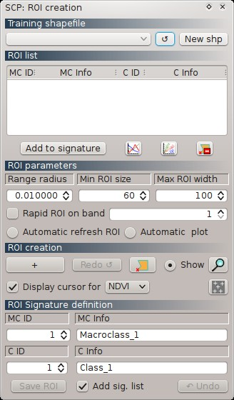
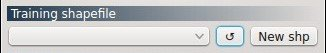
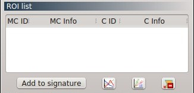
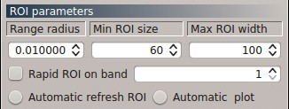
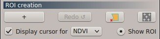
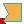
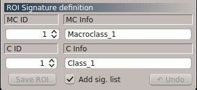

.. _roi_dock:

******************************
ROI Creation dock
******************************

.. |br| raw:: html

  

	
	:guilabel:`ROI creation dock`
		
The dock ``ROI creation`` allows for the definition of a **training shapefile**, and for the creation of **ROIs** (Regions Of Interest) using a **region growing** algorithm or **manual drawing**.

The training shapefile, created with SCP, is used for storing the ROI polygons.

SCP allows for the creation of **temporary ROI polygons** using a region growing algorithm (i.e. image is segmented around a pixel seed including spectrally homogeneous pixels). Alternatively, ROIs can be drawn manually. Temporary ROIs are displayed over the image.
If the ROI characteristics (e.g. spectral signature) are considered acceptable, then it can be saved in the training shapefile and the spectral characteristics are saved in the :ref:`signature_list_file`.

**It is worth pointing out that classification is not based on ROIs, but it is based on the spectral characteristics of signatures in the** :ref:`signature_list` .

ROIs are defined with a **Macroclass ID and Class ID** (see :ref:`classes_definition`) that are used for the classification process; in addition, Macroclass Information (e.g. macroclass name) and Class Information (e.g. class name) can be defined, but they are not used in the classification process.

Training shapefiles (which can be created by SCP) must contain at least four fields as in the following table (custom names can be defined in the :ref:`field_names_training_shapefile`).

+-------------------------------------+--------------------------+------------------------+
| Description                         | Field name               |  Field type            |
+=====================================+==========================+========================+
| Macroclass ID                       | MC_ID                    |  int                   |
+-------------------------------------+--------------------------+------------------------+
| Macroclass Information              | MC_info                  |  string                |
+-------------------------------------+--------------------------+------------------------+
| Class ID                            | C_ID                     |  int                   |
+-------------------------------------+--------------------------+------------------------+
| Class Information                   | C_info                   |  string                |
+-------------------------------------+--------------------------+------------------------+
	
|br|

[P] = Configuration stored in the active project of QGIS

[Q] = Configuration stored in QGIS registry
	
.. _training_shapefile:
 
Training shapefile
==================

	
	:guilabel:`Training shapefile`
	
* ``Training shapefile`` [P]: select a shapefile from a list of shapefiles (containing the required fields) loaded in QGIS; ; ROIs polygons are saved in this shapefile;
* |refresh|: refresh layer list;
* [ ``New shp`` ]: create a new shapefile containing the required fields Macroclass ID, Macroclass Information , Class ID, and Class Information.
		
.. |refresh| image:: _static/refresh_button.jpg
	:width: 20pt
	
.. _ROI_list:
 
ROI list
==================

	
	:guilabel:`ROI list`
	
The ``ROI list`` displays the ROI polygons collected in the ``Training shapefile``.
Double click on any table item to zoom in the map to that ROI; also, ROIs can be edited within this table (changes affect also the shapefile).
In order to highlight items perform a mouse selection in the table.

* Table fields:
	* ``MC ID`` : ROI Macroclass ID [int];
	* ``MC Info`` : ROI Macroclass Information [text];
	* ``C ID`` : ROI Class ID [int];
	* ``C Info`` : ROI Class Information [text];
* [ ``Add to signature`` ]: calculate ROI spectral signature (from ``Input image`` pixels under ROI polygon) of highlighted ROIs in the table; signatures are added to the :ref:`signature_list`; if multiple highlighted ROIs share the same ``MC ID`` and ``C_ID``, then only one spectral signature is calculated considering these ROIs as one polygon;
* |sign_plot| : show the ROI spectral signature the :ref:`spectral_signature_plot`; spectral signature is calculated from the ``Input image``;
* |scatter_plot| : open the :ref:`scatter_plot`;
* |delete_ROI| : delete highlighted ROIs from the ``Training shapefile``.
	
.. |sign_plot| image:: _static/semiautomaticclassificationplugin_sign_tool.png
	:width: 20pt
		
.. |scatter_plot| image:: _static/semiautomaticclassificationplugin_scatter_tool.png
	:width: 20pt
			
.. |delete_ROI| image:: _static/semiautomaticclassificationplugin_delete_ROI.png
	:width: 20pt
	
.. _ROI_parameters:

ROI parameters
==============

	
	:guilabel:`ROI parameters`
	
ROI parameters are required for the ROI creation using a region growing algorithm. Region growing works on the ``Input image`` defined in the :ref:`toolbar`.

* ``Range radius`` [P]: set the interval which defines the maximum spectral distance between the seed pixel and the surrounding pixels (in radiometry unit);
* ``Min ROI size`` [P]: set the minimum area of a ROI (in pixel unit); this setting overrides the ``Range radius`` until the minimum ROI size is reached; if ``Rapid ROI on band`` is checked, then ROI will have at least the size defined ``Min ROI size``; if ``Rapid ROI on band`` is unchecked, then ROI could have a size smaller than ``Min ROI size``;
* ``Max ROI width`` [P]: set the maximum width of a ROI (i.e. the side length of a square, centred at the seed pixel, which inscribes the ROI) in pixel unit;
* ``Rapid ROI on band`` [P]: if checked, ROI is created using only the selected band of the ``Input image`` defined in the combo box (the process is quicker); if unchecked, ROI is the result of the intersection between ROIs calculated using every band (the process is longer, but ROI is spectrally homogeneous on every band);
* ``Automatic refresh ROI`` : create automatically a new ROI while ``Range radius`` , ``Min ROI size`` , or ``Max ROI width`` are changed;
* ``Automatic plot`` : calculate automatically the ROI spectral signature and display it in the :ref:`spectral_signature_plot` (spectral signature has ``MC Info = tempo_ROI``).

.. _ROI_creation:

ROI creation
============

	
	:guilabel:`ROI creation`
	
ROI creation is used for creating ROI polygons; these ROIs are **temporary** until they are saved in the :ref:`training_shapefile` .

* [+]: recall the pointer for ROI creation using the region growing algorithm; **left click** on the map for creating the ROI: **right click** on the map for displaying the spectral signature of a pixel of the ``Input image``;
* [ ``Redo`` ]: create a new ROI using the region growing algorithm at the same point of the previous one;
* |manual|: create a ROI by manual drawing a polygon on the map; after clicking the button, left click on the map to define the ROI vertices and right click to define the last vertex closing the polygon;
* |multiple|: open the :ref:`multiple_rois_tab`;
* < ``Display cursor for`` > [P]: if the ROI creation pointer is active, display vegetation index values on the map; vegetation indices available in the combo box are NDVI (Normalized Difference Vegetation Index) and EVI (Enhanced Vegetation Index); NDVI requires the near-infrared and red bands; EVI requires the blue, near-infrared and red bands converted to reflectance; wavelengths must be defined in the :ref:`band_set_tab`;
* < ``Show`` >: show/hide the temporary ROI in the map;
* |zoom_to_ROI|: zoom to the last temporary ROI.

.. |multiple| image:: _static/semiautomaticclassificationplugin_roi_multiple.png
	:width: 24pt

.. |zoom_to_ROI| image:: _static/semiautomaticclassificationplugin_zoom_to.png
	:width: 24pt

.. _ROI_signature_definition:

ROI Signature definition
========================

	
	:guilabel:`ROI Signature definition`
	
This allows for the definition of ROI's class and saving the temporary ROI to the :ref:`training_shapefile` ; in addition, it is possible to automatically calculate the ROI spectral signature and add it to the :ref:`signature_list` .

* ``MC ID`` [P]: ROI Macroclass ID [int];
* ``MC Info`` [P]: ROI Macroclass information [text];
* ``C ID`` [P]: ROI Class ID [int];
* ``C Info`` [P]: ROI Class information [text];
* [ ``Save ROI`` ]: save the temporary ROI to the :ref:`training_shapefile` ;
* ``Add sig. list`` [P]: if checked, the spectral signature is calculated (the ROI mean value, and standard deviation for each raster band, and the covariance matrix) while the ROI is saved to shapefile (it takes some time depending on the number of ``Input image`` bands);
* [ ``Undo`` ]: delete the last saved ROI from the :ref:`training_shapefile` .
