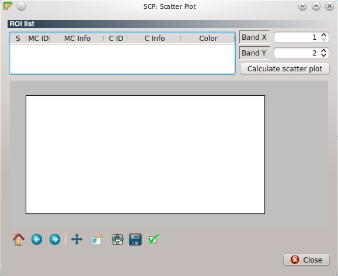
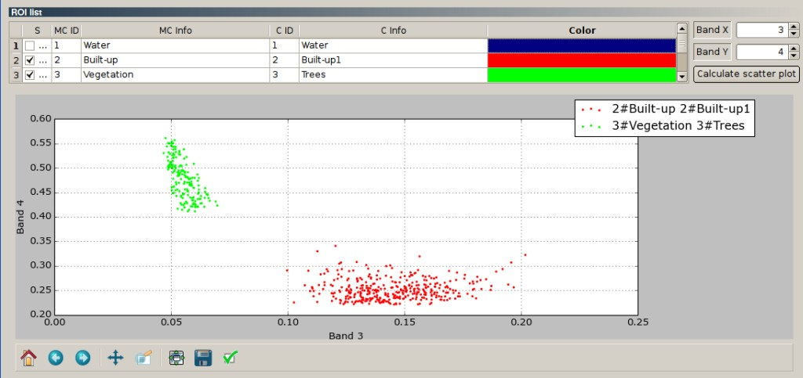

.. _scatter_plot:

******************************
Scatter Plot
******************************

.. |br| raw:: html

  

The ``Scatter plot`` window allows for the calculation of the ROI scatter plots, which are useful for assessing ROI separability between two bands. Pixel values for two raster bands are represented as points in the 2D space.

	
	:guilabel:`Scatter Plot`

.. _scatter_roi_list:

ROI List
----------------

* Table fields:
	* ``S`` : checkbox field;
	* ``MC ID`` : Macroclass ID;
	* ``MC Info`` : Macroclass Information;
	* ``C ID`` : Class ID;
	* ``C Info`` : Class Information;
	* ``Color`` : color field; double click to select a color for the plot;
* < ``Band X`` >: X band of the plot;
* < ``Band Y`` >: Y band of the plot;
* [ ``Calculate scatter plot`` ]: calculate the scatter plot for the ROI checked in the list (it can be time consuming).
* Plot commands (from Matplotlib):
	* |m_home|: Reset to original view;
	* |m_back|: Back to previous view;
	* |m_forward|: Forward to next view;
	* |m_pan|: Pan axes with left mouse, zoom with right;
	* |m_zoom|: Zoom to rectangle;
	* |m_sub|: Unused;
	* |m_save|: Save plot to a figure (e.g. JPG file); 
	* |m_edit|: Unused.

|br|

.. |m_home| image:: _static/matplotlib_home.jpg
	:width: 20pt
	
.. |m_back| image:: _static/matplotlib_back.jpg
	:width: 20pt
	
.. |m_forward| image:: _static/matplotlib_forward.jpg
	:width: 20pt
	
.. |m_pan| image:: _static/matplotlib_pan.jpg
	:width: 20pt
	
.. |m_zoom| image:: _static/matplotlib_zoom.jpg
	:width: 20pt
	
.. |m_sub| image:: _static/matplotlib_sub.jpg
	:width: 20pt

.. |m_save| image:: _static/matplotlib_save.jpg
	:width: 20pt
	
.. |m_edit| image:: _static/matplotlib_edit.jpg
	:width: 20pt
	

	
	:guilabel:`Example Scatter Plot`
