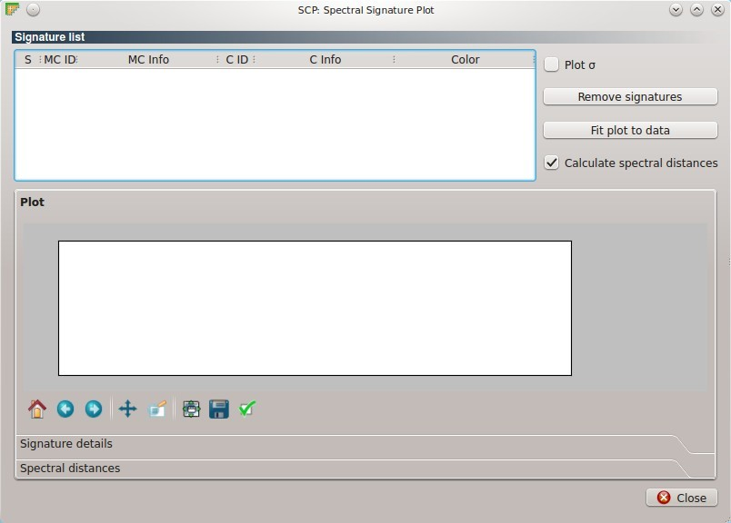
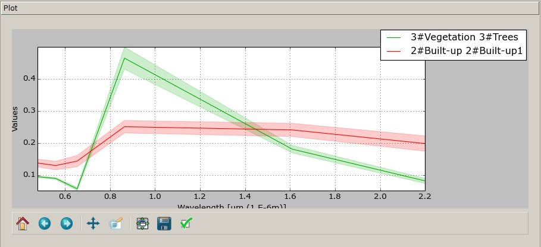
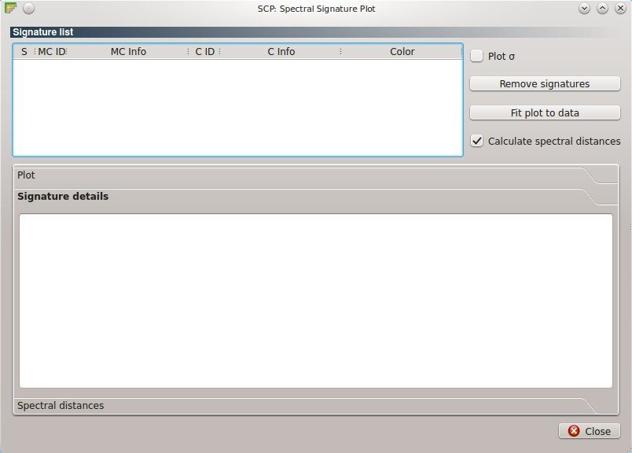
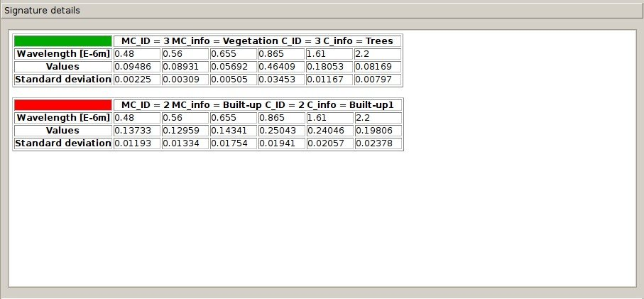
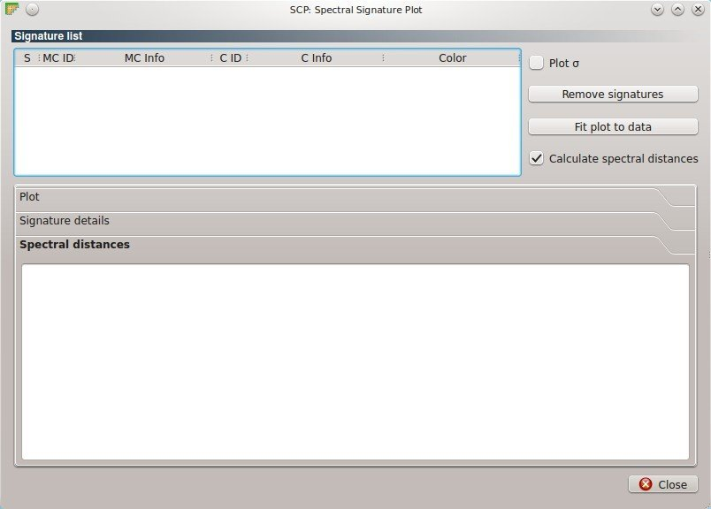
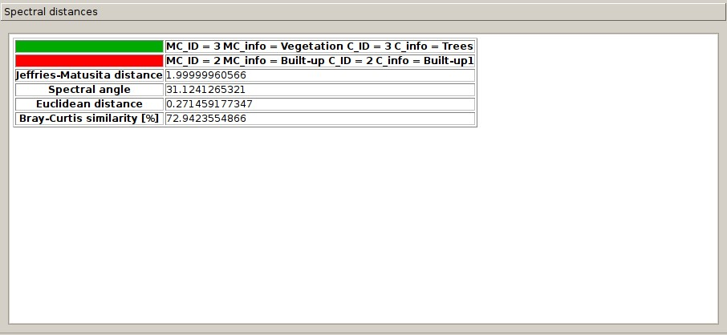

.. _spectral_signature_plot:

******************************
Spectral Signature Plot
******************************

.. |br| raw:: html

  

The ``Spectral Signature Plot`` window allows for the displaying of spectral signature plots, which are the signature values (usually reflectance) as a function of wavelength. 
Signatures can be added to the ``Spectral Signature Plot`` through the :ref:`roi_dock` and the :ref:`classification_dock`.
Only signatures checked in the :ref:`signature_list_plot` are displayed (which is independent from :ref:`signature_list` in the :ref:`classification_dock` ).

	
	:guilabel:`Spectral Signature Plot`

.. _signature_list_plot:

Plot Signature list
----------------------

* Table fields:
	* ``S`` : checkbox field; if checked, then signature is displayed in the plot;
	* ``MC ID`` : Macroclass ID;
	* ``MC Info`` : Macroclass Information;
	* ``Class ID`` : Class ID;
	* ``C Info`` : Class Information;
	* ``Color`` : color field; double click to select a color for the plot;
* ``Plot`` :math:`\sigma` : if checked, plot the standard deviation for each signature;
* [ ``Remove signatures`` ]: remove highlighted signatures from this list;
* [ ``Fit to data`` ]: resize the plot to fit to all the data;
* ``Calculate spectral distances`` : if checked, calculate the following spectral distances in :
	* Jeffries-Matusita distance;
	* Spectral angle;
	* Euclidean distance;
	* Bray-Curtis similarity.

	
.. _signature_plot:

Plot
^^^^^^^^^^^^^^^^^^^^^^^^^

It is possible to move the legend inside the plot with the mouse.
	
* Plot commands (from Matplotlib):
	* |m_home|: Reset to original view;
	* |m_back|: Back to previous view;
	* |m_forward|: Forward to next view;
	* |m_pan|: Pan axes with left mouse, zoom with right;
	* |m_zoom|: Zoom to rectangle;
	* |m_sub|: Unused;
	* |m_save|: Save plot to a figure (e.g. JPG file); 
	* |m_edit|: Unused.

|br|

	

	

	

	

	

	

	
		

	:guilabel:`Example Spectral Signature Plot`
	
.. _signature_details:

Signature details
^^^^^^^^^^^^^^^^^^^^^^^^^

	
	:guilabel:`Spectral Signature: Signature details`

Display the details about spectral signatures (i.e. Wavelength, Values, and Standard deviation)
		

	:guilabel:`Spectral Signature: Example signature details`
		
.. _spectral_distances:

Spectral distances
^^^^^^^^^^^^^^^^^^^^^^^^^

	
	:guilabel:`Spectral Signature: Spectral distances`

Display spectral distances for each combination of signatures, if ``Calculate spectral distances`` is checked in :ref:`signature_list_plot` .
It is useful for assessing ROI separability.

The following spectral distances are calculated :

* Jeffries-Matusita distance:  range [0 = identical, 2 = different],; useful in particular for Maximum Likelihood classifications;
* Spectral angle: range [0 = identical, 90 = different]; useful in particular for Spectral Angle Mapping classifications;
* Euclidean distance: useful in particular for Minimum Distance classifications;
* Bray-Curtis similarity [%]: range [0 = different, 100 = identical]; useful in general.
	
Values are displayed in red if signatures are particularly similar.
	

	
	:guilabel:`Spectral Signature: Example spectral distances`
