.. _thematic_tutorials:

***************************************************************
Thematic Tutorials
***************************************************************

.. |br| raw:: html

  

The following are thematic tutorials.
Before these tutorials, it is recommended to read the :ref:`tutorials`.

.. contents::
    :depth: 2
    :local:
	

.. _thematic_tutorial_3:
 
Tutorial: Land Cover Classification and Mosaic of Several Landsat images
===============================================================================

This tutorial is about the land cover classification of several Landsat images in order to create a classification of a large study area using the Semi-Automatic Classification Plugin (SCP).
For very basic tutorials see :ref:`tutorial_1` and :ref:`tutorial_2`.

The study area of this tutorial is `Costa Rica <https://en.wikipedia.org/wiki/Costa_Rica>`_ , a Country in Central America that has an extension of about 51,000 square kilometres.
In particular, we are going to classify Landsat 8 and Landsat 7 images, masking clouds and creating a mosaic of classifications.
We are going to identify the following land cover classes:

#. Built-up;
#. Vegetation;
#. Soil;
#. Water.

Following the video of this tutorial.

.. raw:: html

	<iframe allowfullscreen="" frameborder="0" height="360" src="http://www.youtube.com/embed/acxmIrM-Qns?rel=0" width="100%"></iframe>

http://www.youtube.com/watch?v=acxmIrM-Qns

Alternative video link
https://archive.org/details/video_tutorial_Landsat_mosaic_ENG

.. _thematic_tutorial_3_1:

Plugin installation
------------------------------------------------------

First, install the SCP.
For information about the installation of QGIS in various systems see :ref:`installation`.

Open QGIS; from the main menu, select ``Plugins`` > ``Manage and Install Plugins``;

.. figure:: _static/install_d.jpg
	:align: center
	
From the menu ``All``, select the Semi-Automatic Classification Plugin and click the button ``Install plugin``;

.. figure:: _static/plugins.jpg
	:align: center
	
The SCP should be automatically activated; however, be sure that the Semi-Automatic Classification Plugin is checked in the menu ``Installed`` (the restart of QGIS could be necessary to complete the SCP installation);

.. figure:: _static/plugins_installed.jpg
	:align: center

We are going to set some of the SCP options in order to optimize the following processes.
Open the :ref:`settings_tab` clicking the button |settings| and select :ref:`settings_processing_tab`.
Now, in :ref:`classification_process` check the options ``Use virtual rasters for temp files`` and ``Raster compression``, in order to save disk space during the processing.

In :ref:`ram` set the available RAM (in MB) for processing entering half of the system RAM; for instance it your system has 2GB of RAM enter 1024.
If the system is 32bit, due to system limitations you should not enter values higher than 512MB.

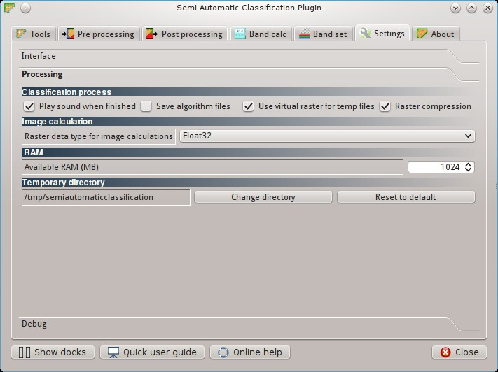
	
	:guilabel:`SCP settings`
	
In order to ease the photo interpretation in the following steps, we are going to use also the OpenLayers Plugin which allows for the display of several maps.
If you don't have already installed, follow the same steps previously described and install the OpenLayers Plugin in QGIS.

.. _thematic_tutorial_3_2:

Download and Pre processing of Landsat images
------------------------------------------------------

We are going to **download Landsat 7 and 8 images** using the SCP tool :ref:`Landsat_download_tab`.
Landsat images are available from the U.S. Geological Survey, and these bands are downloaded through the Google Earth Engine and the Amazon Web Services.
Also, we are going to convert Landsat images to **reflectance** and apply the DOS1 atmospheric correction (see :ref:`landsat_conversion_to_reflectance`).

First, we need to download the Landsat database in SCP.
Open the tab :ref:`Landsat_download_tab` clicking the button |tools| in the :ref:`SCP_menu` or the :ref:`toolbar`.
Click the button ``Select database directory`` in order to define where to save the database.
It is preferable to create a new directory (e.g. ``LandsatDB``) in the user directory.
Click the button ``Update database`` and click ``Yes`` in the following question about updating the image database.

	**TIP** : Landsat databases are updated daily, therefore when you need up to date images you should click the button ``Update database`` in order to the get the latest Landsat images.

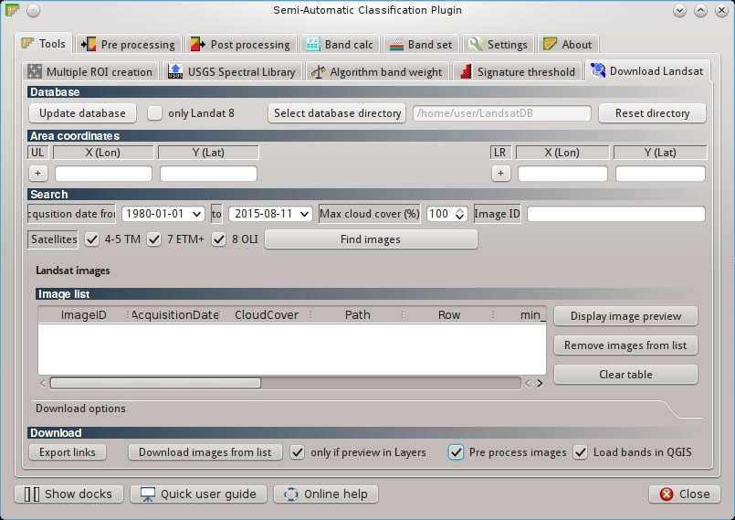
	
	:guilabel:`Landsat database download`
	
Now we could define the :ref:`area_coordinates_Landsat` of the study area, click ``Find images`` and browse Landsat images.
Each Landsat image has a unique ID (i.e. identifier).
In this tutorial we are going to use two Landsat 8 images acquired on February 2014 (IDs: LC80150532014050LGN00 and LC80160532014057LGN00) and a Landsat 7 image acquired on March 2014 (ID: LE70150532014090EDC00); of course, more images are required for the classification of the whole Country.

With SCP, it is possible to find an image basing on the ID thereof using the :ref:`search_Landsat` options.
In particular, in ``Image ID`` paste the following IDs and click ``Find images``::

	LC80150532014050LGN00; LC80160532014057LGN00; LE70150532014090EDC00
	
After a few seconds, the three images are listed in the :ref:`landsat_images`.

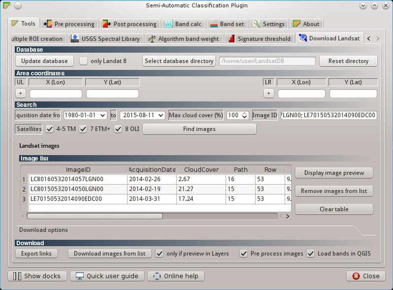
	
	:guilabel:`Landsat image search`
	
Before downloading the images, we need to define the options for the conversion to reflectance which will be performed automatically to downloaded images.
Open the tab :ref:`landsat_tab` clicking the button |preprocessing| in the :ref:`toolbar` ; enable the options ``Apply DOS1 atmospheric correction`` and ``Brightness temperature in Celsius``.
Also, leave checked ``Use NoData value (image has black border)``.

	**TIP** : check ``Perform pan-sharpening`` in order to perform the :ref:`pan_sharpening_definition` of Landsat images producing bands with 15m spatial resolution; of course, using pan-sharpened images increases the classification time (because a greater number of pixels need to be processed) and can increase the spectral variability.

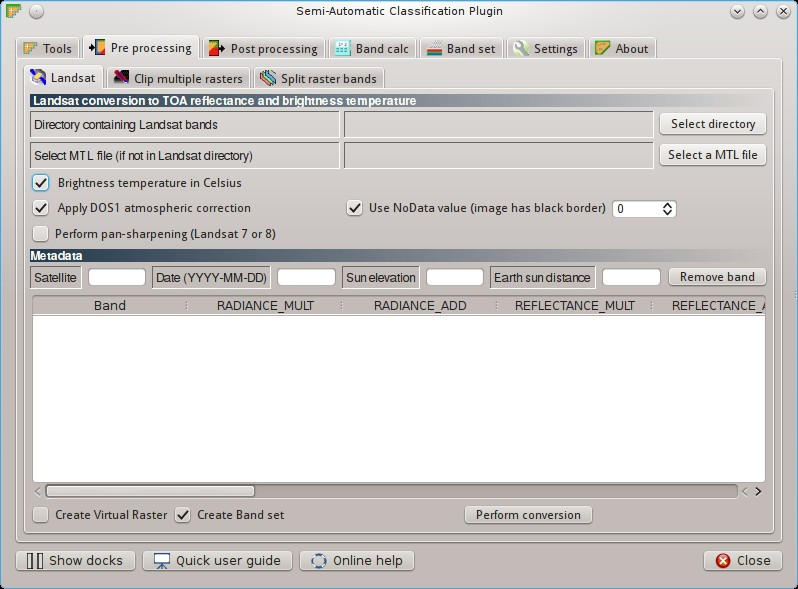
	
	:guilabel:`Landsat pre processing`
	
Now, open the tab :ref:`Landsat_download_tab` and uncheck the options ``only if preview in Layers`` and ``Load bands in QGIS`` (leave checked ``Pre process images`` in order to convert bands to reflectance automatically).
Click the button ``Download images from list`` to select an output directory and start the download process (this may take a while).

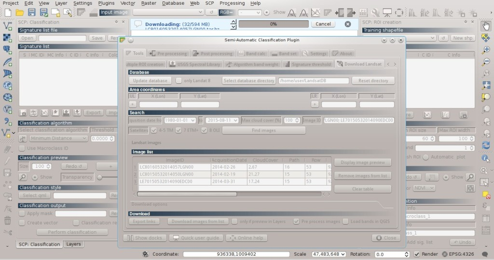
	
	:guilabel:`Landsat download`
	
When the download process is finished, several directories are created in the output directory with the name like Landsat ID, containing the original Landsat bands and the converted bands (with the suffix ``_converted``).
	
.. _thematic_tutorial_3_3:

Classification of Landsat Images
------------------------------------------------------

We are going to start the classification of the Landsat 8 image ``LC80150532014050LGN00`` converted to reflectance.
Open the directory ``LC80150532014050LGN00_converted``.

In QGIS, open the following bands (also with drag and drop):

	* RT_LC80150532014050LGN00_B2.tif = Blue;
	* RT_LC80150532014050LGN00_B3.tif = Green;
	* RT_LC80150532014050LGN00_B4.tif = Red;
	* RT_LC80150532014050LGN00_B5.tif = Near-Infrared;
	* RT_LC80150532014050LGN00_B6.tif = Short Wavelength Infrared 1;
	* RT_LC80150532014050LGN00_B7.tif = Short Wavelength Infrared 2.

Open the tab :ref:`band_set_tab` clicking the button |band_set| in the :ref:`SCP_menu` or the :ref:`toolbar`.
Click the button ``Select All``, then ``Add rasters to set``, and then ``Sort by name`` for ordering bands automatically.
Finally, select ``Landsat 8 OLI`` from the combo box ``Quick wavelength settings``, in order to set automatically the center wavelength of each band (this is required for the spectral signature calculation).

	**TIP** : click the button ``Build band overviews`` in order to improve display performance of bands.

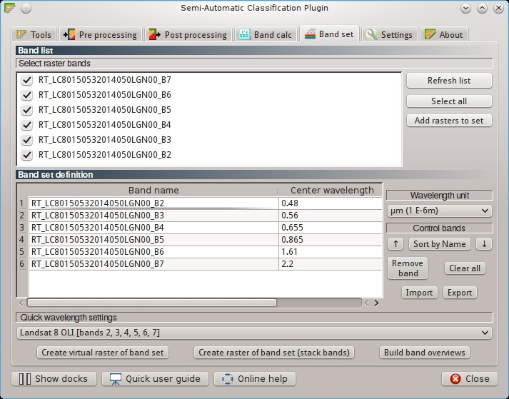
	
	:guilabel:`Definition of Band set`
	
In the list ``RGB`` select the item ``4-3-2`` for displaying a :ref:`color_composite_definition` of Near-Infrared, Red, and Green.
A temporary virtual raster of the Band set will be created in QGIS, allowing for the photo interpretation of the image.

Now we need to create ``Training shapefile`` and ``Signature list file`` in order to collect :ref:`ROI_definition` (ROIs) and calculate the :ref:`spectral_signature_definition` thereof (for very basic definitions see :ref:`tutorial_1`).

In the :ref:`roi_dock` click the button ``New shp`` and define a name (e.g. ``ROI.shp`` ) in order to create the ``Training shapefile`` that will store ROI polygons.
The shapefile is created and added to QGIS.
The name of the ``Training shapefile`` is displayed in :ref:`training_shapefile` .

Also, click the button ``Save`` in the :ref:`classification_dock` and define a name (e.g. ``SIG.xml`` ) in order to create the ``Signature list file`` that will store spectral signatures.
The path of the ``Signature list file`` is displayed in :ref:`signature_list_file` .

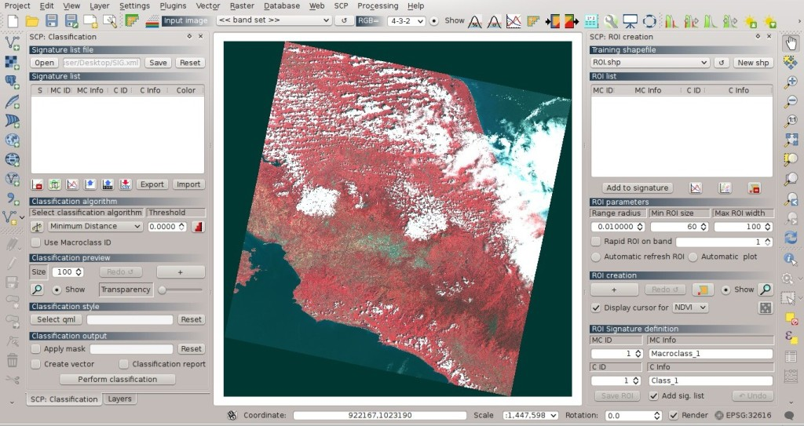
	
	:guilabel:`Definition of SCP input for the Landsat image LC80150532014050LGN00`
	
Now we are ready for the creation of ROIs.
We are going to use the same codes for ROIs in all the Landsat images, according to the following table.

+-----------------------------+--------------------------+
| Macroclass name             | Macroclass ID            |
+=============================+==========================+
|   Built-up                  |  1                       |
+-----------------------------+--------------------------+
|   Vegetation                |  2                       |
+-----------------------------+--------------------------+
|   Soil                      |  3                       |
+-----------------------------+--------------------------+
|   Water                     |  4                       |
+-----------------------------+--------------------------+

About the basics of ROI creation see :ref:`tutorial_1_4`.
It is possible to create ROIs by drawing manually a polygon using the button |manual| or with region growing pressing the button + and then clicking the map.
Use the button |zoom_to_ROI| in :ref:`ROI_creation` for zooming to the polygon extent of the ROI, and ``Show`` for showing or hiding the temporary ROI.

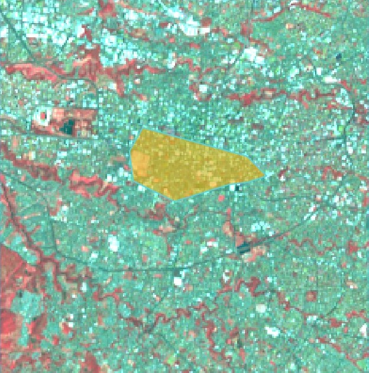
	
	:guilabel:`Example of Built-up ROI`

.. figure:: _static/tutorial_3_3_4.jpg
	:align: center
	
	:guilabel:`Example of Vegetation ROI`

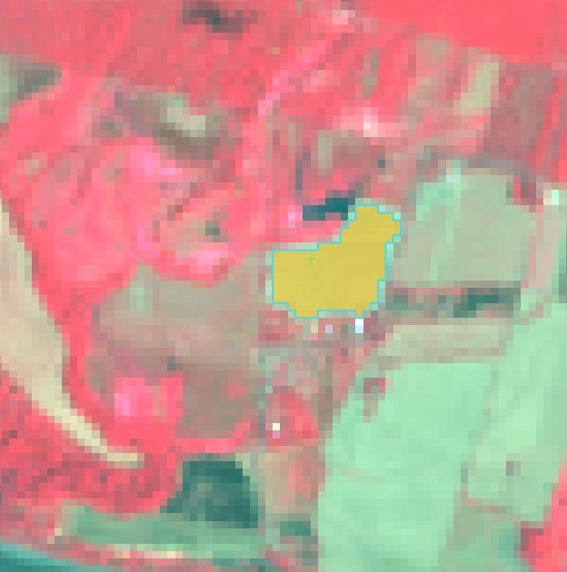
	
	:guilabel:`Example of Soil ROI`

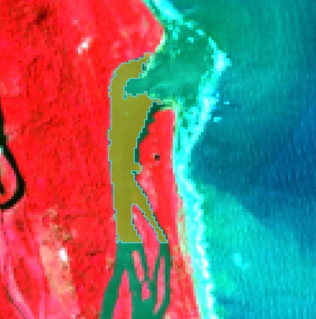
	
	:guilabel:`Example of Water ROI`

With the :ref:`roi_dock` create as many ROIs as possible, assigning a unique Class ID (C_ID) to each ROI, and the Macroclass ID (MC_ID) of the corresponding Macroclass.
If ``Display cursor for`` is checked in the :ref:`ROI_creation`, the NDVI value of the pixel beneath the cursor is displayed in the map: it is useful for detecting vegetation pixels (characterized by high NDVI values).

	**TIP** : change frequently the :ref:`color_composite_definition` and use the buttons |cumulative_stretch| and |std_dev_stretch| in the :ref:`toolbar` for stretching the minimum and maximum values of the displayed image; also, use the button ``Show`` for hiding and showing the image.

ROIs are used for the calculation of spectral signatures that are used by the classification algorithm in order to classify the entire image.
In this tutorial we are going to use the :ref:`max_likelihood_algorithm` algorithm.

After the creation of each ROI it is useful to check the :ref:`spectral_distance_definition` in order to assess the separability of ROI; in fact, each ROI should be different (i.e. spectrally distant) from the others, in order to avoid spectral confusion and achieve better classification results.

In the :ref:`signature_list` highlight the ROIs and click the button |sign_plot|.
Spectral signature are added to the :ref:`spectral_signature_plot`.

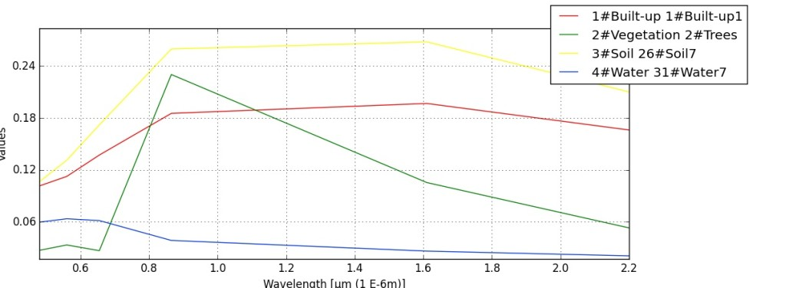
	
	:guilabel:`Plot of spectral signatures`

Now click the tab :ref:`spectral_distances`.
Each table represent the :ref:`spectral_distance_definition` of each ROI combination.

As shown in the following figure, the comparison of the Built-up ROI and the Soil ROI highlights very low :ref:`spectral_angle` and :ref:`euclidean_distance`; this means high similarity if we used the :ref:`spectra_angle_mapping_algorithm` or the :ref:`minimum_distance_algorithm` algorithms.
The :ref:`Jeffries_Matusita_distance` is near 2; this means that the two ROIs are separable for the :ref:`max_likelihood_algorithm` algorithm.

Since we are using the :ref:`max_likelihood_algorithm` algorithm, it is important that the :ref:`Jeffries_Matusita_distance` is near 2 for each ROI combination.

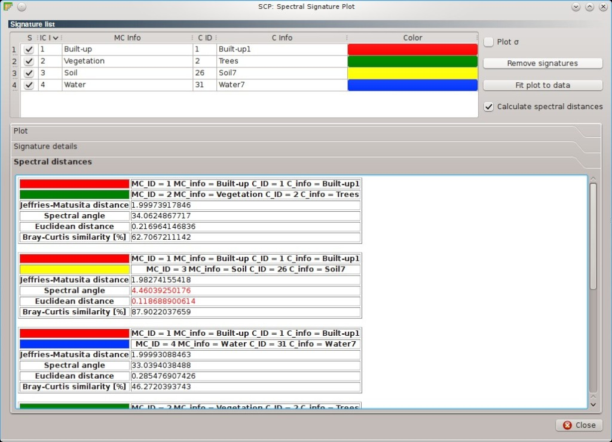
	
	:guilabel:`Spectral distances`

Now we can create a classification preview (see :ref:`tutorial_1_5` for the basics of classification previews).
	
In the :ref:`classification_alg` select the classification algorithm ``Maximum Likelihood``.
In :ref:`classification_preview` set ``Size`` = 500 , click the button ``+`` and then **left click** in the map in order to create a classification preview.
Use the ``Transparency`` tool for changing the preview transparency and display the classification over the image.

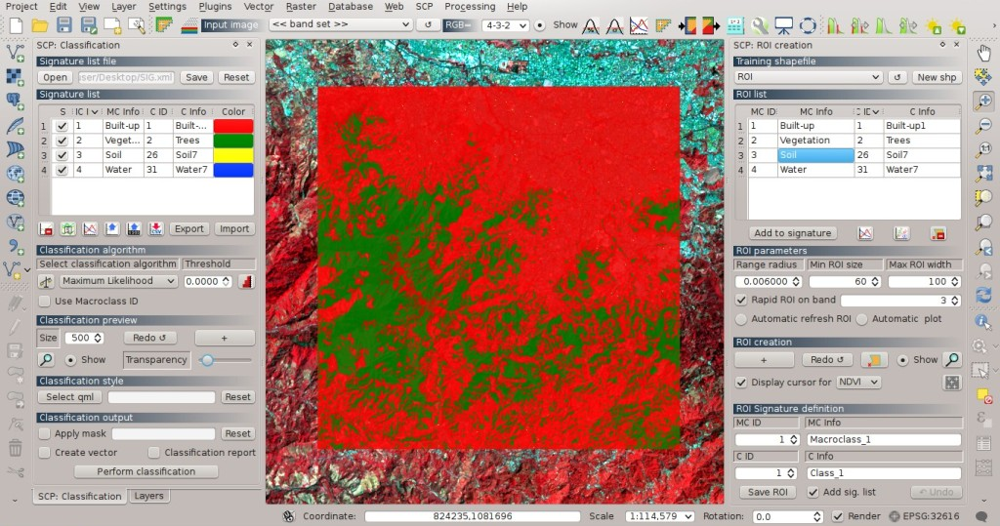
	
	:guilabel:`Classification preview`
	
In the :ref:`classification_alg`, click the button ``+`` and then **right click** in the map for calculating the ``algorithm raster``.
The ``algorithm raster`` represents the calculation result of the :ref:`classification_algorithm_definition`; it is useful for locating where we need to create new ROIs.

As shown in the following figure, the ``algorithm raster`` has a grey scale symbology, where dark areas represent pixels that the algorithm found distant from all the spectral signatures and white areas represents pixels that are very similar to spectral signatures.
In these dark areas we have a greater level of uncertainty, therefore we need to create new ROIs in order to improve the classification results.

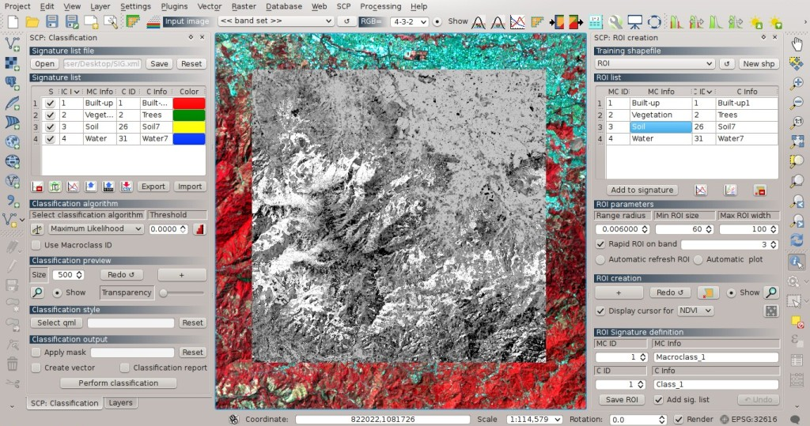
	
	:guilabel:`Preview of the algorithm raster`
	
We can notice the presence of clouds in the image.
In order to avoid classification errors, we need to mask clouds.

There are several methods for masking clouds; during the classification step, a simple method for masking clouds is the creation of ROIs.
Create a new ROI inside a cloud in the image, and assign a unique Class ID and the Macroclass ID equals to 0.
In fact, the MC ID = 0 is used by SCP for the category ``Unclassified``, which means that cloud pixels are not classified (i.e. masked).

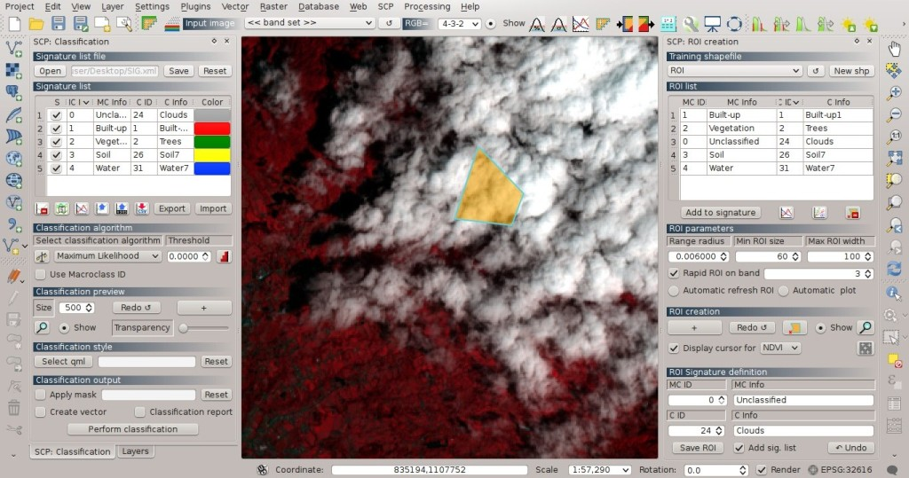
	
	:guilabel:`ROI created for cloud masking`
	
In the following image, we can see that clouds are now masked.
However, pixels near the border of clouds are classified incorrectly as Built-up.
In the next paragraphs, more effective methods are described for masking clouds after the classification process (see :ref:`thematic_tutorial_3_5`).

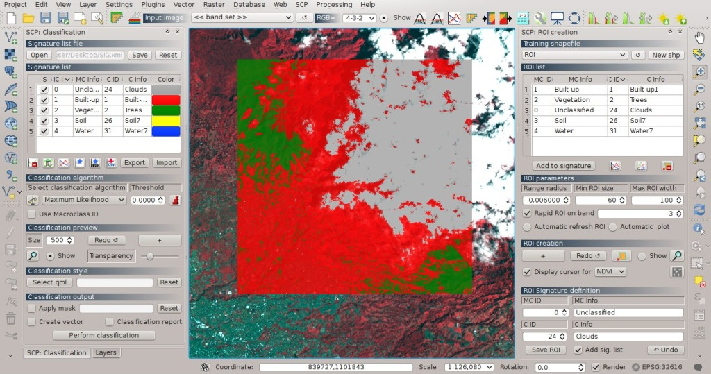
	
	:guilabel:`Classification preview over clouds`

	
	**TIP** : load a service such as OpenStreetMap using the OpenLayers Plugin, which can ease the photo interpretation and the ROI creation.

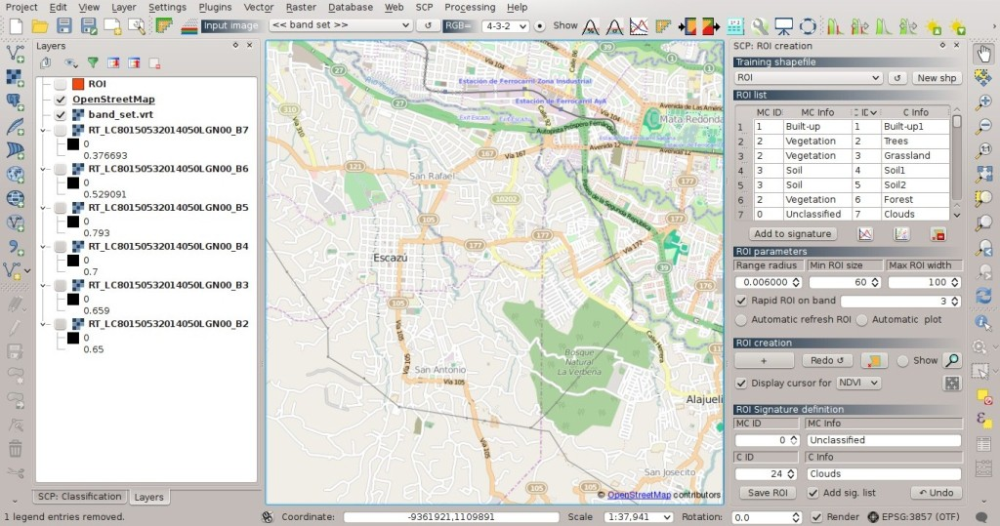
	
	:guilabel:`OpenStreetMap loaded in QGIS`
	
When we are happy with the results of the previews, we can perform the classification of the whole image.
In :ref:`classification_alg`, activate the checkbox ``Use Macroclass ID``.
In the :ref:`classification_output` click the button ``Perform classification`` and define the name of the classification output (e.g. ``classification_1.tif``).

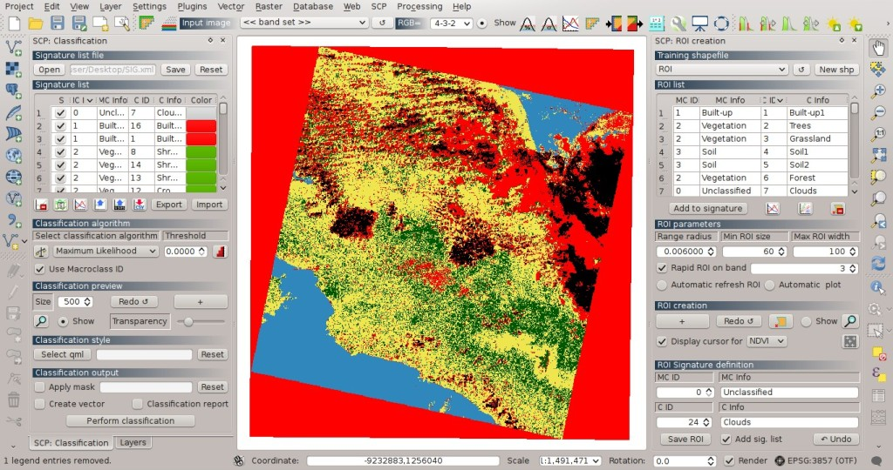
	
	:guilabel:`Land cover classification 1 of the Landsat image LC80150532014050LGN00`

We can see that part of the clouds are black (i.e. unclassified), however several cloud pixels are classified as Built-up.
Also, the black border of the Landsat image is classified as Built-up.
We are going to correct these errors and refine the classification in the next steps.

Now, in QGIS open the following Landsat 8 bands that are inside the directory ``LC80160532014057LGN00_converted``.

	* RT_LC80160532014057LGN00_B2.tif = Blue;
	* RT_LC80160532014057LGN00_B3.tif = Green;
	* RT_LC80160532014057LGN00_B4.tif = Red;
	* RT_LC80160532014057LGN00_B5.tif = Near-Infrared;
	* RT_LC80160532014057LGN00_B6.tif = Short Wavelength Infrared 1;
	* RT_LC80160532014057LGN00_B7.tif = Short Wavelength Infrared 2.
	
Repeat the above steps for the creation of the Band set, the ``Training shapefile`` and ``Signature list file``.

	**TIP** : close QGIS and create a new QGIS project for each Landsat image, in order to delete temporary files and free disk space. 

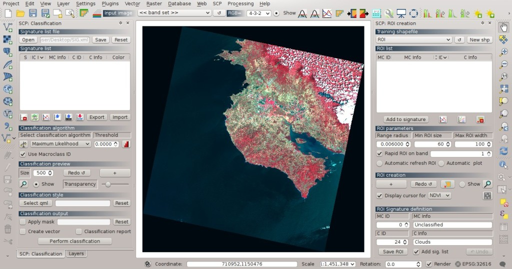
	
	:guilabel:`Definition of SCP input for the Landsat image LC80160532014057LGN00`
	
Create a land cover classification repeating the steps previously described.

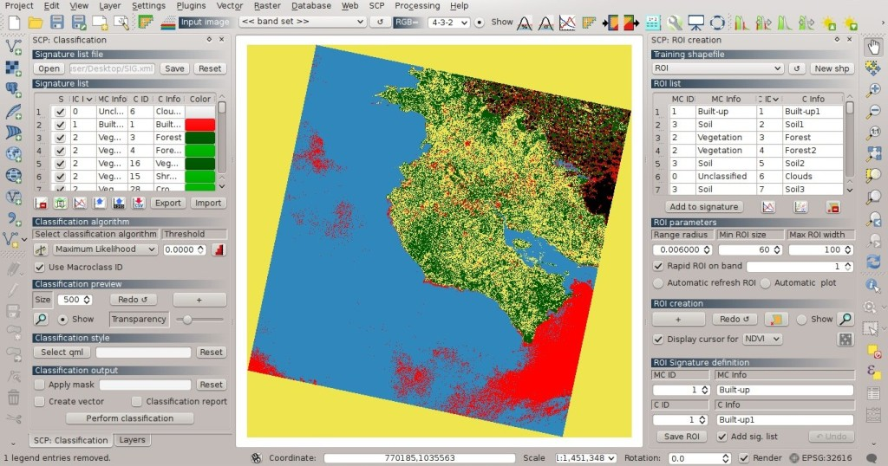
	
	:guilabel:`Land cover classification 2 of the Landsat image LC80160532014057LGN00`
	
In a new QGIS project, open the Landsat 7 bands inside the directory ``LE70150532014090EDC00_converted``:

	* RT_LE70150532014090EDC00_B1.tif = Blue;
	* RT_LE70150532014090EDC00_B2.tif = Green;
	* RT_LE70150532014090EDC00_B3.tif = Red;
	* RT_LE70150532014090EDC00_B4.tif = Near-Infrared;
	* RT_LE70150532014090EDC00_B5.tif = Short Wavelength Infrared 1;
	* RT_LE70150532014090EDC00_B7.tif = Short Wavelength Infrared 2.
	
You can see that this image covers the same area as the Landsat 8 image ``LC80150532014050LGN00``.
In fact, we are going to use the classification of this Landsat 7 image in order to fill the Unclassified pixels of the Landsat 8 image.

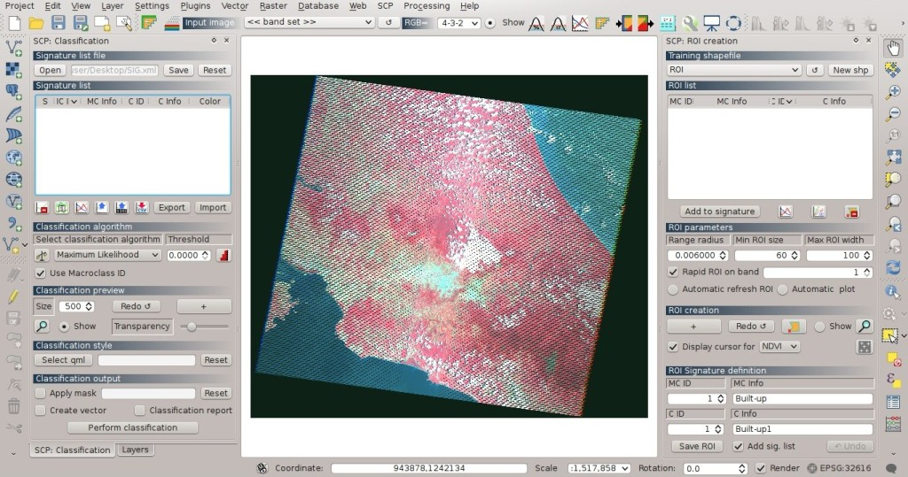
	
	:guilabel:`Definition of SCP input for the Landsat image LE70150532014090EDC00`
	
Again, create a land cover classification following the steps previously described.

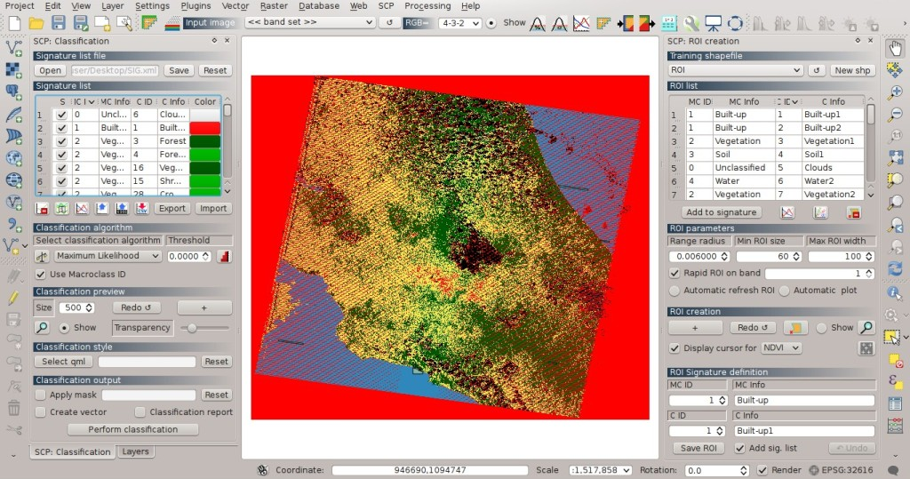
	
	:guilabel:`Land cover classification 3 of the Landsat image LE70150532014090EDC00`
	
Now, we have 3 land cover classifications that we can enhance in several ways.	

.. _thematic_tutorial_3_4:

Enhancement of Classification Using NDVI
------------------------------------------------------

We are going to calculate NDVI for enhancing the classification using the :ref:`band_calc_tab` (see :ref:`thematic_tutorial_6`).
In particular, pixels where NDVI value is above a certain threshold will be classified as vegetation (code 2).
Below this NDVI threshold, the Maximum Likelihood classification is untouched.

Of course, this is an example of integration of ancillary data; we could use other data such as other vegetation indices or the result of other classifications (e.g. using :ref:`spectra_angle_mapping_algorithm`).

Now, in QGIS load the bands of the Landsat 8 image ``LC80150532014050LGN00`` and the respective land cover classification.
Open the :ref:`band_calc_tab` and click the button ``Refresh list``.
In the :ref:`band_calc_tab`, calculate the NDVI copying the following :ref:`expression`::

	("RT_LC80150532014050LGN00_B5" - "RT_LC80150532014050LGN00_B4")  /  ("RT_LC80150532014050LGN00_B5" + "RT_LC80150532014050LGN00_B4")

Click the button ``Calculate``, select where to save the NDVI (e.g. a new file named ``NDVI_1.tif``).

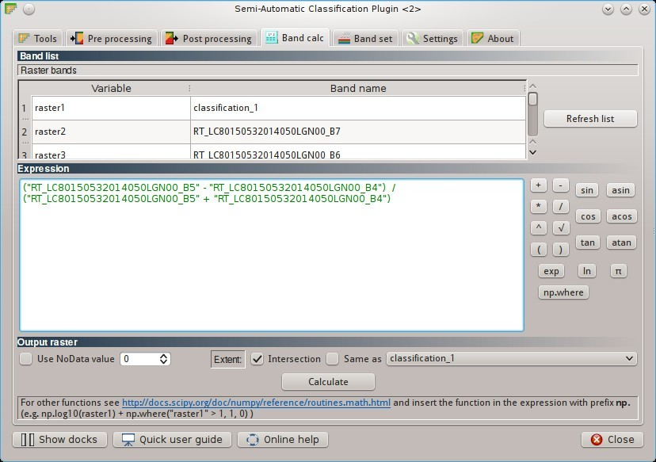
	
	:guilabel:`NDVI calculation`
	
Then, calculate the following :ref:`expression` for enhancing the classification basing on the NDVI::

	np.where("NDVI_1" > 0.6, 2, "classification_1")

Click the button ``Calculate``, and select where to save the new classification (e.g. ``classification_1_NDVI.tif``).
We can see in the following figure that the area classified as vegetation has increased.

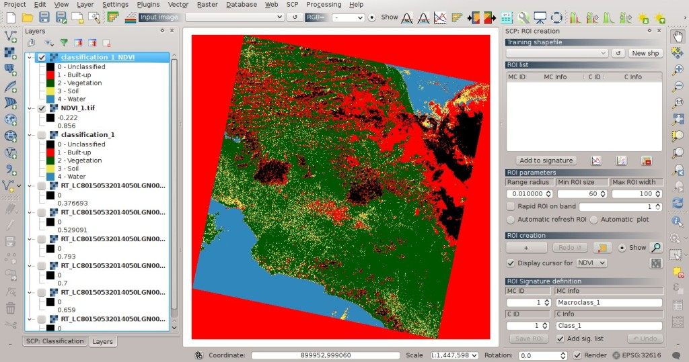
	
	:guilabel:`Classification 1 refined with NDVI`
	
In this case we have used a NDVI threshold equals to 0.6 .
However, the threshold value has to be chosen for every image, because NDVI can vary from image to image.

Now we perform the same enhancement for the other land cover classifications.
For the Landsat 8 image ``LC80160532014057LGN00`` calculate NDVI with the following expression::

	("RT_LC80160532014057LGN00_B5" - "RT_LC80160532014057LGN00_B4")  /  ("RT_LC80160532014057LGN00_B5" + "RT_LC80160532014057LGN00_B4")

and the following expression for enhancing the classification::

	np.where("NDVI_2" > 0.5, 2, "classification_2")

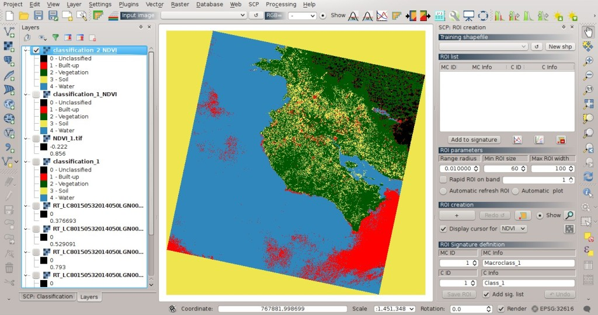
	
	:guilabel:`Classification 2 refined with NDVI`
	
For the Landsat 7 image ``LE70150532014090EDC00`` calculate NDVI with the following expression::

	("RT_LE70150532014090EDC00_B4" - "RT_LE70150532014090EDC00_B3")  /  ("RT_LE70150532014090EDC00_B4" + "RT_LE70150532014090EDC00_B3")

and the following expression for enhancing the classification::

	np.where("NDVI_3" > 0.5, 2, "classification_3")

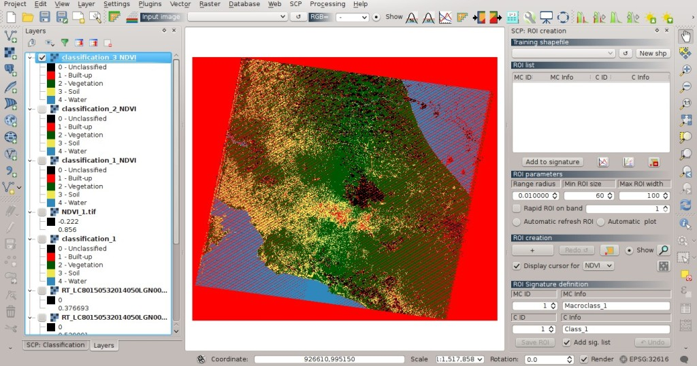
	
	:guilabel:`Classification 3 refined with NDVI`
	
Now that the classification of vegetation has been enhanced for the three images, we are going to mask clouds and border pixels in order to avoid classification errors.

.. _thematic_tutorial_3_5:

Cloud Masking
------------------------------------------------------

Landsat 8 images include Quality Assessment bands (QA) that are useful for identifying clouds.
Pixel values of QA bands are codes that represent combinations of surface and atmosphere conditions.
These values indicate with high confidence cirrus or clouds pixels (for the description of these codes see the table at http://landsat.usgs.gov/L8QualityAssessmentBand.php ).

The QA band of the Landsat 8 image ``LC80150532014050LGN00`` includes mainly the values 53248 and 61440 indicating clouds, and the value 36864 indicating potential clouds.
Therefore, we are going to write an expression that masks our classification (i.e. ``classification_1_NDVI``) where pixels of the QA band are equal to one of these values.

In QGIS, open the band ``LC80150532014050LGN00_BQA`` that is inside the directory ``LC80150532014050LGN00`` of the downloaded Landsat image and the ``classification_1_NDVI``.
Copy the following :ref:`expression` in the :ref:`band_calc_tab`::

	np.where(("LC80150532014050LGN00_BQA" == 53248) | ("LC80150532014050LGN00_BQA" == 36864) | ("LC80150532014050LGN00_BQA" == 61440), 0, "classification_1_NDVI")

Click the button ``Calculate``, and select where to save the new classification (e.g. ``classification_1_clouds.tif``).

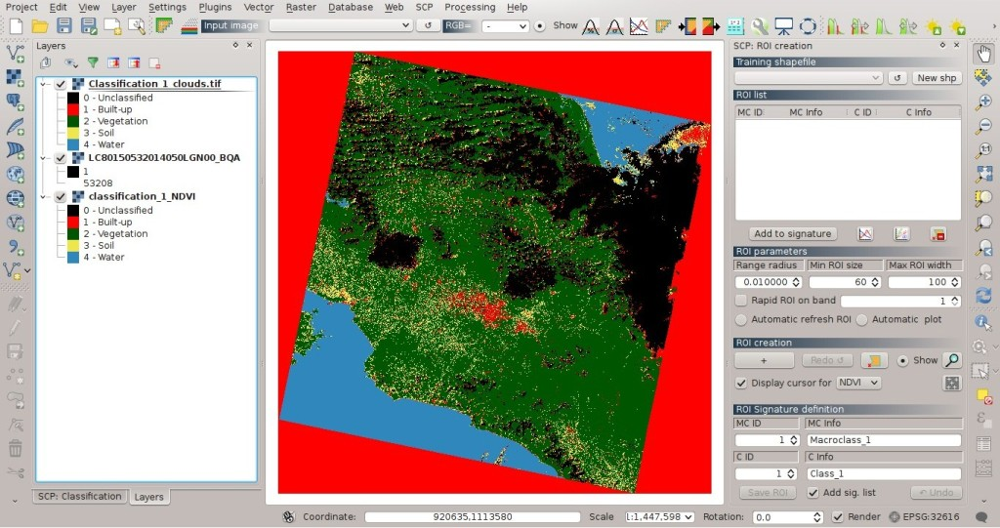
	
	:guilabel:`Classification 1 with masked clouds`
	
Clouds are almost completely masked (i.e. Unclassified); however, some pixels are still classified as Built-up (in red).
We can do the same for the image ``LC80160532014057LGN00`` using the following :ref:`expression` in the :ref:`band_calc_tab`::

	np.where(("LC80160532014057LGN00_BQA" == 53248) | ("LC80160532014057LGN00_BQA" == 36864) | ("LC80160532014057LGN00_BQA" == 61440), 0, "classification_2_NDVI")

The Landsat 7 image does not have the QA band.
Another method for masking clouds uses the Blue and the Thermal Infrared (converted to temperature) bands, basing on the fact that clouds are generally colder than soil and have high reflectance values in the blue band.
Landsat 7 is also affected by black stripes (i.e. SLC-off) that we are going to mask as well.

We are going to create an expression that identifies pixel values below a certain temperature threshold for the Thermal band (band 6 for Landsat 7), and above a certain reflectance threshold for the Blue band (band 1).

In QGIS load all the Landsat bands inside the directory ``LE70150532014090EDC00_converted``.
Use the following expression in the :ref:`band_calc_tab`::

	np.where((("RT_LE70150532014090EDC00_B6_VCID_1"<23) & ("RT_LE70150532014090EDC00_B1">0.1)) | ("RT_LE70150532014090EDC00_B1" == 0) | ("RT_LE70150532014090EDC00_B2" == 0) | ("RT_LE70150532014090EDC00_B3" == 0) | ("RT_LE70150532014090EDC00_B4" == 0) | ("RT_LE70150532014090EDC00_B5" == 0) | ("RT_LE70150532014090EDC00_B7" == 0), 0,"classification_3_NDVI")

The first part (``("RT_LE70150532014090EDC00_B6_VCID_1"<23) & ("RT_LE70150532014090EDC00_B1">0.1)``) means that we are going to mask pixels that have both temperature lower than 23°C and Blue band reflectance greater than 0.1 .
These threshold values have been identified in the image, using the tool ``Identify`` of QGIS for cloud pixels in band 1 and band 6.

The character ``|`` means ``or`` , so that the other expressions (e.g. ``"RT_LE70150532014090EDC00_B1" == 0``) identify pixel values equal to 0 (which are NoData) for every Landsat band, in order to mask the black stripes due to SLC-off and the black border.

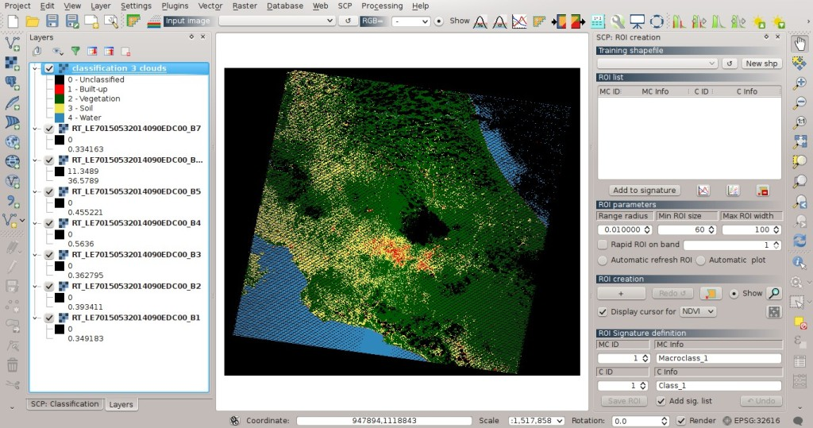
	
	:guilabel:`Classification 3 with masked clouds`
	
We could use the same method of cloud masking also for Landsat 8 images.
For the image ``LC80150532014050LGN00`` load the bands ``RT_LC80150532014050LGN00_B10`` and ``RT_LC80150532014050LGN00_B2``, and use the following :ref:`expression` in the :ref:`band_calc_tab`::

	np.where((("RT_LC80150532014050LGN00_B2" > 0.03) & ("RT_LC80150532014050LGN00_B10" < 24)) | ("RT_LC80150532014050LGN00_B2" == 0), 0, "classification_2_NDVI")
	
The condition ``"RT_LC80160532014057LGN00_B2" == 0`` allows for the masking of the image black border.

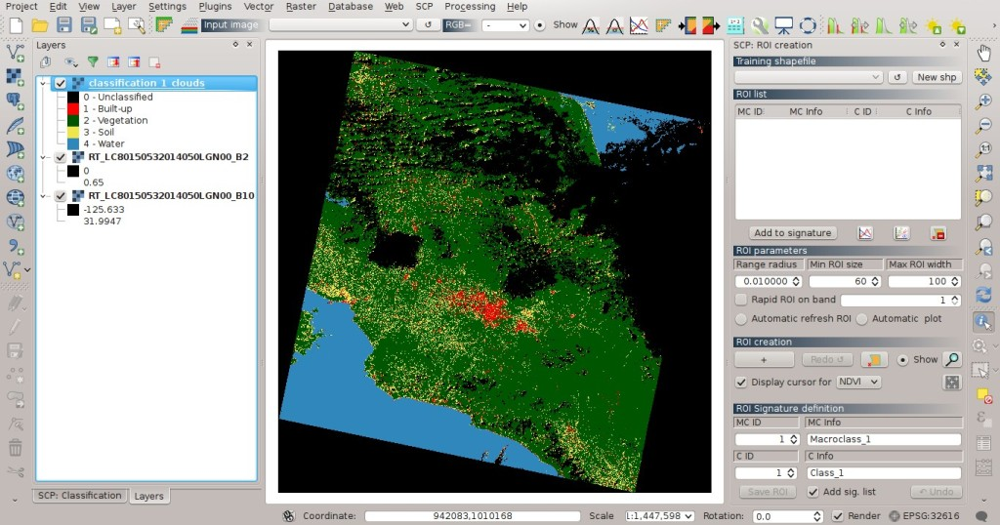
	
	:guilabel:`Classification 1 with clouds masked using the alternative method`
	
As you can see, there are still gaps (Unclassified pixels) in the classification; we would require the classification of other Landsat images in order to fill those gaps.
After the cloud masking of these three classifications, we can create one mosaic that is the classification of the whole study area.

Part of the unclassified gaps has been filled with the Landsat 7 classification.
Of course, we would require more classifications in order to fill all the gaps.
	
.. _thematic_tutorial_3_6:

Mosaic of Classifications
------------------------------------------------------

In order to create a mosaic of classifications, we are going to write an expression that will fill Unclassified pixels of the Landsat 8 image (ID ``LC80150532014050LGN00``) with the classification of the Landsat 7 image (ID ``LE70150532014090EDC00``).
Also, we are going to merge these classifications to third one (the Landsat 8 image with ID ``LC80160532014057LGN00``).

In QGIS open the three cloud masked classifications.
Copy the following :ref:`expression` in :ref:`band_calc_tab`::

	np.where("classification_1_clouds" == 0,  np.where("classification_3_clouds" == 0, "classification_2_clouds", "classification_3_clouds"), "classification_1_clouds")

Uncheck the checkbox ``Intersection`` in :ref:`output_raster` and click ``Calculate``.
The result (e.g. ``classification_mosaic``) is shown in the following image.

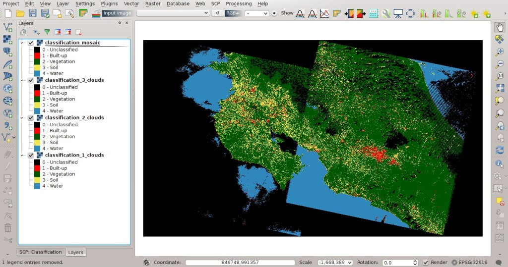
	
	:guilabel:`Classification mosaic`
	
In the following steps we are going to perform the accuracy assessment and the estimation of land cover area.

.. _thematic_tutorial_3_7:

Accuracy Assessment
------------------------------------------------------

:ref:`accuracy_assessment_definition` is an important step of a land cover classification.
In this tutorial we are going to use the ``Training shapefile`` as reference for assessing classification accuracy.
However, there other methods that can improve the validation reliability (see http://fromgistors.blogspot.com/2014/09/accuracy-assessment-using-random-points.html ).

In QGIS, load the classification mosaic and the ``Training shapefile`` used for the image ``LC80150532014050LGN00``.
In SCP open the tab :ref:`accuracy_tab` and click the buttons ``Refresh list``.
Select ``classification_mosaic`` as the classification to assess and the ``Training shapefile`` as  reference shapefile.
Also, select ``MC_ID`` as ``Shapefile field``.
Click ``Calculate error matrix`` and choose the output destination (e.g. ``accuracy.tif``).

The process produces an ``error matrix`` and an ``error raster`` which are useful for assessing the quality of our classification.

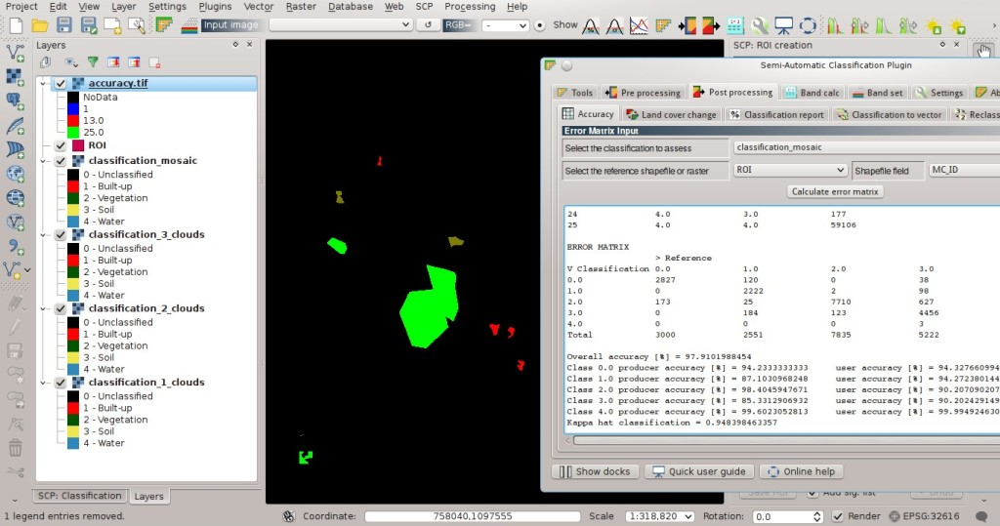
	
	:guilabel:`Accuracy assessment`

.. _thematic_tutorial_3_8:

Clip of the Classification
------------------------------------------------------

Before calculating the area of each land cover class, we need to clip the classification to the extent of the study area, which is Costa Rica.

Download the Shapefile of Sub-National Administrative Units of Costa Rica from http://data.fao.org/map?entryId=c7a0f990-88fd-11da-a88f-000d939bc5d8&tab=metadata (clicking the Download button) by the `FAO  <http://www.fao.org>`_ .

Extract the downloaded file (``1173.zip``) and load the shapefile ``costa rica.shp`` in QGIS (select WGS84 as projection).

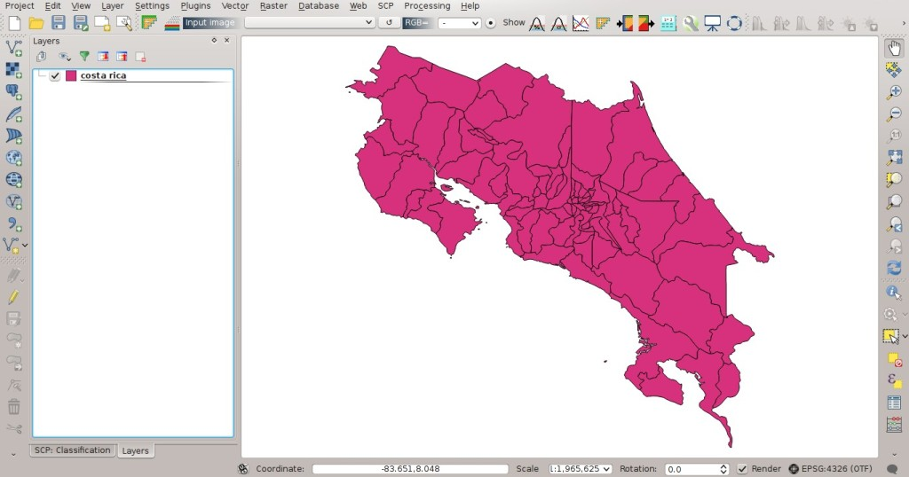
	
	:guilabel:`The shapefile of Costa Rica by FAO`

In this case, we need to define the projection of this shapefile.
In QGIS, open the command ``Vector > Data management tool > Define current projection``; select the shapefile ``costa rica`` as ``Input vector layer`` and choose ``EPSG:4326 - WGS 84`` as spatial reference, and click ``OK``.

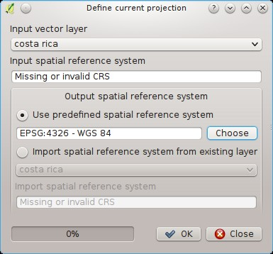
	
	:guilabel:`Define the shapefile projection`

Now we can clip the ``classification_mosaic.tif``.
Load the classification in QGIS. 
Open the command ``Raster > Extraction > Clipper``.
Select the ``classification_mosaic`` as input raster; set the output file (e.g. ``classification_clip.tif``), and set ``No data value`` equals to 0.
In ``Clipping mode`` enable ``Mask layer`` and select ``costa rica``, then click ``OK``.

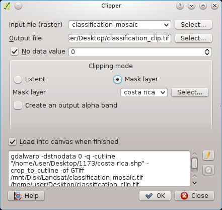
	
	:guilabel:`Clipping the classification`
	
Finally, we have a classification clipped to the extent of Costa Rica (as you can see we would need other classifications for covering the whole extent of Costa Rica), and we can calculate the classification report.

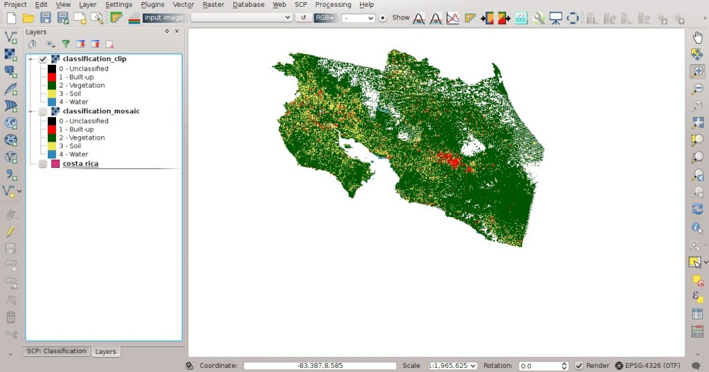
	
	:guilabel:`The clipped classification`

.. _thematic_tutorial_3_9:

Classification Report
------------------------------------------------------

In SCP open the tab :ref:`classification_report_tab` and click the buttons ``Refresh list``.
Check ``Use NoData value`` setting the value equals to 0 and click the button ``Calculate classification report``.
The classification report is displayed with the count of pixels, the area, and percentage of each land cover class.
You can save the report to text file clicking the button ``Save report to file``.

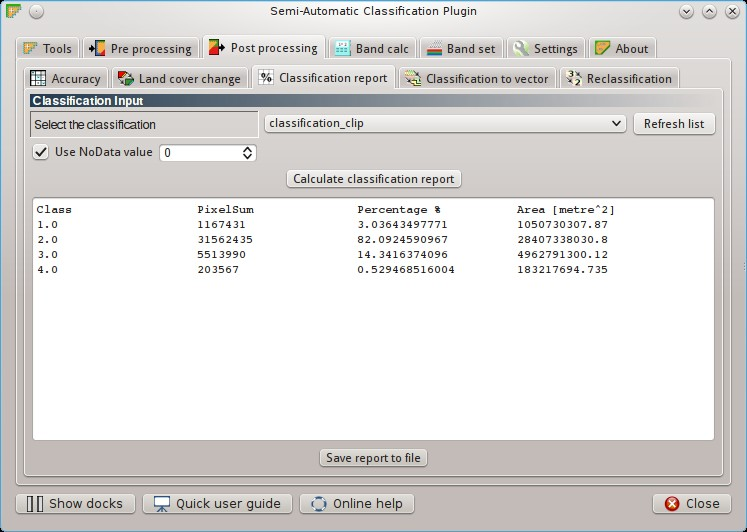
	
	:guilabel:`Classification report`

We have completed this tutorial about the land cover classification of a large area, using multiple Landsat images and creating a classification mosaic.
It is worth pointing out that classification results depend on the season of the images.
Therefore, the input images should be acquired in the same period, in order to avoid differences due for instance to the phenological state of vegetation or occurred land cover change.
	
.. |manual| image:: _static/semiautomaticclassificationplugin_manual_ROI.jpg
	:width: 20pt

.. |zoom_to_ROI| image:: _static/semiautomaticclassificationplugin_zoom_to.png
	:width: 20pt

.. |cumulative_stretch| image:: _static/semiautomaticclassificationplugin_bandset_cumulative_stretch_tool.png
	:width: 20pt

.. |std_dev_stretch| image:: _static/semiautomaticclassificationplugin_bandset_std_dev_stretch_tool.png
	:width: 20pt

.. |sign_plot| image:: _static/semiautomaticclassificationplugin_sign_tool.png
	:width: 20pt
	
.. |band_set| image:: _static/semiautomaticclassificationplugin_bandset_tool.png
	:width: 20pt
	
.. |tools| image:: _static/semiautomaticclassificationplugin_roi_tool.png
	:width: 20pt
		
.. |settings| image:: _static/semiautomaticclassificationplugin_settings_tool.png
	:width: 20pt
	
.. |preprocessing| image:: _static/semiautomaticclassificationplugin_class_tool.png
	:width: 20pt
	
.. _thematic_tutorial_6:

Tutorial: Using the tool Band calc
===================================================

This is a tutorial about the use of the tool :ref:`band_calc_tab` that allows for the **raster calculation for bands**.
In particular, we are going to calculate the NDVI (Normalized Difference Vegetation Index) of a Landsat image, and then apply a condition in order to refine a land cover classification (see :ref:`tutorial_2` ) basing on NDVI values (a sort of Decision Tree Classifier).

The :ref:`band_calc_tab` can perform multiple calculations in sequence.
We are going to apply a mask to every Landsat bands in order to exclude cirrus and cloud pixels from the NDVI calculation, and avoid anomalous values.
In particular, Landsat 8 includes a `Quality Assessment Band <http://landsat.usgs.gov/L8QualityAssessmentBand.php>`_ ) that can be used for masking cirrus and cloud pixels.

The values that indicate with high confidence cirrus or clouds pixels are (for the description of these codes see the table at http://landsat.usgs.gov/L8QualityAssessmentBand.php ):

* 61440;
* 59424;
* 57344;
* 56320;
* 53248;
* 31744;
* 28672 .

In particular, the Quality Assessment Band of the sample dataset includes mainly the value 53248 indicating clouds.
Therefore, in this tutorial we are going to exclude the pixels with the **value 53248** from all the Landsat bands.

Following the video of this tutorial.

.. raw:: html

	<iframe allowfullscreen="" frameborder="0" height="360" src="http://www.youtube.com/embed/vjKX00jML64?rel=0" width="100%"></iframe>

http://www.youtube.com/watch?v=vjKX00jML64

Alternative video link
https://archive.org/details/video_band_calc

First, **download the sample dataset**, which is a Landsat 8 image already converted to reflectance (see :ref:`tutorial_2_1`) from `this link <https://docs.google.com/uc?id=0BysUrKXWIDwBZFFMMlJNZXJpS3c&export=download>`_ (data available from the U.S. Geological Survey).
Also, **download the land cover classification** from `here <https://docs.google.com/uc?id=0BysUrKXWIDwBYVlTZ2ZQRVo2V1k&export=download>`_ .

.. _thematic_tutorial_6_1:

Application of a mask to multiple bands
------------------------------------------------------

Unzip the downloaded dataset and load all the raster bands in QGIS.

.. figure:: _static/tutorial_6_1.jpg
	:align: center
	
	:guilabel:`Bands loaded in QGIS`
	
Open the :ref:`band_calc_tab` and click the button ``Refresh list``.

.. figure:: _static/tutorial_6_2.jpg
	:align: center
	
	:guilabel:`The Band calc tool`
	
We are going to use conditional expressions (i.e. ``np.where``, for more information see `this page <http://docs.scipy.org/doc/numpy/reference/generated/numpy.where.html>`_) with the following structure: ::

	np.where( condition , value if true, value if false)
	
Where:

* ``condition`` is a logical condition between bands or values;
* ``value if true`` and ``value if false`` can be a numerical value, a band, or another expression.

In ``Expression`` enter the following block of expressions: ::

	np.where("LC81910312015006LGN00_BQA" == 53248, 0, "RT_LC81910312015006LGN00_B2")
	np.where("LC81910312015006LGN00_BQA" == 53248, 0, "RT_LC81910312015006LGN00_B3")
	np.where("LC81910312015006LGN00_BQA" == 53248, 0, "RT_LC81910312015006LGN00_B4")
	np.where("LC81910312015006LGN00_BQA" == 53248, 0, "RT_LC81910312015006LGN00_B5")
	np.where("LC81910312015006LGN00_BQA" == 53248, 0, "RT_LC81910312015006LGN00_B6")
	np.where("LC81910312015006LGN00_BQA" == 53248, 0, "RT_LC81910312015006LGN00_B7")

.. figure:: _static/tutorial_6_3.jpg
	:align: center
	
	:guilabel:`The expression in Band calc`
	
	
	**TIP** : If the text in ``Expression`` is green it means that the syntax is correct, otherwise it is red and the button ``Calculate`` is disabled.

Click the button ``Calculate``, select where to save the bands (e.g. a new directory named `masked_bands`) and write the output name (e.g. ``masked``).
Multiple outputs are created with the same output name and a numerical suffix based on the numerical order of the expressions.
Calculated bands are also added to QGIS.

.. figure:: _static/tutorial_6_4.jpg
	:align: center
	
	:guilabel:`Masked bands`
	
According to the order of expressions, the file ``masked_1`` corresponds to the band ``RT_LC81910312015006LGN00_B2``,  the file ``masked_2`` corresponds to the band ``RT_LC81910312015006LGN00_B3``, and so on.
Masked pixels have NoData values (i.e. nan).

.. _thematic_tutorial_6_2:

NDVI Calculation
------------------------------------------------------

NDVI is an index calculated as ``( Near Infrared band - Red band ) / (Near Infrared band + Red band)`` which ranges from -1 to 1 .
Green vegetation has the highest NDVI values tending to 1.

Open the :ref:`band_calc_tab` and click the button `Refresh list`.
Clear the content of ``Expression`` and write the following expression for the calculation of NDVI: ::

	("masked_4.tif" - "masked_3.tif") / ("masked_4.tif" + "masked_3.tif")
	
where ``masked_4.tif`` is the Near Infrared band and ``masked_3.tif`` is the Red band.

.. figure:: _static/tutorial_6_5.jpg
	:align: center
	
	:guilabel:`The expression in Band calc`
	
	
	**TIP** : The expression can work both with ``Variable`` and ``Band name`` between quotes.
	Also, bands in the :ref:`band_set_tab` can be referenced directly; for example ``bandset#b1`` refers to band 1 of the Band set.
	Double click on any item in the :ref:`band_list2` for adding its name to the expression.

Click the button ``Calculate``, select where to save the NDVI (e.g. a new file named `NDVI`).
The NDVI is added to QGIS.

.. figure:: _static/tutorial_6_6.jpg
	:align: center
	
	:guilabel:`The NDVI calculated`
	
	
.. _thematic_tutorial_6_3:

Classification refinement basing on NDVI values
------------------------------------------------------

Load the downloaded classification in QGIS.

.. figure:: _static/tutorial_6_7.jpg
	:align: center
	
	:guilabel:`The land cover classification`
	
The classification is the result of :ref:`tutorial_2` where the land cover classes described in the following table were identified.

+-----------------------------+--------------------------+
| Class name                  | Pixel value              |
+=============================+==========================+
| Water                       |  1                       |
+-----------------------------+--------------------------+
| Built-up                    |  2                       |
+-----------------------------+--------------------------+
| Vegetation                  |  3                       |
+-----------------------------+--------------------------+
| Bare soil                   |  4                       |
+-----------------------------+--------------------------+

We are going to refine this classification defining the following condition: pixels having NDVI > 0.5 are classified Vegetation. 
The value 0.5 is an arbitrary value that should be changed according to the image condition (i.e. phenological state of vegetation).

Open the :ref:`band_calc_tab` and click the button `Refresh list`.
Clear the content of ``Expression`` and write the following expression: ::

	np.where("NDVI.tif" > 0.5, 3, "classification")
	
which means that if NDVI value is greater than 0.5, assign the pixel value 3 (i.e. Vegetation), otherwise leave the original classification value.

.. figure:: _static/tutorial_6_8.jpg
	:align: center
	
	:guilabel:`The expression in Band calc`
	
Click the button ``Calculate``, select where to save the new classification (e.g. a new file named ``refined_classification``).
The new classification is added to QGIS.

.. figure:: _static/tutorial_6_9.jpg
	:align: center
	
	:guilabel:`The output land cover classification`
	
It is possible to copy the style from the original classification (in QGIS Layers right click on the layer name and select ``Copy style``) and paste it to the new classification (right click on the layer name and select ``Paste style``).

.. figure:: _static/tutorial_6_10.jpg
	:align: center
	
	:guilabel:`The output land cover classification with color style`
	
You can see that now a larger area is classified as vegetation.

.. _other_tutorials_2:
 
Other Tutorials
========================================================

Visit the blog `From GIS to Remote Sensing <http://fromgistors.blogspot.com/search/label/Tutorial>`_ for other tutorials such as:

* `Supervised Classification of Hyperspectral Data <http://fromgistors.blogspot.com/2014/10/supervised-classification-of-hyperspectral.html>`_;

* `Monitoring Deforestation <http://fromgistors.blogspot.com/2014/09/monitoring-changes-in-amazon-rainforest.html>`_;

* `Flood Monitoring <http://fromgistors.blogspot.com/2014/09/flood-monitoring-tutorial-using-semi.html>`_;

* `Estimation of Land Surface Temperature with Landsat Thermal Infrared Band <http://fromgistors.blogspot.com/2014/01/estimation-of-land-surface-temperature.html>`_;

* `Land Cover Classification of Cropland <http://fromgistors.blogspot.com/2014/01/land-cover-classification-of-cropland.html>`_.

For other unofficial tutorials, also in languages other than English, see :ref:`other_3`.
