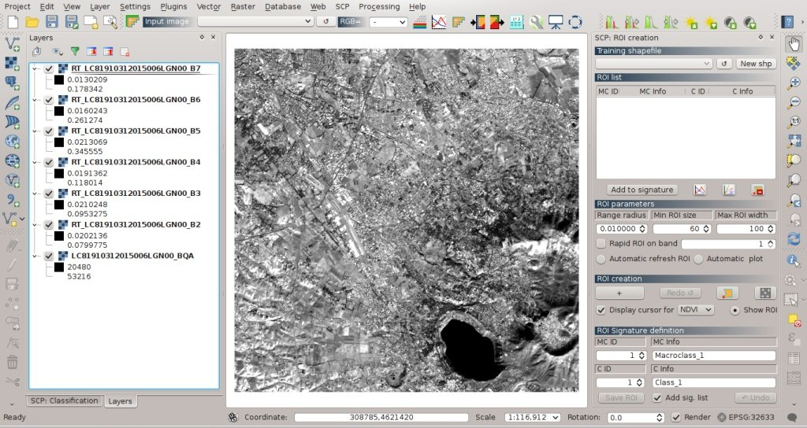
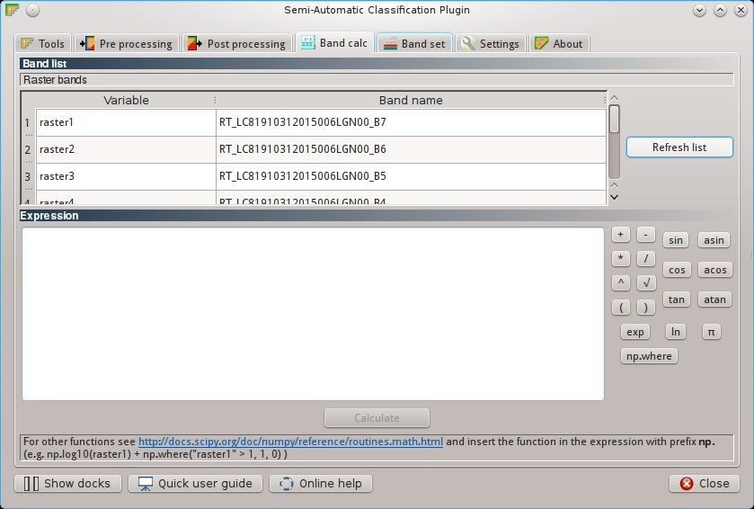
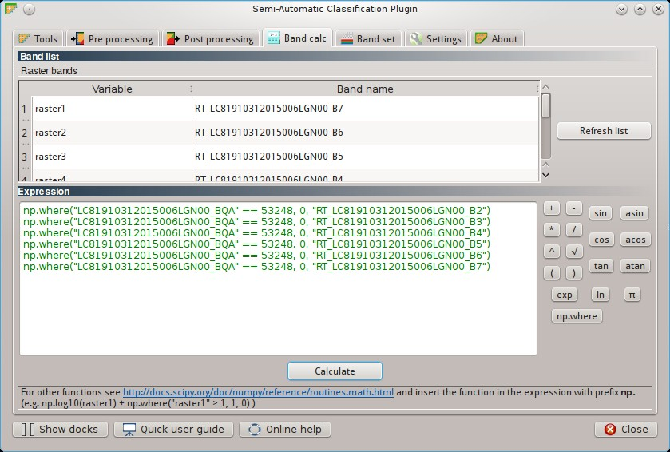
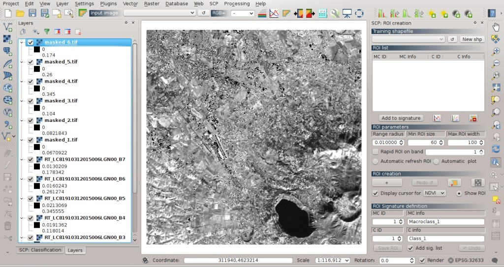
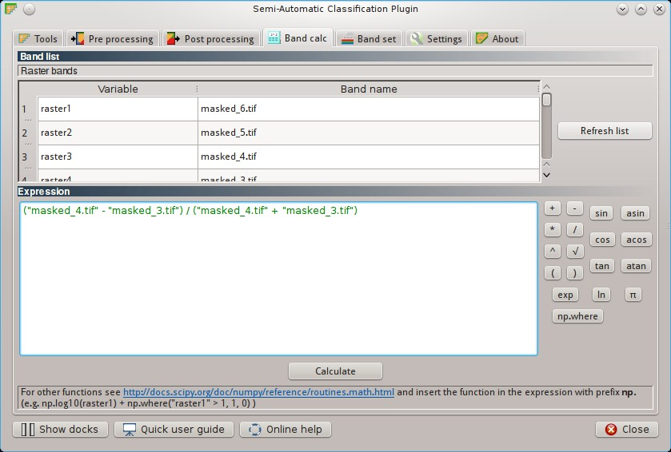
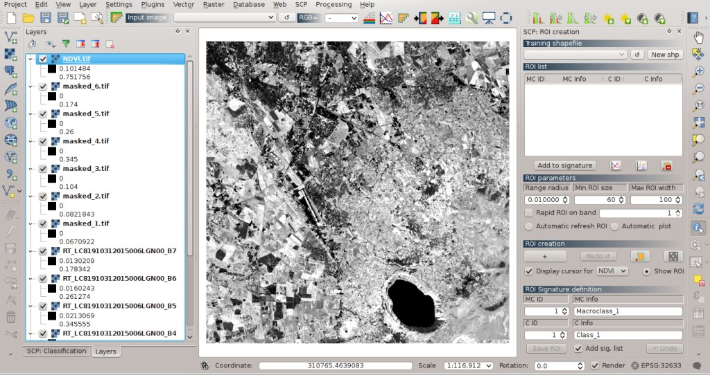
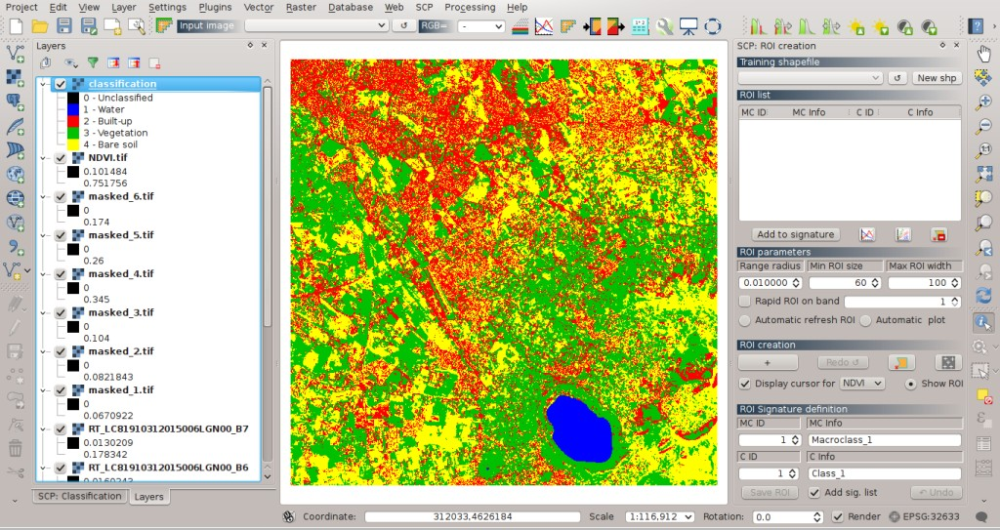
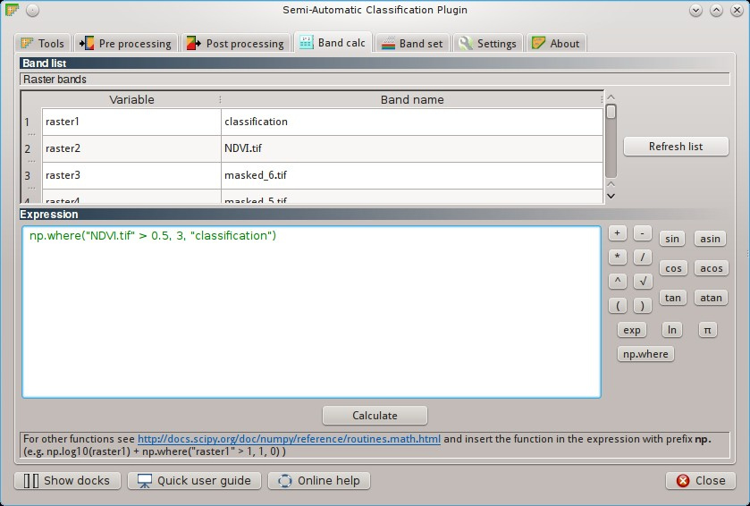
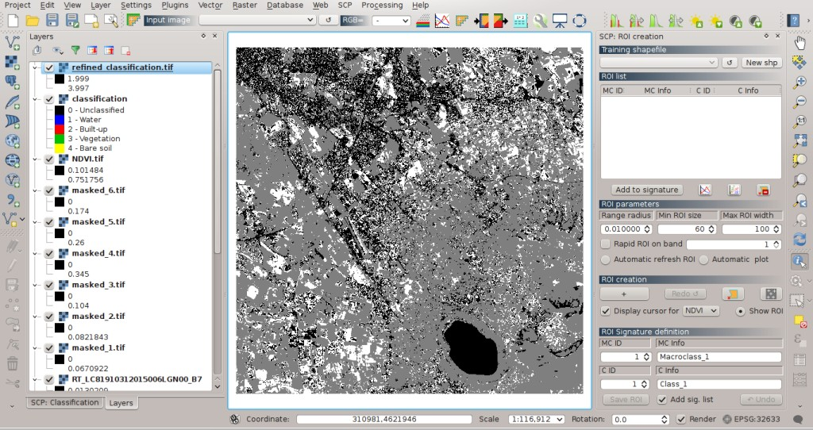
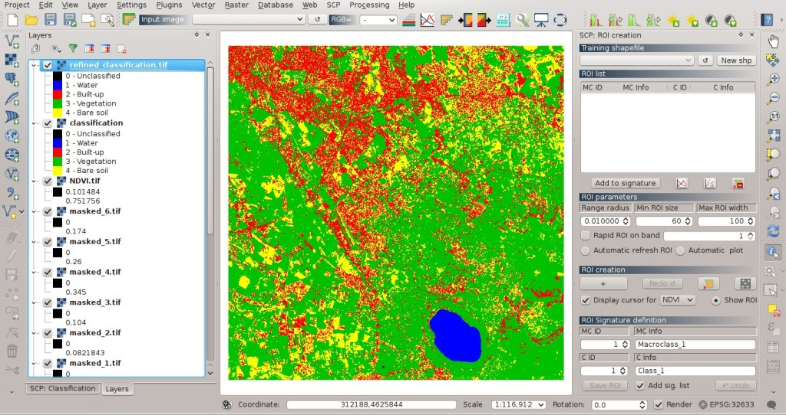

.. _thematic_tutorials:

***************************************************************
Thematic Tutorials
***************************************************************

.. |br| raw:: html

  

The following are thematic tutorials.
Before these tutorials, it is recommended to read the :ref:`tutorials`.

.. contents::
    :depth: 2
    :local:
	

.. _thematic_tutorial_1:
 
Tutorial 1: Set the Input in SCP
===================================================

Work in progress ...

.. _thematic_tutorial_2:
 
Tutorial 2: Pre processing
=====================================================

.. _thematic_tutorial_2_1:

Download Landsat Images with the SCP
------------------------------------------------------

Work in progress ...

.. _thematic_tutorial_2_2:
 
Clip multiple rasters
------------------------------------------------------

Work in progress ...

.. _thematic_tutorial_2_3:
 
Split a multiband raster
------------------------------------------------------

Work in progress ...

.. _thematic_tutorial_3:
 
Tutorial 3: ROI Creation
===================================================

Work in progress ...

.. _thematic_tutorial_4:
 
Tutorial 4: Classifications
===================================================

Work in progress ...

.. _thematic_tutorial_4_1:

Classification Previews
------------------------------------------------------

Work in progress ...

.. _thematic_tutorial_4_2:

Band Weights and Algorithm Thresholds
------------------------------------------------------

Work in progress ...

.. _thematic_tutorial_4_3:

Algorithm Raster
------------------------------------------------------

Work in progress ...

.. _thematic_tutorial_5:

Tutorial 5: Post Processing
===================================================

Work in progress ...

.. _thematic_tutorial_6:

Tutorial: Using the tool Band calc
===================================================

This is a tutorial about the use of the tool :ref:`band_calc_tab` that allows for the **raster calculation for bands**.
In particular, we are going to calculate the NDVI (Normalized Difference Vegetation Index) of a Landsat image, and then apply a condition in order to refine a land cover classification (see :ref:`tutorial_2` ) basing on NDVI values (a sort of Decision Tree Classifier).

The :ref:`band_calc_tab` can perform multiple calculations in sequence.
We are going to apply a mask to every Landsat bands in order to exclude cirrus and cloud pixels from the NDVI calculation, and avoid anomalous values.
In particular, Landsat 8 includes a `Quality Assessment Band <http://landsat.usgs.gov/L8QualityAssessmentBand.php>`_ ) that can be used for masking cirrus and cloud pixels.

The values that indicate with high confidence cirrus or clouds pixels are (for the description of these codes see the table at http://landsat.usgs.gov/L8QualityAssessmentBand.php ):

* 61440;
* 59424;
* 57344;
* 56320;
* 53248;
* 31744;
* 28672 .

In particular, the Quality Assessment Band of the sample dataset includes mainly the value 53248 indicating clouds.
Therefore, in this tutorial we are going to exclude the pixels with the **value 53248** from all the Landsat bands.

Following the video of this tutorial.

.. raw:: html

	<iframe allowfullscreen="" frameborder="0" height="360" src="http://www.youtube.com/embed/vjKX00jML64?rel=0" width="640"></iframe>

http://www.youtube.com/watch?v=vjKX00jML64

Alternative video link
https://archive.org/details/video_band_calc

First, **download the sample dataset**, which is a Landsat 8 image already converted to reflectance (see :ref:`tutorial_2_1`) from `this link <https://docs.google.com/uc?id=0BysUrKXWIDwBZFFMMlJNZXJpS3c&export=download>`_ (data available from the U.S. Geological Survey).
Also, **download the land cover classification** from `here <https://docs.google.com/uc?id=0BysUrKXWIDwBYVlTZ2ZQRVo2V1k&export=download>`_ .

.. _thematic_tutorial_6_1:

Application of a mask to multiple bands
------------------------------------------------------

Unzip the downloaded dataset and load all the raster bands in QGIS.

	
	:guilabel:`Bands loaded in QGIS`
	
Open the :ref:`band_calc_tab` and click the button ``Refresh list``.

	
	:guilabel:`The Band calc tool`
	
We are going to use conditional expressions (i.e. ``np.where``, for more information see `this page <http://docs.scipy.org/doc/numpy/reference/generated/numpy.where.html>`_) with the following structure: ::

	np.where( condition , value if true, value if false)
	
Where:

* ``condition`` is a logical condition between bands or values;
* ``value if true`` and ``value if false`` can be a numerical value, a band, or another expression.

In ``Expression`` enter the following block of expressions: ::

	np.where("LC81910312015006LGN00_BQA" == 53248, 0, "RT_LC81910312015006LGN00_B2")
	np.where("LC81910312015006LGN00_BQA" == 53248, 0, "RT_LC81910312015006LGN00_B3")
	np.where("LC81910312015006LGN00_BQA" == 53248, 0, "RT_LC81910312015006LGN00_B4")
	np.where("LC81910312015006LGN00_BQA" == 53248, 0, "RT_LC81910312015006LGN00_B5")
	np.where("LC81910312015006LGN00_BQA" == 53248, 0, "RT_LC81910312015006LGN00_B6")
	np.where("LC81910312015006LGN00_BQA" == 53248, 0, "RT_LC81910312015006LGN00_B7")

	
	:guilabel:`The expression in Band calc`
	
	
	**TIP** : If the text in ``Expression`` is green it means that the syntax is correct, otherwise it is red and the button ``Calculate`` is disabled.

Click the button ``Calculate``, select where to save the bands (e.g. a new directory named `masked_bands`) and write the output name (e.g. ``masked``).
Multiple outputs are created with the same output name and a numerical suffix based on the numerical order of the expressions.
Calculated bands are also added to QGIS.

	
	:guilabel:`Masked bands`
	
According to the order of expressions, the file ``masked_1`` corresponds to the band ``RT_LC81910312015006LGN00_B2``,  the file ``masked_2`` corresponds to the band ``RT_LC81910312015006LGN00_B3``, and so on.
Masked pixels have NoData values (i.e. nan).

.. _thematic_tutorial_6_2:

NDVI Calculation
------------------------------------------------------

NDVI is an index calculated as ``( Near Infrared band - Red band ) / (Near Infrared band + Red band)`` which ranges from -1 to 1 .
Green vegetation has the highest NDVI values tending to 1.

Open the :ref:`band_calc_tab` and click the button `Refresh list`.
Clear the content of ``Expression`` and write the following expression for the calculation of NDVI: ::

	("masked_4.tif" - "masked_3.tif") / ("masked_4.tif" + "masked_3.tif")
	
where ``masked_4.tif`` is the Near Infrared band and ``masked_3.tif`` is the Red band.

	
	:guilabel:`The expression in Band calc`
	
	
	**TIP** : The expression can work both with ``Variable`` and ``Band name`` between quotes.
	Also, bands in the :ref:`band_set_tab` can be referenced directly; for example ``bandset#b1`` refers to band 1 of the Band set.
	Double click on any item in the :ref:`band_list2` for adding its name to the expression.

Click the button ``Calculate``, select where to save the NDVI (e.g. a new file named `NDVI`).
The NDVI is added to QGIS.

	
	:guilabel:`The NDVI calculated`
	
	
.. _thematic_tutorial_6_3:

Classification refinement basing on NDVI values
------------------------------------------------------

Load the downloaded classification in QGIS.

	
	:guilabel:`The land cover classification`
	
The classification is the result of :ref:`tutorial_2` where the land cover classes described in the following table were identified.

+-----------------------------+--------------------------+
| Class name                  | Pixel value              |
+=============================+==========================+
| Water                       |  1                       |
+-----------------------------+--------------------------+
| Built-up                    |  2                       |
+-----------------------------+--------------------------+
| Vegetation                  |  3                       |
+-----------------------------+--------------------------+
| Bare soil                   |  4                       |
+-----------------------------+--------------------------+

We are going to refine this classification defining the following condition: pixels having NDVI > 0.5 are classified Vegetation. 
The value 0.5 is an arbitrary value that should be changed according to the image condition (i.e. phenological state of vegetation).

Open the :ref:`band_calc_tab` and click the button `Refresh list`.
Clear the content of ``Expression`` and write the following expression: ::

	np.where("NDVI.tif" > 0.5, 3, "classification")
	
which means that if NDVI value is greater than 0.5, assign the pixel value 3 (i.e. Vegetation), otherwise leave the original classification value.

	
	:guilabel:`The expression in Band calc`
	
Click the button ``Calculate``, select where to save the new classification (e.g. a new file named ``refined_classification``).
The new classification is added to QGIS.

	
	:guilabel:`The output land cover classification`
	
It is possible to copy the style from the original classification (in QGIS Layers right click on the layer name and select ``Copy style``) and paste it to the new classification (right click on the layer name and select ``Paste style``).

	
	:guilabel:`The output land cover classification with color style`
	
You can see that now a larger area is classified as vegetation.